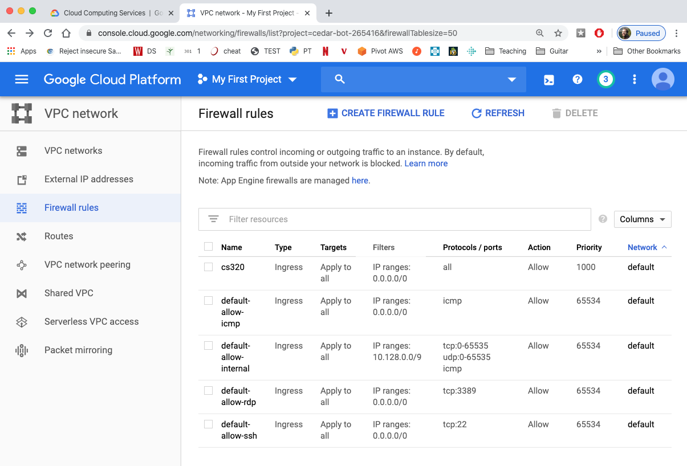

# Firewall Setup

1. Go to the Google Cloud Console at https://console.cloud.google.com/.  Then sign into your account.

2. In the menu on the left, scroll down to "Networking"; under that, open
the "VPC network" menu and select "Firewall"

3. Click the "CREATE FIREWALL RULE" button

4. For the name and description, enter "cs320"

5. Under Targets, chose "All instances in the network".  Set "Source filter" to "IP ranges" and "Source IP ranges" to "0.0.0.0/0".  Choose "Allow all" under "Protocols and ports".  Click "Create".

6. You should see the new "cs320" rule in the table:

