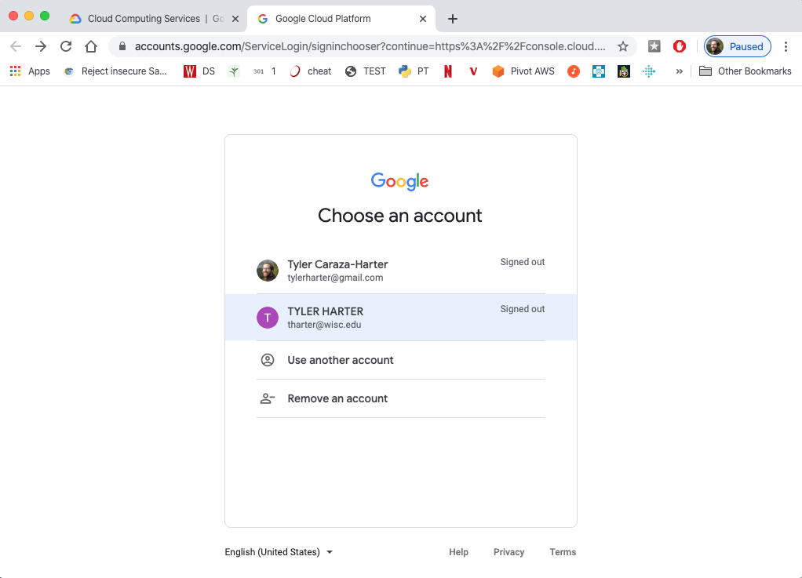
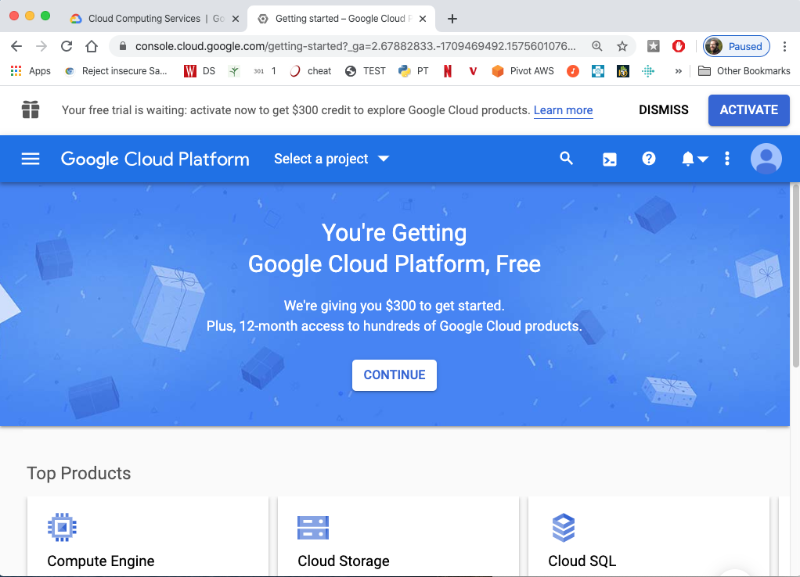

# Google Cloud Signup

1. Go to https://cloud.google.com

2. Sign in with your Google account.  Note that your @wisc.edu account
is recognized as a Google account, so you may use that if you like.

3. Read+Agree...

4. If offered trial credit, activate it to save some cash this semester:

5. Read+Agree...

