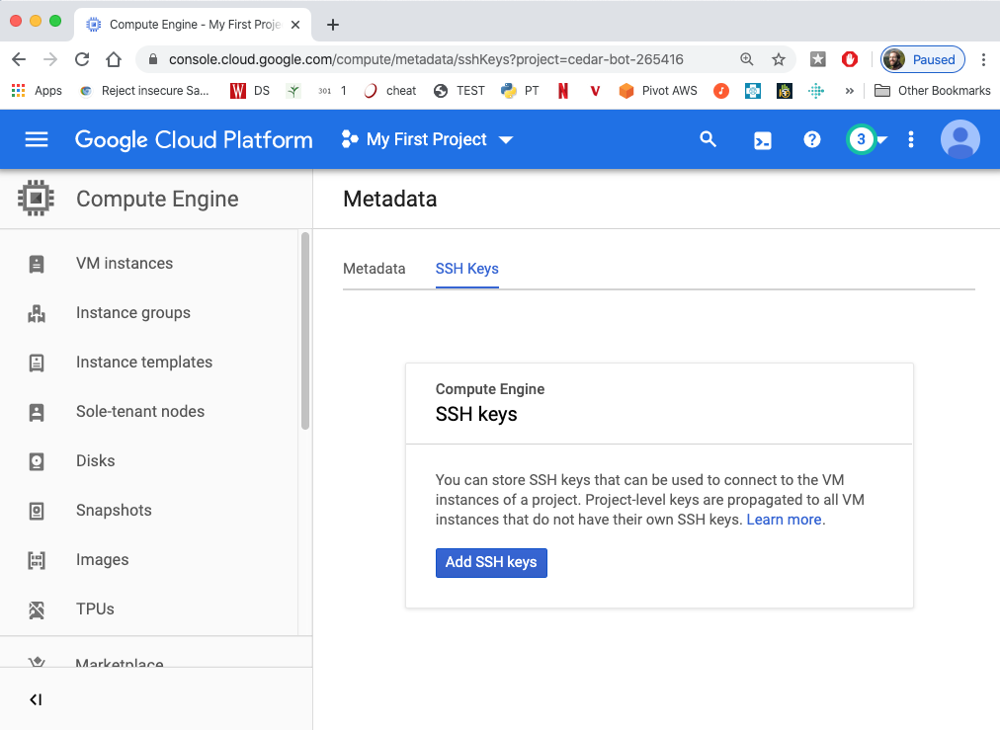

# SSH

1. In the cloud console, find "Compute Engine" under "COMPUTE", and click "Metadata" (it's roughly in the middle of the "Compute Engine" menu).

2. Go to "SSH Keys" and click "Add SSH keys".  There will be a box
where we need to paste a key, which we haven't generated yet.

3. Open your terminal, and run the command `ssh-keygen`.  You should be able
to just use the defaults by hitting enter a few times. It looks
like the following on a Mac, but should work the same on Windows.  If
`ssh-keygen` isn't found, then you should skip the rest of this
section and go back to the next steps on the [main page](README.md)
for now (feel free to get help more specific to your setup during
office hours).

4. run `cat ~/.ssh/id_rsa.pub`.  Then copy the output (the part
highlighted in the following screenshot).

5. go back to where you were adding an SSH key in the Google cloud
console and paste your key (as copied in step 4).  Make a note of the
username that appears to the left of the box (in this case "trh") --
you'll need it later.

6. Then click "Save".
