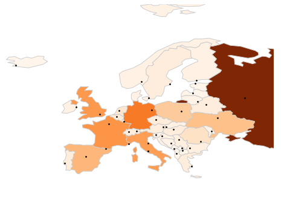

# Lab 10: Geographic Maps

We'll be talking more about geopandas in the next lecture, but for
now, we'll guide you through some steps to make a map.

If you haven't already, you need to install some things to make maps:

```
pip3 install geopandas shapely descartes
```

And this:

```
sudo apt install python3-rtree
```

Let's say you want to plot a map of Europe, showing major cities and
shading countries by popluation.  Past+run the following:

```python
import geopandas
world = geopandas.read_file(geopandas.datasets.get_path('naturalearth_lowres'))
cities = geopandas.read_file(geopandas.datasets.get_path('naturalearth_cities'))

eu = world[world["continent"] == "Europe"]
ax = eu.plot(column="pop_est")
geopandas.sjoin(cities, eu).plot(ax=ax)
```

It should look like this:


Can't see much there!  We'll walk you through a series of changes to
make it look like this much-better version:



Re-generate the map after each step so you can see the result of your
changes.

### Step 1: Latitude/Longitude Limits

At the end of the cell, paste these calls:

```python
ax.set_xlim(-25, 45)
ax.set_ylim(30, 80)
```

### Step 2: Country Styling

Let's use the "Oranges" color map, put a light gray border around
countries, and increase the color size.  In the above snippet, change
the `ax = eu.plot(...)` line to this:

```python
ax = eu.plot(column="pop_est", cmap="Oranges", edgecolor="0.8", figsize=(8,8))
```

### Step 3: City Styling

Let's use small black markers for cities by passing `color` and
`markersize` to the second `.plot` call:

```python
geopandas.sjoin(cities, eu).plot(ax=ax, color="black", markersize=3)
```

### Step 4: Removing Axes

Although there are exceptions, axes are often less useful for maps
than other plots, so add this to turn them off:

```python
ax.set_axis_off()
```

### Summary

If you got stuck above, here are all the changes together:

```python
import geopandas
world = geopandas.read_file(geopandas.datasets.get_path('naturalearth_lowres'))
cities = geopandas.read_file(geopandas.datasets.get_path('naturalearth_cities'))

eu = world[world["continent"] == "Europe"]
ax = eu.plot(column="pop_est", cmap="Oranges", edgecolor="0.8", figsize=(8,8))
geopandas.sjoin(cities, eu).plot(ax=ax, color="black", markersize=3)
ax.set_xlim(-25, 45)
ax.set_ylim(30, 80)
ax.set_axis_off()
```