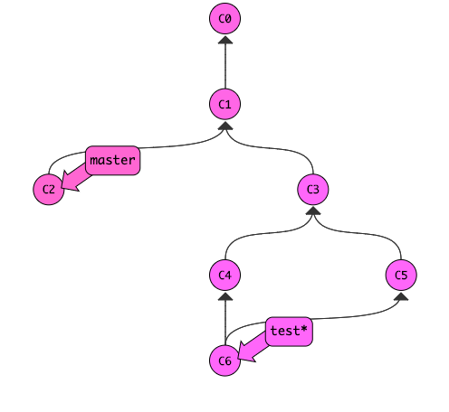
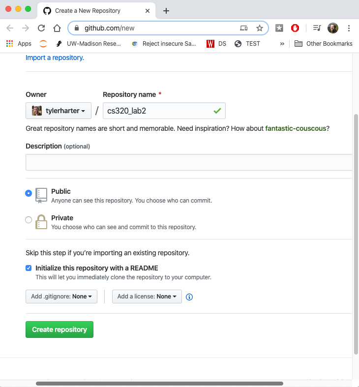
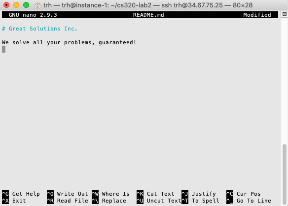
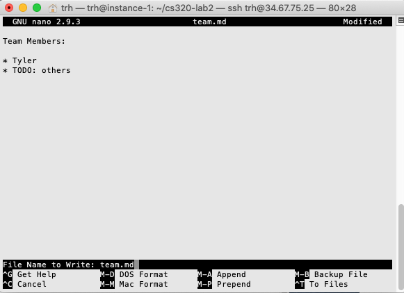
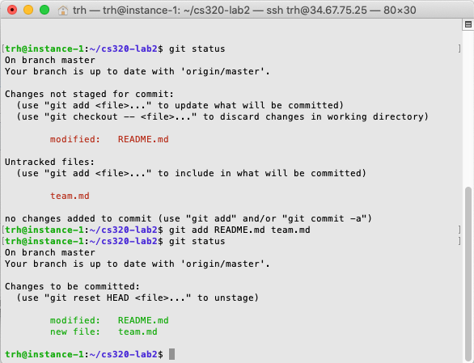
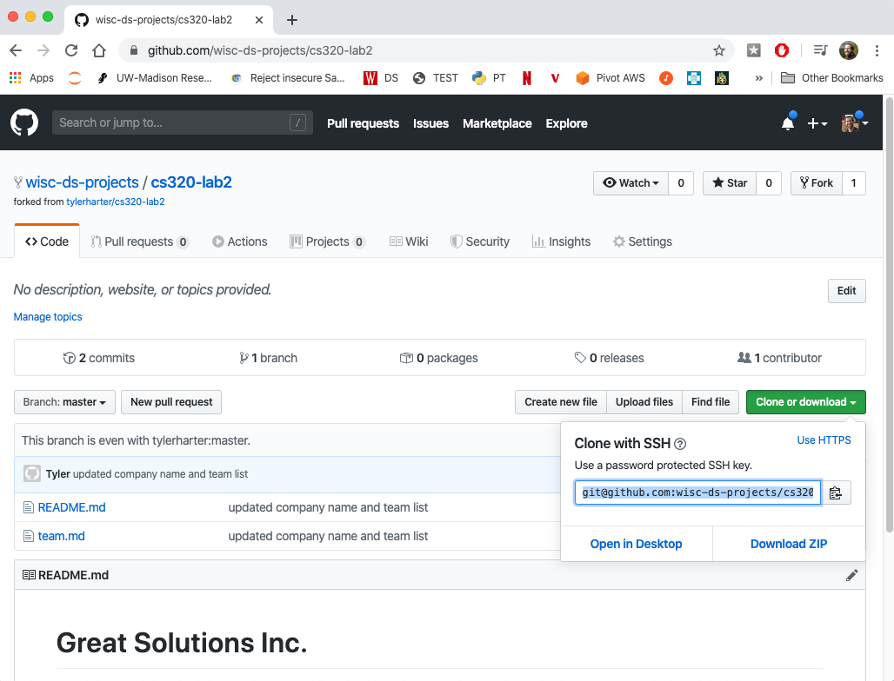
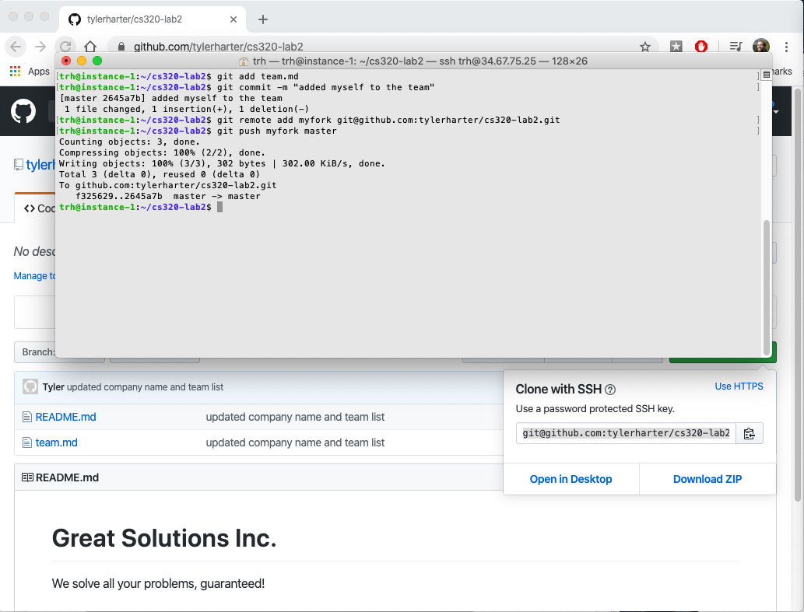
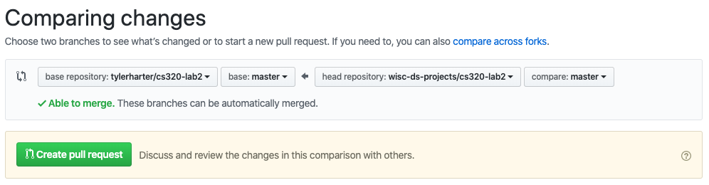

# Lab 2: Git Practice

In this lab, you'll practice using git and GitHub.  Git is a
collaborative tool, so make sure you **form a group of 2-3 people** to
do this lab together (use Google Hangouts or some other tool with
screensharing).  You'll do the following:

* practice merging in a Git simulator
* create a GitHub account
* create a GitHub repos from scratch and by forking other GitHub repos
* push changes from a laptop repo directly to a GitHub repo
* push changes from a loptop repo to a forked repo, before merging those changes into the main repo (this is the very important *pull request* process)

You can do this lab on your virtual machine, which should already have
git installed (and even not, installing git on Ubuntu can be done with
a simple `apt` command, like this: `sudo apt install git`).

It's probably a good idea to install git on your own laptop at some
point.  Windows directions: https://git-scm.com/download/win.  Mac
directions:
https://www.ics.uci.edu/~pattis/common/handouts/macmingweclipse/allexperimental/macxcodecommandlinetools.html.
You're welcome to do this lab directly on your laptop (not through the
virtual machine), though if you run into any tricky issues installing
or using git directly on your laptop, we might ask you to switch to
using your virtual machine.

## Background

A **repo** contains a bunch of commits, and usually a few branches to
label different commits.  In order to support collaboration and
offline work, it is common to have multiple copies of the same repo.
For example, say there is a team of 3 people working on an open-source
project.  There will probably be six copies of the repo: one on each
person's laptop or virtual machine and one on each person's GitHub
account (with one of the GitHub ones being the primary home for the
code).

Various git commands and tools can be used to syncronize the copies.
For example, running `git push origin test` uploads the `test` branch,
and all the associated commits, to `origin`:


`origin` is an example of a **remote**, a shorthand name to use instead
of a full URL for a repo somewhere else (like GitHub).  When you
`clone` a repo from GitHub, you automatically get a remote called
`origin`, but you can setup more yourself.

`clone` is a one-time thing to make a new copy of a GitHub repo on
your computer and download all the commits/branches/etc.  If new
changes are made on the GitHub repo, you can instead run `git pull` to
download these without creating a whole new copy of the repo.

In addition to these three general git commands (**clone**, **pull**, **push**),
GitHub has two key tools for syncing repos:

* **fork**: copy somebody else's GitHub repo to a new repo (called a fork) on your account
* **pull request**: ask somebody to bring some new code you uploaded to your fork back into the main repo

Consider a concrete example of how to use all these commands.  Say you find a bug in `pandas`, fix it, and want to share the fix back.  You might do the following:

1. find the pandas repo on GitHub
2. clone the pandas repo to a copy on your computer
3. fork the pandas repo to a copy in your own GitHub account
4. make the change to the copy on your computer
5. add a remote so that you can push from your computer to your GitHub fork
6. do a push to upload your changes from your computer to your fork
7. do a pull request from your fork to the main pandas repo
8. somebody in charge of main repo will consider your changes, and probably (a) click a button on GitHub to incorporate your changes, or (b) give you feedback to make the code better first, in which case you go back to step 4

## Step 1: Practice Git Branching

Let's start by practicing in the Git simulator <a
href="https://tyler.caraza-harter.com/cs320/s20/learnGitBranching/index.html"
target="_blank">here</a>.  Try to run commands to get to the following state (if you get stuck, check the [solution here](solution.md)):



Useful commands for the above problem:
* `git commit`: make a new commit
* `git branch bname`: create a branch named `bname`
* `git checkout bname`: move `HEAD` to the commit referenced by the `bname`
* `git checkout c1`: move `HEAD` to the `c1` commit
* `git merge bname`: merge changes on the `bname` branch into the current branch
* `git branch -D bname`: delete the branch named `bname`

Ready for a real challenge?  Try to get to this state (no answer to
check for this one, so you'll need to work for it!):


**Hint:** start by creating commits on four branches, b1, b2, b3, and b4.
Merge b2 into b1 and b4 into b3.  Then merge the two merge commits
with a third merge commit.

## Step 2: Create GitHub Account

Everybody in your group should go to http://github.com/ and create a
GitHub account (choose a name that wouldn't embarrass you on a
resume):


Later, running certain git commands will make you type your GitHub
password each time, unless you setup an SSH key to use instead of a
password (you likely setup an SSH key during the first lab to access
your virtual machine).  It's recommended (but not required) that you
configure GitHub with an SSH key following [these directions](ssh.md).

## Step 3: Create and Fork/Clone a Repo

Identify one person to be the **team leader** -- it should be whoever
has an upcoming birthday the soonest.

The **leader** should go to https://github.com/new and create a public
repo called "cs320-lab2", initialized with a README (the other people
working on the lab will have another role to play):



This should create a repo at https://github.com/tylerharter/cs320-lab2
(with the leader's GitHub name instead of "tylerharter").  **All team
members** should go there and click the "Clone or download" link:


The preferred option for any team member that configured their SSH
keys is to click "Use SSH" (the HTTPS option would also work, it but
would require frequent typing of your password later):


**Everybody** should copy that clone address (from the leader's repo),
then run the command `git clone ADDRESS` in the shell, replacing
"ADDRESS" with whatever was copied.  This will create a new directory
to which you can `cd` and run `git status`.  These three steps should
look something like this:


## Step 4 [Leader Only]: Making and Pushing a Change

Everybody should read, discuss, and understand this part, but only
the team leader will run commands in this section.

We'll pretend that your group is creating some pages for a new company
you're starting together.  **Agree on a company name now for your
group.**

**Leader Only:** you should create some initial pages (other team
  members will later make additions.  Type `nano README.md` from in
  the `cs320-lab2` directory.  Type in your company name and a brief
  description.  Save the file by typing `CTRL-O` (control and "O"
  keys at same time).



Exit with `CTRL-X` and edit a `team.md` file by typing `team.md`; put
in the leader's name, and a note for others to add themselves:



Run `git status`, and note that `README.md` and `team.md` are not staged for commit.  Run `git add README.md team.md`, then run `git status` again to note the difference:



Run `git commit -m "updated company name and team list"`

Currently, the repo on your laptop (which was cloned from the GitHub
repo) has been updated.  The original GitHub repo has not been updated
yet.

To sync back to the GitHub repo, run the `git push` command (you may
be asked to configure your name/email before this will work -- just
follow the hints git provides).

Go back and visit the repo online at
https://github.com/tylerharter/cs320-lab2 (with the leader's GitHub
name instead of "tylerharter").  Do you see the changes?

## Step 5 [Non-Leaders Only]: Making a Pull Request

These steps are for everybody except the leader, but the leader should
read and understand them too.

The leader's changes are now in their laptop's repo and in the GitHub
repo, but not in the previously cloned repos of other team members.
Try running `git log` and confirm there is only one commit, not two.

Run `git pull` from in the `cs320-lab2` directory.  This will grab the
latest changes from the GitHub repo.  Not try running `git log` again.
See both the commits?

Now type `nano team.md` and add yourself to the list, using an alias
if you wish:


Then stage your files (`git add team.md`) and commit (`git commit -m "added myself to the team"`).

Getting your changes back into the leader's repo will trickier for you
than it was for the leader.  The leader could just run `git push`, but
you cannot push changes directly to the leader's GitHub repo because
you aren't configured to have permission to do that.

Instead, what you'll do is create your own GitHub repo that's a copy
of the leader's repo -- such a repo copy is called a *fork*.  You can
push whatever changes you want to your own fork.

Then, you can create a *pull request*.  A pull request is a message to
the leader that basically says: "look at these cool changes in my
forked repo -- please consider pulling those changes back into your
own GitHub repo."

Go to the leader's GitHub page, and click "Fork" at the top:


You'll now see your own forked copy of the repo.  Find and copy the clone address of the fork:



Now, back in the terminal, run the following, replacing `PASTEHERE` with the clone address you just copied:

```
git remote add myfork PASTEHERE
```

We chose "myfork" as a convenient label for your fork -- you could
have chosen any name there.

Now, even though we can't push your committed changes directly to the
leader's GitHub, you can push them to your own fork by running `git
push REMOTE BRANCH`, replacing `REMOTE` and `BRANCH`, something like this:

```
git push myfork master
```

It should all look like this:



Go back and refresh the GitHub page for your fork.  Do you see the
changes to `team.md`?  (you should!).

Ok, now we want to create your pull request, to ask the leader to
integrate your changes back to the main repo.

Go to the GitHub page for the leader's repo, select the "Pull
requests" tab, and click "New pull request":


Click the "compare across forks" link and configure the dropdowns so
that the arrow points from the master branch on your GitHub repo to
the master branch on the leader's repo:



Click "Create pull request", write a note, and click "Create pull request" again.

## Step 6 [Leader Only]: Merging a Pull Request

The leader should go back to the "Pull requests" tab on the page for
their GitHub repo and open the new Pull Request.  To accept it (after
browsing through the changes), click the "Merge pull request" button:


Confirm the merge, then go back to the main repo page and verify that
everybody's changes are part of the main repo.

If you're in a group of 3, the leader will need to repeat these steps
twice to merge in the pull requests of both the other team members.

# Conclusion

Pull requests are neat -- they give you an easy way to make
improvements and recommend them to any public project on GitHub.  Even
amongst your own team, they provide a great way to get feedback on
changes in a fork before those changes become part of the main
repository.
