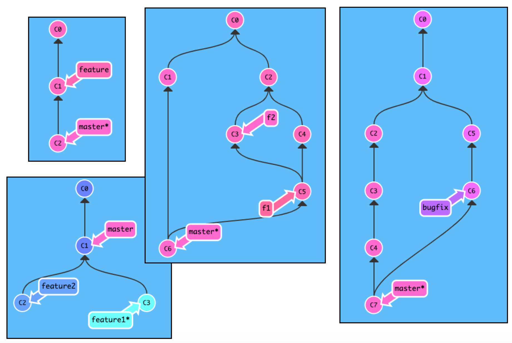

# Sep 9 Lecture

## 1. Git Simulator

### Watch: [12-minute video](https://youtu.be/tu_zv_sx728)



### Practice

Choose at least two scenarios below, then, see if you can reproduce
the situation in the git simulator:
https://tyler.caraza-harter.com/cs320/f20/learnGitBranching/index.html.

Don't worry about the colors of the commits (those are random and just
make it look nice).

## 2. A Conflict

### Watch: [22-minute video](https://youtu.be/kfJEMi1UyS8)

## 3. Runing Programs and Measuring Time

### Watch: [14-minute video](https://youtu.be/tY-iz5tB5ZI)

### Practice: Timing pwd

Adapt+combine the following two examples to measure the average time it takes to run the `pwd` command:

Example 1:

```python
import time

L = list(range(1000000))
sample_size = 100

t0 = time.time()
for i in range(sample_size):
    -100 in L
t1 = time.time()
print((t1-t0)/sample_size*1e3, "milliseconds")
```

Example 2:

```python
from subprocess import check_output
check_output("pwd")
```
