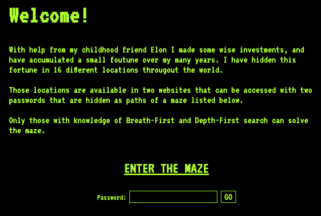

# DON'T START YET (draft only)

# Project 3: Treasure Hunt!

## Corrections/Clarifications

* none yet

## Overview

You are to create a web scraper to find lost secrets!  You'll write
and hand in a module in `scrape.py` file.  It will contain one class,
`Scraper`.  Make sure to run the tests before handing in!

## Website

You'll be scraping a website implemented as a flask application.  To
run it, grab all the relevant html, csv, and css files.  Grab
`application.py` too, and run this on your VM:

```
python3 application.py
```

Then, open `http://<YOUR-VM-IP>:5000` in your web browser.  It should look like this:



Each page (under "ENTER THE MAZE") contains information in the form of
a letter.  If you do either a DFS or BFS search through the site and
concatenate the letters from the pages in the order in which they're
visited, you'll get a password.  Use the DFS buttons when doing a DFS
search and the BFS buttons when doing a BFS search.

By performing both searches, you'll get two passwords.  Entering
either correct password on the home page will redirect you to a
different page.

Use selenium to do the scraping.  BeautifulSoup is probably also
helpful, though not required.

# Group Part (75%)

For this portion of the project, you may collaborate with your group
members in any way (even looking at working code).  You may also seek
help from 320 staff (mentors, TAs, instructor).  You <b>may not</b>
seek receive help from other 320 students (outside your group) or
anybody outside the course.

### Starter Code

```python
class Scraper:
    # required
    def	__init__(self, driver, home_url):
        self.driver = driver
        self.home_url =	home_url

    # you can do these three with your group
    def easter_egg(self):
        pass

    def dfs_pass(self):
        pass

    def bfs_pass(self):
        pass

    # write the code for this one individually
    def protected_df(self, password):
        pass
```

Feel free to add helper methods or code to `__init__` as you find useful.

When it's done, you should be able to use your module from a notebook like this:

```python
import os
from selenium import webdriver
from selenium.webdriver.chrome.options import Options

from scrape import Scraper

# kill previous chrome instance if still around (to conserve memory)
os.system("pkill chrome")

url = "http://VM_IP:5000" # TODO: enter your VM's IP
options = Options()
options.headless = True
driver = webdriver.Chrome(options=options)
s = Scraper(driver, url)

print("Easter Egg:", s.easter_egg())

dpass = s.dfs_pass()
print("\nDFS Password", dpass)

bpass = s.bfs_pass()
print("\nBFS Password", bpass)

print("\nDFS Locations")
print(s.protected_df(dpass))

print("\nBFS Locations")
print(s.protected_df(bpass))

s.driver.close()
```

Expected output:

```
Easter Egg: on wisconsin

DFS Password BleuSus

BFS Password XÆ_A-12

DFS Locations
   ID   Latitude   Longitude Access Code                     Description
0   9  38.624912  -90.186127  83ucbsobyq        Gateway Arch in St.Louis
1  10 -13.162773  -72.545824  sjnvjn27ap              Machupiccu in Peru
2  11  43.036319  -89.415369  djhsfdhf31              Culvers in Madison
3  12  39.917529  116.392320  qazwxs23df         Forbidden City in China
4  13  29.979174   31.133935  ewiufb35sf  Great Pyramid of Giza in Egypt
5  14  40.774200  -73.970357  37jdvnag4s        Central Park in New York
6  15 -78.464419  106.826764  ujsdfi274x    Vostok Station in Antarctica
7  16  11.425367  142.811867  8hfnskjdnf          Mariana Trench by Guam

BFS Locations
   ID   Latitude   Longitude Access Code                          Description
0   1  43.089034  -89.416128  983kbsdfk1              Picnic Point in Madison
1   2  38.105507  126.910613  37461983fd               Silver Beach in Hawaii
2   3  65.044901  -16.712836  jnjsd238yf  Shore of a Volcanic Lake in Iceland
3   4  48.860945    2.335773  7733hhfsdf                  The Louvre in Paris
4   5  37.434183 -122.321990  ksjfn21213      Redwood forest in San Francisco
5   6  51.180315   -1.829659  348219389f                 Stonehenge in the UK
6   7  27.987586   86.925002  njsg1hywov                 Mt. Everest in Nepal
7   8  43.070010  -89.409450  8wbd1vy29a          Quick Trip on Monroe Street
```

### `easter_egg` method

If you look at the HTML source for the home page, you'll see some text
is inline `<span>` tags.  The `easter_egg` method should extract all
these pieces, concatenate them to construct a message, and return the
result.

### `dfs_pass` method

Treat each page as a node, and each hyperlink as a directed edge.  Do
a Depth-First Search, starting from the home page.  Explore edges that
appear earlier in the page first.

Each time a page is visited for the first time, click the "DFS Click!"
button to get a letter.

Contatenate the letters in the order found to construct a password.
Return it.

Consider adding helper methods to simplify your search.  For example,
would it be helpful to have one that visits a page and returns a list
of hyperlinks to children?

### `bfs_pass` method

This is the same, but visit the pages in Breadth-First Search order,
and use the "BFS Click!" buttons instead of the DFS buttons.

# Individual Part (25%)

You have to do the remainder of this project on your own.  Do not
discuss with anybody except 320 staff (mentors, TAs, instructor).

### `protected_df` method

The method should navigate to the home page, enter the password, click
GO, and return a DataFrame based on the page that is loaded.

Note that after clicking a button, there might be a slight delay
before `driver.page_source` reflects the new page.  Consider how you
can use `time.sleep(...)` to reduce the chance that this will happen
on some systems (like our test machine).

You may want to use this function: https://pandas.pydata.org/pandas-docs/stable/reference/api/pandas.read_html.html

The method should return the whole DataFrame, even if getting the
whole DataFrame involves waiting or clicking a button.  You should
repeatedly check the number of rows in the table ever 1 second, only
returning if a whole second passes with no new rows.  If there's a
button for loading more rows, it should be clicked at each check.
