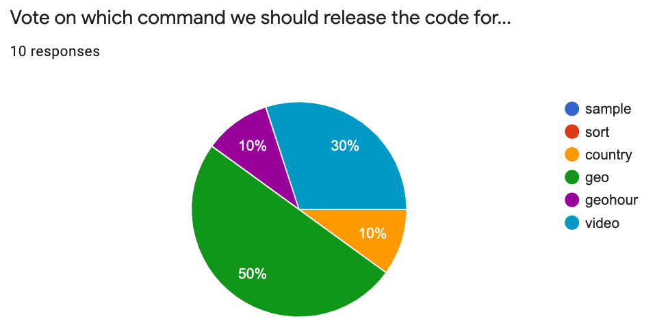

# Geo Solution

10 people voted on which command to release, with `geo` winning.



Here's the code!

```python
from collections import defaultdict

def world():
    world = geopandas.read_file(geopandas.datasets.get_path('naturalearth_lowres'))
    world.set_index("name", drop=False, inplace=True)
    return world[world["continent"] != "Antarctica"]

@click.command()
@click.argument('zipname')
@click.argument('imgname')
def geo(zipname, imgname):
    # count occurences per country
    reader = zip_csv_iter(zipname)
    header = next(reader)
    cidx = header.index("country")
    counts = defaultdict(int)
    for row in reader:
        counts[row[cidx]] += 1

    # add color column that defaults gray, but set
    # to shade of red for higher request counts
    w = world()
    w["color"] = "0.7"

    for country, count in counts.items():
        # sometimes country names in IP dataset don't
        # match names in naturalearth_lowres -- skip those
        if not country in w.index:
            continue

        color = "lightsalmon" # >= 1
        if count >= 10:
            color = "tomato"
        if count >= 100:
            color = "red"
        if count >= 1000:
            color = "brown"
        w.at[country, "color"] = color

    ax = w.plot(color=w["color"], legend=True, figsize=(16, 4))
    ax.figure.savefig(imgname, bbox_inches="tight")
```

**Bonus Hint:** hopefully this helps with `geohour` and `video` too.
I refactored this a bit so that `geo` would be a complete solution you
can use, but in my original, I just had this:

```python
@click.command()
@click.argument('zipname')
@click.argument('imgname')
def geo(zipname, imgname):
    ax = plot_hour(zipname)
    ax.figure.savefig(imgname, bbox_inches="tight")
```

The `plot_hour` was a pretty long function with a definition line like this:

```python
def plot_hour(zipname, hour=None, ax=None):
```

`geo`, `geohour`, and `video` would use this function.  So think about
how you can use the `geo` solution to solve the other problems too, by
pulling out some of the code into a `geo_hour` (or some other)
function.