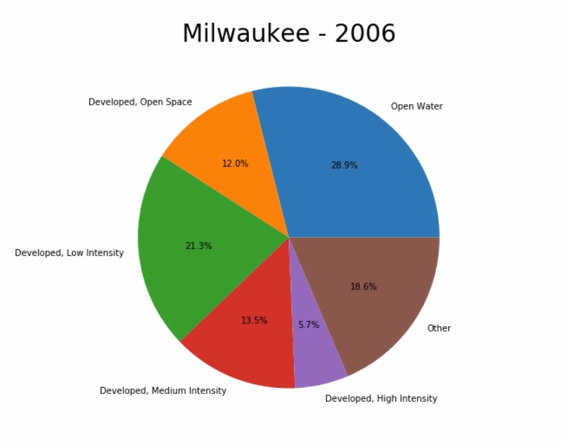

# Don't Start Yet!!!  Still under revision.

# P6: Wisconsin Land Use

In this project, you'll explore how land is used in Wisconsin (for
cities, forests, farming, etc).  [This
dataset](https://www.mrlc.gov/data/nlcd-land-cover-conus-all-years)
breaks the United States into 30m squares and categorizes how those
chunks of land have been used from 2001 to 2016 (this data is
collected every 2-3 years, so there only 7 years of data over this
range).

Take a look
[here](https://www.mrlc.gov/data/legends/national-land-cover-database-2016-nlcd2016-legend)
to see the different ways land is used.

Although the data covers the whole US, we'll be looking at a sampling
of places in WI.  Here's an example of the land use around Madison:


You'll write a Python module to help others analyze this data (like
the bus module for P2).  The module will help pull data from a sqlite3
database, a zip file, and numpy matrices representing land use.

## Corrections/Clarifications

None yet. 

## Dataset

The [original dataset](https://s3-us-west-2.amazonaws.com/mrlc/NLCD_Land_Cover_L48_20190424_full_zip.zip) for the whole US is large (roughly 10GB, compressed).

Thus, we only take data for the following points in WI:


The 100 gray dots are randomly chosen, and the black dots are the 10
largest cities.  There are seven years of data for each of the city
points, but only 2016 data for the randomly sampled points.

We're giving you two files with data about these locations:
`images.zip` and `images.db`.  Both are generated by
build-dataset.ipynb (you're welcome to look at how it works if you're
curious, but it's not really related to what you'll do for P6, and
uses several things we haven't talked about in CS 320).

### Zipped Images

Look inside `images.zip`:

```
unzip -l images.zip
```

You'll see a bunch of .npy files, meaning they contain numpy matrices
(these contain the use data).

#### [Read This](map.md) to learn how to generate a map from the matrices.

How do you know where those images are for?  That's where `images.db`
comes in.

### Sqlite Database

Run the following:

```python
import os
import sqlite3
import pandas as pd

assert os.path.exists("images.db")
c = sqlite3.connect("images.db")

pd.read_sql("SELECT tbl_name FROM sqlite_master", c)
```

Run some SQL queries to see what is in each of the tables.

Note, you'll often want to combine (or *join*) data from the two
tables into one big "table", so you can see both time (from `images`
table) and location (from `places` table).  More on this in lab...

## Requirements

You'll need to write a class and some methods in your module, which
should be in a file named `land.py`.

# Group Part (75%)

### 1. `Connection` class

Create a `Connection` class in land.py, building on the following:

```python
import zipfile
import sqlite3

def open(name):
    pass # TODO

class Connection:
    def __init__(self, name):
        self.db = sqlite3.connect(name+".db")
        self.zf = zipfile.ZipFile(name+".zip")

    def close(self):
	# TODO
```

People should be able to use your module like this:

```python3
import land

c = land.open("images")
# use connection
c.close()
```

Or this:

```python3
with land.open("images") as c:
    pass # use connection
```

Make sure `db` and `zf` get closed at the end.

`Connection` should have `list_images`, `image_year`, `image_name`,
and `image_load` methods that behave as follows:

```python
with land.open("images") as c:
    # gets alphabetically sorted list of images
    # expected: ['area0.npy', 'area1.npy', 'area10.npy', 'area100.npy', ...]
    print(c.list_images()) 

    # get name from DB corresponding to this image
    # expected: 2001 (of type int, not int64)
    print(c.image_year("area0.npy"))

    # get name from DB corresponding to this image
    # should be "madison"
    print(c.image_name("area0.npy")) 
    
    # get numpy area that encodes area usage
    # should be a 2-dimensional numpy array
    print(c.image_load("area0.npy"))
	
	# should plot the given image similar too in map.md
	# the plot title should include that image's year and city name
	# (assuming ax is defined earlier as usual. ax should then be returned by the function)
	c.plot_img("area0.npy", ax=ax)
```

For these functions, you may either do a query each time, or load the
data to a pandas DataFrame when a `Connection` is created.  It's up to
you!

The middle three functions take an image name and return some
corresponding data.  "Year" comes from the `images` table in the DB.
"Name" is trickier: the `images` table associates the file name with a
`place_id`, which can then be used in the `places` table to get a
name.

### 2. `Connection.lat_regression` method

Use least-squares to get `slope` and `intercept` values for an
equation like this:

`percent = slope*lat + intercept`

`percent` is the portion (between 0 and 100) that is expected to have
usage code `use_code` at a given latitude.

If `c` is a `Connection` then `c.lat_regression(use_code, ax)` should
return this information as a `(slope, intercept)` tuple.

For example, `c.lat_regression(41, None)` returns `(5.965578948401942,
-243.38363729644226)`.

This means that for every degree of latitude you go north, you can
roughly expect another 6% to be Deciduous Forest (the land type for
code 41).  Or, based on this information, we might note that Madison's
latitude is 43.0731, so we might expect about 13.3% (`5.96 * 43.07 +
-243.38`) of the nearby areas to be Deciduous Forest.

Install scikit-learn (`pip3 install sklearn`) and use
`LinearRegression` to do the regression:

https://scikit-learn.org/stable/modules/generated/sklearn.linear_model.LinearRegression.html

If the `ax` value passed is not None, `lat_regression` should plot the
computed points and fit line in that area.  For example, somebody
might use your function like this:


**Important**: When using `scatter()` in this project, you need to call it like 
`ax.scatter()` so the tester picks up the points. Otherwise tester.py may not 
recognize the points. 

**Important**: only include points with names that begin with "samp",
  like "samp5" (but not with `name="madison"`) for this function.
  We'll use the city data for the next part.

### 3. `Connection.city_regression` method

This is similar to `lat_regression`, but with the following differences:
1. we'll only use data points with a name
2. the x-axis will be year instead of latitude
3. it should be possible to pass a list of codes to list_code
4. plus more...

This function should, for each of the 10 cities, use a new `LinearRegression` 
model to predict the percent of an image that will contain one of the usage 
codes in the first parameter. The prediction will be done in a year, which will 
be the second parameter.  
  
After you have all of these predictions, you should return both the city 
that got the highest prediction and the prediction itself. 
(Something like `return city, city_pred`)


For example, you should be able to run this:

```python
c.city_regression([21,22,23,24], 2050)
```

And get this:
`('milwaukee', 58.1294187021073)`


These are the city names in the dataset: madison, milwaukee, greenbay,
kenosha, racine, appleton, waukesha, oshkosh, eauclaire, janesville.

# Individual Part (25%)

### 4. `Connection.animate` method

This one should take a city name, then use FuncAnimation to produce
some HTML that can be shown in a Jupyter cell, like this:

```python
from IPython.core.display import HTML
html = c.animate("milwaukee")
HTML(html)
```

It should say the year somewhere on the animation (optionally the city name as well).  
It's OK to have one frame per year of data (this is slightly misleading, 
because the time elapsed between frames will sometimes be 2 years and 
sometimes 3, but we want to keep it simple).  
  
You should use matplotlib to create a pie chart for each year of a parameter 
`name` (in this case "milwaukee"). The pie chart consists of all use codes that 
have over 5% usage in the image for that city in that year (All less than
 5% should be grouped together into a separate other category. The pie chart should 
 include both the labels of the usage codes (Developed, Forest, Open Water, etc.) and 
 its percent in that image. 
 
  
To help, here is a dictionary that maps usage codes to their string description. 
```python
use_codes = {11:'Open Water', 12: 'Perennial Ice/Snow', 
			21: "Developed, Open Space", 22: "Developed, Low Intensity",
			23: "Developed, Medium Intensity", 24: "Developed, High Intensity",
			31: "Barren Land (Rock/Sand/Clay)", 41: "Deciduous Forest",
			42: "Evergreen Forest", 43: "Mixed Forest",
			51: "Dwarf Scrub (Alaska)", 52: "Shrub/Scrub",
			71: "Grassland/Herbaceous", 72: "Sedge/Herbaceous (Alaska)",
			73: "Lichens (Alaska)", 74: "Moss (Alaska)",
			81: "Pasture/Hay", 82: "Cultivated Crops",
			90: "Woody Wetlands", 95: "Emergent Herbaceous Wetlands",
			}
```

You can download an example of the video at
[milwaukee.mp4](milwaukee.mp4).  A screenshot of it looks like this:

  
  
### Not Required: Another Animation  
As the header says, this part is not required. You can consider yourself 
done with the project! If you'd like to explore another cool animation 
(ok, this one is a lot cooler than the last), then this section is for you.  

Similar to the last one, this one also takes a city name. Now, we're showing 
images themselves as they change throughout the years. [map.md](map.md), 
as mentioned in the Zipped Images section, will be helpful here.    
  
You can download an example of this video at
[eauclaire.mp4](eauclaire.mp4).  A screenshot of it looks like this:


