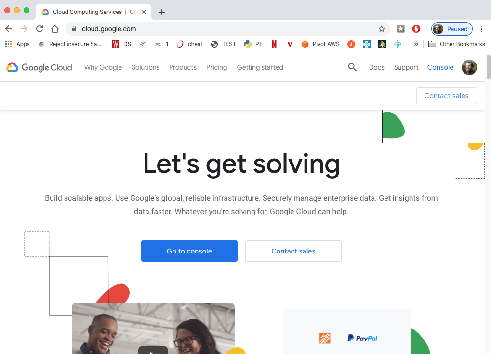
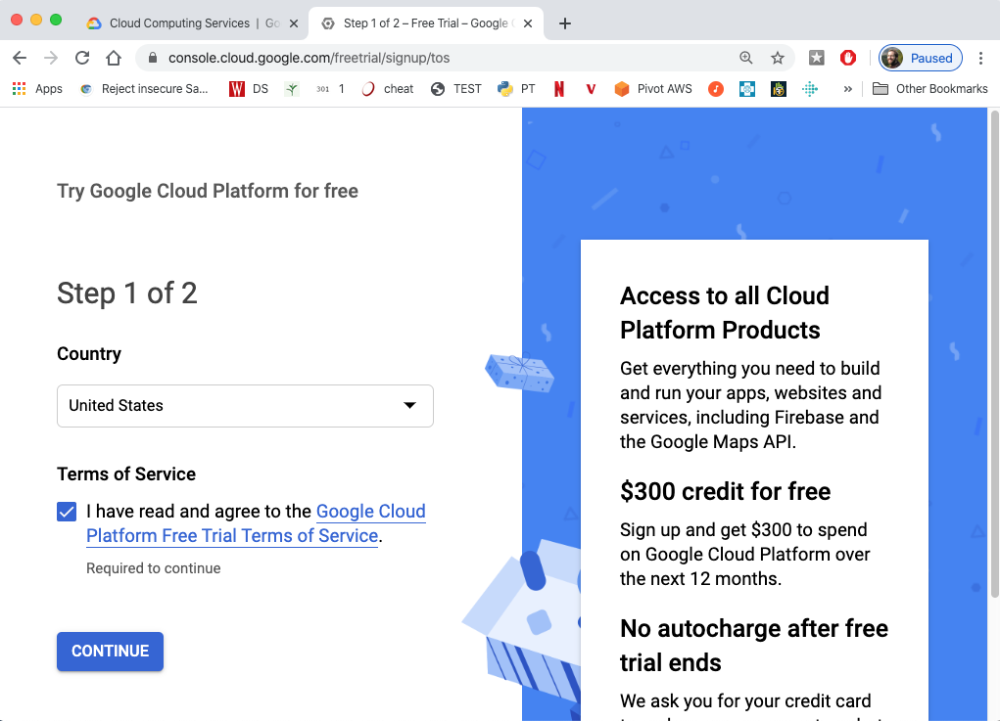
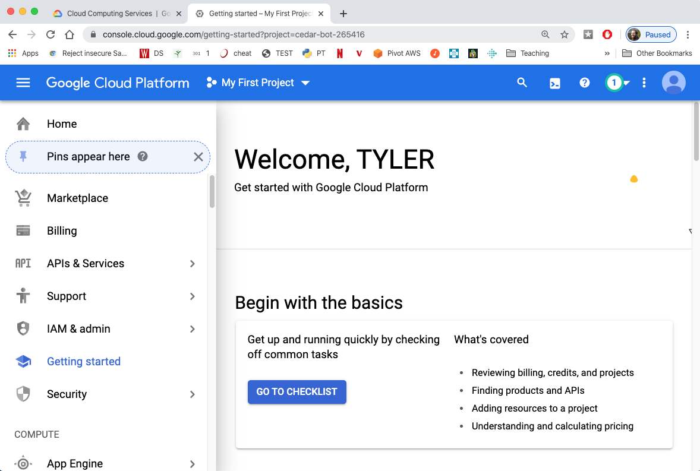
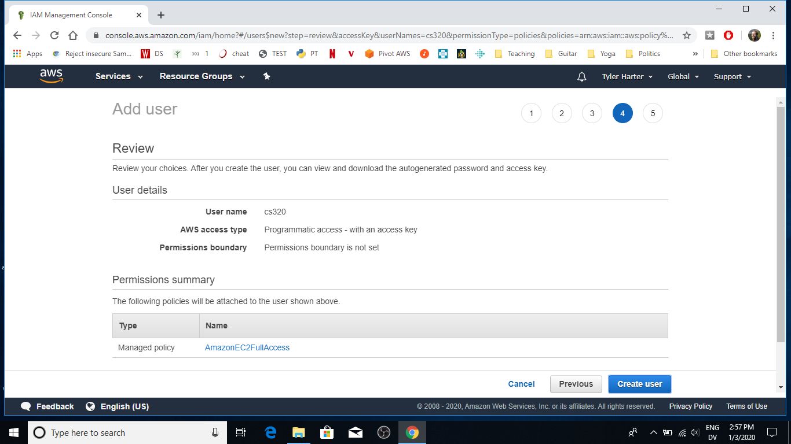
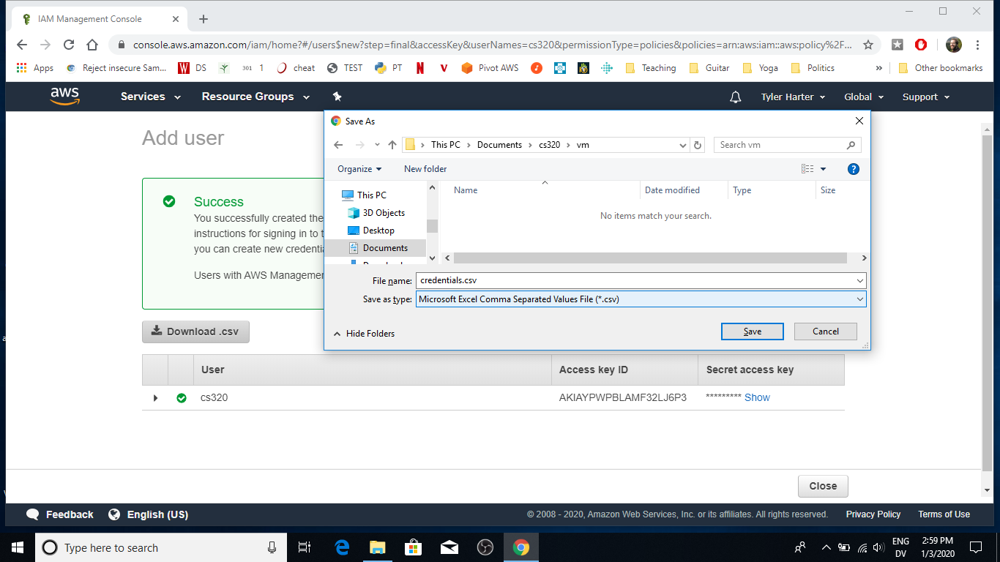
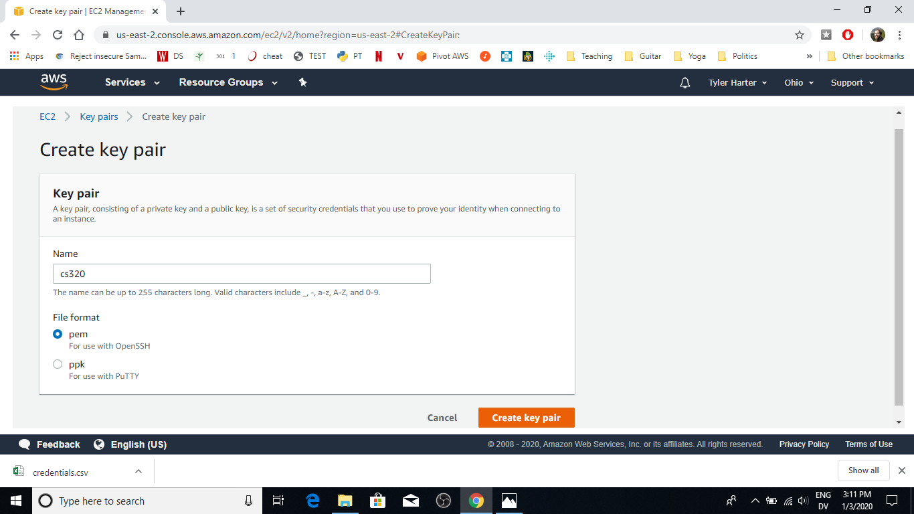
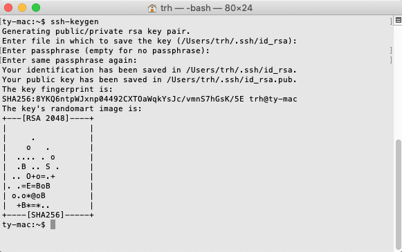
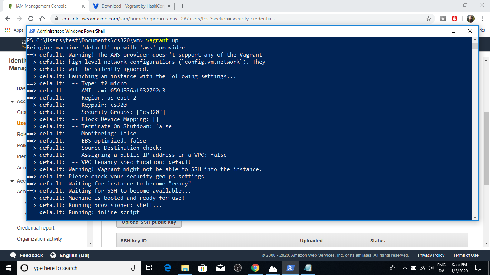
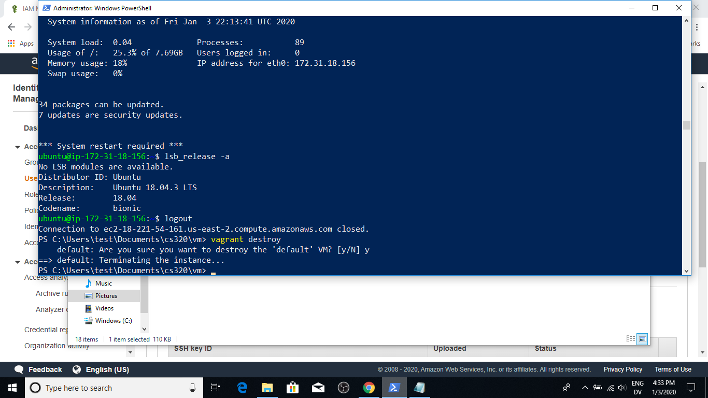

# Computer Setup for CS 320

In CS 320, you'll be writing your code and testing it on Linux --
Linux is a popular free operating system.  A big advantage of this is
that we auto-grade you on a Linux machine.  By using Linux yourself,
you'll usually know sooner if `test.py` is going to fail when we run
it.  Also, we can give you the exact steps we followed to install
various software on our Linux system, so you can do the same.

Of course, you probably already have Mac or Windows on your ~~laptop~~
machine, and we won't ask you to give that in up.  Instead, you'll be
running Linux on a "virtual machine".  You can think of a virtual
machine as a "fake" computer that you can install another operating
system on, like Windows or Linux.  The advantage is that you can have
multiple virtual machines on you ~~real computer~~ physical machine.
So you could in theory be running Mac, Window, and Linux programs on
your computer at the same time if you have the right virtual machines
setup!

Knowing how to create virtual machines is an important data-science
skill because it makes your analysis more *reproducible* -- if your
code works in your virtual machine, and other people know how to
reconstruct a similar virtual machine on their computer (with the same
operating system and programs installed), they're more likely to be
produce the same results by running your code.

Although you could install virtual machine software on your computer,
in this class we'll be renting virtual machines in Amazon's cloud
(called AWS) -- this generally isn't expensive (depending on which
type of virtual machine you choose, you could keep this under
$10/month).  You can sign up as a student for $100 of free credits, so
you'll probably end up paying nothing if you're careful not to create
lots of virtual machines.  Although you generally need to give Amazon
a credit card to create an account, you could buy a low-amount Visa
credit card to protect yourself from accidentally signing up for
expensive services not covered by your free credit.  Using AWS instead
of installing virtual-machine software on your own computer will
simplify things a bit, but it will still probably take you a couple
hours to set this up, and many of you will likely need some help.  We
recommend getting as far as you can at home, then coming to the first
lab for help with any issues you encounter.

## AWS (Amazon Cloud Services) Account

1. go to https://aws.amazon.com/education/awseducate/, enroll as a student using your @wisc.edu email to get $100 in AWS credit (they'll email you a code to redeem).



2. go to https://aws.amazon.com, then click "Sign In to the Console" (top right)

3. choose "Create a new AWS account" (if you don't already have one), complete the process, and sign into the console

4. go to https://console.aws.amazon.com/billing/home?#/credits and enter your the promo code that should have been emailed to you for step 1


## Creating an AIM User Credentials File

5. in the console, click "Services", find "IAM",  then click on "Users"


6. click "Add User", enter "cs320" for the user name, and check the box that says "Programmic access"



7. click "Next: Permissions", then select "Attach existing policies directly", then search for AmazonEC2FullAccess.  Check that one.  Then click "Next: Tags"



8. click "Next: Review" (you don't need tags)

9. click "Create user"



10. click "Download .csv".  Create a new directory named `vm` under a new `cs320` directory under your documents (or wherever you keep you course stuff).  Save the CSV as `credentials.csv` in the "vm" directory.  Remember where this vm directory is -- we'll reference it later



## EC2 (Virtual Machine) Configuration

11. click "Services" at the top of the window, type "EC2", and go to that service.  We'll need to decide where to create our virtual machine.  Ohio is the the closest to us, so click the menu in the top-right of the page, and select "US East (Ohio) us-east-2".  In general, you can choose where to create your instances, but configurations we'll give you later assume you pick us-east-2, so don't get creative.


12. There are several things we'll configure using the menu on the left -- "Instances" under "Instances" and "Security Groups" and "Key Pairs" under "Network & Security".  Go to "Key Pairs" first.  Click "Create Key Pair".


13. Call yours "cs320" and choose "pem".  Click "Create Key Pair".  A download box will popup -- save the file as `cs320.pem` in the vm directory you used in step 10.



14. Now navigate to "Security Groups" on the left, and click "Create Security Group"


15. Enter "cs320" for both the "Security group name" and "Description".  Under "Inbound", click "Add Rule".  For the rule, select "All traffic" for the "Type" and select "Anywhere" for the "Source".  This basically disables the firewall -- not a good idea to do in a high-stakes environment, but it's ok to sacrifice some security for convenience in a class.  Click "Create".



## Vagrant: Making a VM

16. Download and install the 64-bit Vagrant version for your laptop: https://www.vagrantup.com/downloads.html.  Vagrant helps you create virtual machines (on AWS and other places) with specific software installed.  You can use the defaults when installing Vagrant.


17. Open your terminal (on Windows, go to the start menu and search for PowerShell; on Mac, search for the Terminal app).

18. Use `cd` to navigate to the "vm" directory you created in step 10.


19. Install some Vagrant extensions with the following:

```
vagrant box add dummy https://github.com/mitchellh/vagrant-aws/raw/master/dummy.box
vagrant plugin install --plugin-version 1.0.1 fog-ovirt
vagrant plugin install vagrant-aws
```

20. Paste the following and run it: `wget https://raw.githubusercontent.com/tylerharter/cs320/master/s20/lab1/Vagrantfile -o Vagrantfile`.  The `wget` program lets you download things from the Internet with a simple command (no need to use a web browser).  Run `ls` to see the new file.


21. While still in the "vm" directory, run `vagrant up`.  This creates a new virtual machine in Amazon's cloud and installs Jupyter, pandas, and other tools.  This will probably take a few minutes.  Note that there are a couple warnings that show up, even when everything works fine (such as "Warning! The AWS provider doesn't support any of the Vagrant high-level network configurations" and "Warning! Vagrant might not be able to SSH into the instance").  The end is not too exciting -- you just get a lack of an error message at the end.


<br>


## Vagrant: Connecting to the VM

22. from inside the "vm" directory in the terminal, run `vagrant ssh`.  This should connect you to the Linux virtual machine.

23. run `lsb_release -a`.  If all is well, you'll see that you're running Ubuntu (a flavor of Linux), version 18.04.


24. to exit, type `CONTROL` and `D`

25. [OPTIONAL] if you want to kill the virtual machine (e.g., to conserve free AWS credits), you could run `vagrant destroy`.  Of course, if you do this later in the semester, make sure you've saved any work on the virtual machine first.  Keeping this one virtual machine running throughout the semester is not a bad idea.



Good work!  It's not easy setting up the first time, but using a
virtual machine should make things go smoother down the road.