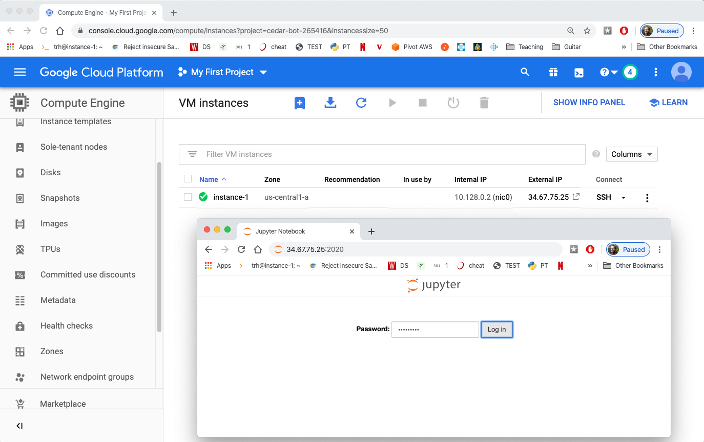

# Jupyter

1. Connect via SSH (or the Google Cloud Console) to your virtual machine.

2. Before we install Jupyter, let's get pip.  Run the following, and enter "Y" when prompted:

`sudo apt install python3-pip`

The `apt` program lets you install software on an Ubuntu system; think
of it like `pip`, for more general (you can install stuff not related
to Python).  Putting `sudo` in front of the command means "do this as
a super user".  You're signed in as a regular user, without permission
to install software by default, so you'll use `sudo` often for
installing tools and other tasks.

3. Now let's use pip3 to install Jupyter (don't use sudo for this one):

`pip3 install jupyter`

4. When you start Jupyter notebook remotely, you'll want to set a
password for connecting to it.  Make it a good one, or anybody will be
able to take over your VM!  Run the following:

`python3 -m notebook password`

5. Now let's start Jupyter.  Run the following:

`python3 -m notebook --ip=0.0.0.0 --port=2020`

6. Now, open up a new browser window, and type `IP:2020` for the URL
(IP should be the External IP of the virtual machine).  You can enter
the same password that you set in step 4:

7. After you login, make sure the setup works (e.g., you can create a
notebook and run code).

8. There's one last detail: if you close the terminal where you run
`python3 -m notebook ...`, you'll need to restart it again next time.
We want to put Jupyter in "background" mode so that we can close the
terminal window without killing Jupyter.  Within the terminal where
you started Jupyter, type `CTRL-Z` (yes, this is what you type in
other programs to "undo").  This pauses Jupyter and gives it a job ID
of 1.  Now type `bg 1`.  It will be running in the background now:

If you ever run the `jobs` command, you can see Jupyter running in the
background.  It should be safe to close the terminal window now.  Try
it, and make sure Jupyter still works in the browser (by refreshing
the page).

Good work on getting Jupyter running in your virtual machine!  We
suggest you bookmark the login page so you can come back to it later.
