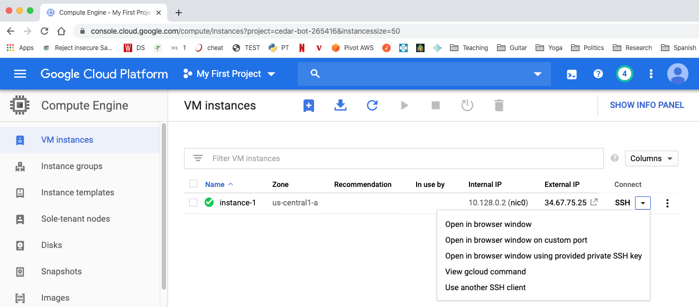

# Creating a Virtual Machine

1. in the menu on the left, expand the "Compute Engine" menu under
"COMPUTE" and click "VM Instances".  You should see the following, and you should click "Create".

2. under "Machine type" choose "g1-small".  If you were able to signup
for free credits earlier, you should be reminded of this on the right
hand side.

3. Scroll down to "Boot disk" and click "Change"

4. Select "Ubuntu" for the operating system.  Ubuntu is a popular
version of Linux (choosing a popular one is good because it's easier
to search for useful online suggestions when things go amiss).  Choose
"Ubuntu 18.04 LTS" for the version.  "LTS" stands for "Long Term
Support".  LTS versions aren't generally the most recent version, but
they're generally more reliable.

6. Further down, click to allow HTTP and HTTPS traffic, then click "Create".

7. You should see one instance here.  After the semester, or if you
ever want to start fresh with a new virtual machine, you may want to
delete the old virtual machines on this page.  Remember that you pay
per virtual machine (e.g., about $15/month for each small instance),
so it's a waste of money (or hopefully credits) to have more running
than necessary.

8. Make a note of the "External IP" -- you'll be using it again.
