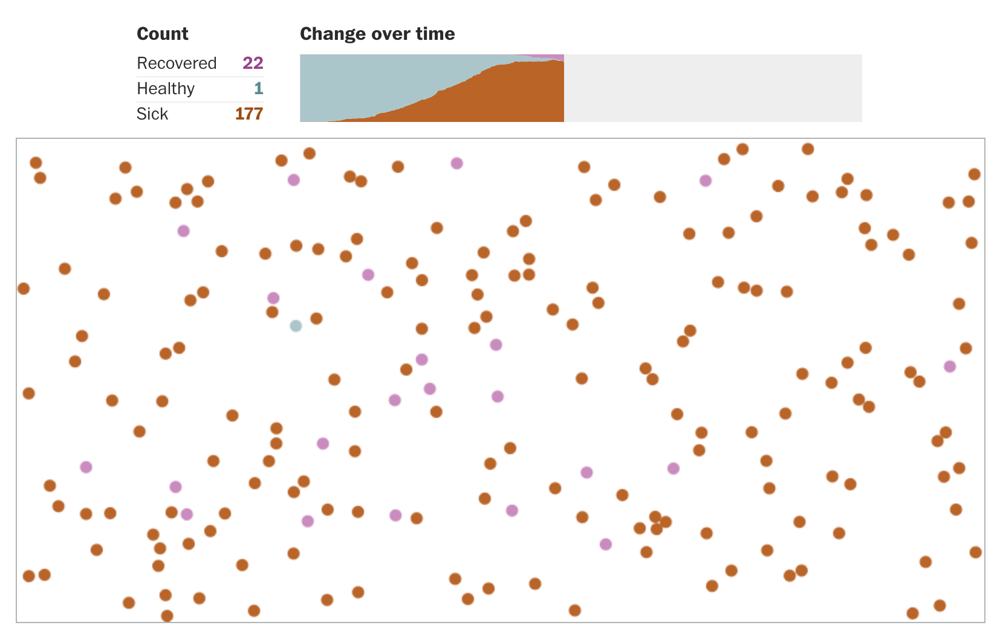
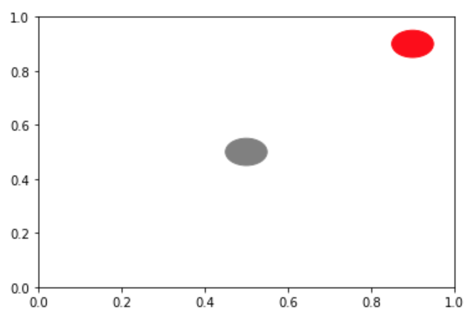

# Social/Physical Distancing

The Washington Post recently published a simple simulator and
animation to show the effect of social/physical distancing on the
spread of contagions.  It looked like this:



Check out the original
[here](https://www.washingtonpost.com/graphics/2020/world/corona-simulator/)
to see it in action.

The experiment is simple: (1) some number of circles move through a 2D
space, (2) some dots are infected, and (3) non-infected dots become
infected when they get close to infected dots.

In the first part of this lab, you'll build a simplified version of
this animation/simulation from scratch.  Try to follow our steps to do
it, but if you get really stuck, you can look at the complete solution
[here](part1-solution.md).

In a new notebook, first do some imports:

```python3
from matplotlib import pyplot as plt
from matplotlib.patches import Circle
from matplotlib.animation import FuncAnimation
from IPython.core.display import HTML
```

## `Person` class

Let's create a class to represent people.  We'll be showing people as
circles, so we can make our `Person` class inherit from the matplotlib
`Circle` patch:

```python
class Person(Circle):
    def __init__(self, ax, xy=(0.5,0.5), xyrate=(0.2,0.1), infected=False):
        Circle.__init__(self, xy, radius=0.05)
        self.xyrate = list(xyrate) # mutable, so we can update it
        self.set_infected(infected)
        ax.add_artist(self) # draw ourself on the canvas
        
    def set_infected(self, infected):
        self.infected = infected
        if self.infected:
            self.set_color("red")
        else:
            self.set_color("0.5")
```

Observations:
1. because a `Person` is a kind of `Circle` here, our `Person.__init__` immediately calls `Circle.__init__` so that we can initialize all circle-related attributes.
2. in general, we can call `ax.add_artist(SOME PATCH)`.  A `Circle` is a kind of patch, and a `Person` is a kind of `Circle`, therefore we can call `ax.add_artist(p)` where `p` is a `Person`.  Here, a `Person` automatically draws itself in the constructor.
3. in addition to having an `infected` attribute, we also have a `set_infected` method.  This is so we can automatically change the color of the circle based on the infected status.

Let's try making a person on a blank plot:

```python
fig,ax = plt.subplots()
p1 = Person(ax)
```

Can you add a second person at position (0.9, 0.9) who is infected?

<details>
    <summary>ANSWER</summary>
    <code>p2 = Person(ax, xy=(0.9,0.9), infected=True)</code>
</details>



## Motion

To animate people, we'll need to move them a bit for each frame.  How
much they should move depends on (a) how many seconds have passed and
(b) the rate at which they're moving.  `xyrate[0]` is the change in x
coordinates that should occur per second, and `xyrate[1]` is the same
for y.

Add+complete this method in `Person`:

```python
    def move(self, seconds):
        new_x = self.center[0] + self.xyrate[0] * seconds
        new_y = self.center[1] + ????
        self.set_center((new_x, new_y))
```

Let's create an animation with two people that calls `move` on each
person for each frame:

```python
fig, ax = plt.subplots(figsize=(6,6))

p1 = Person(ax)
p2 = Person(ax, xy=(0.2, 0.3), xyrate=(-0.3, 0), infected=True)
people = [p1, p2]

fps = 3
seconds = 15
frames = fps * seconds

def draw_frame(fnum):
    perc = fnum / frames
    for p in people:
        p.move(seconds=1/fps)

anim = FuncAnimation(fig, draw_frame, frames=frames, interval=1000/fps)
html = anim.to_html5_video()
plt.close(fig)
HTML(html)
```

## Bouncing

Right now, people run outside bounds of the plot and never get
infected.  Unfortunately, this is not a viable strategy for real
people.  To make it more accurate, the circles should bounce off the
edges when they've gone to far in some direction.

Bouncing just means changing the direction (but not speed) of either
the x or y rate.

Paste this code to the `move` method to implement horizontal bouncing:

```python
        # "bounce" off walls
        if new_x > ax.get_xlim()[1]:
            # too far right, move left
            self.xyrate[0] = -abs(self.xyrate[0])
        elif new_x < ax.get_xlim()[0]:
            # too far left, move right
            self.xyrate[0] = abs(self.xyrate[0])
```

Test it!  You'll notice the gray circle, which has some vertical
motion, eventually escapes the top of the area.  But the red circle,
which moves only horizontally, keeps bouncing back and forth.

Add some logic to `move` to implement vertical bouncing too.  It will
be similar, but in terms of `new_y`, `get_ylim()`, and `xyrate[1]`.

## Contagion

You might notice that around 11 seconds in, the two circles come in
contact, but the healthy circle does not become infected.

Add this function to check whether two circles are touching:

```python
    def in_contact(self, other):
        xdiff = self.center[0] - other.center[0]
        ydiff = self.center[1] - other.center[1]
        dist = (xdiff**2 + ydiff**2) ** 0.5
        return dist < self.radius + other.radius
```

Now, add this (and complete it with a call to `in_contact`), inside
the loop inside the `draw_frame` function:

```python
        if p.infected:
            for other in people:
                if p.????:
                    other.set_infected(True)
```

## Making it Better

Optional things to try (if you like):

1. increase the FPS to get a smoother video, like [this](part1.mp4).
2. add more people
3. randomize the starting points and `xyrate`s for each person
4. enforce social/physical distancing on some subset of the points (by setting `xyrate` to `(0,0)`) and observe the impact on how many get infected in a given time frame
5. implement recovery -- after some amount of time, circles should become well, unable to infect others and unable to become infected again
