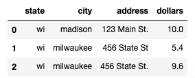

# Lab 11: SQL JOIN and Counting Cells

## Corrections

* Apr 7: add `SUM` (which had been forgotten) to several queries

## Part 1: SQL JOIN

Let's review SQL, then learn a very important new operator, JOIN.
First, create a database with information about sales at two grocery
store locations:

```python
import pandas as pd
import sqlite3

df = pd.DataFrame([
    {"state": "wi", "city": "madison", "address": "123 Main St.", "item": "apples", "quantity": 3, "price": 1},
    {"state": "wi", "city": "madison", "address": "123 Main St.", "item": "oranges", "quantity": 4, "price": 0.8},
    {"state": "wi", "city": "madison", "address": "123 Main St.", "item": "cantaloupe", "quantity": 5, "price": 2},
    {"state": "wi", "city": "milwaukee", "address": "456 State St", "item": "apples", "quantity": 6, "price": 0.9},
    {"state": "wi", "city": "milwaukee", "address": "456 State St.", "item": "oranges", "quantity": 8, "price": 1.2},
])
connection = sqlite3.connect("grocery.db")
df.to_sql("sales", connection, if_exists="replace", index=False)
```

Take a look at the data:

```python
pd.read_sql("SELECT * FROM sales", connection)
```

To review `GROUP BY`, take a look at this query that computes how much
revenue each kind of fruit generates and run it:

```python
pd.read_sql("SELECT item, SUM(quantity*price) AS dollars FROM sales GROUP BY item", connection)
```

Now, try to write a query that counts sales per location.

<details>
    <summary>ANSWER</summary>
    <code>
    pd.read_sql("SELECT state, city, address, SUM(quantity*price) AS dollars FROM sales GROUP BY state, city, address", connection)
    </code>
</details>

Notice a problem?  The issue is that all address information is
repeated for each location.  That wastes space, but much worse, it
opens the possibility for typos leading to results such as this:



To avoid these issues, it's common in practice to break up such a
table into two smaller tables, perhaps named `locations` and `sales`.
A `location_id` field might make it possible to combine the
information.

```python
df = pd.DataFrame([
    {"location_id": 1, "state": "wi", "city": "madison", "address": "123 Main St."},
    {"location_id": 2, "state": "wi", "city": "milwaukee", "address": "456 State St."},
])
df.to_sql("locations", connection, if_exists="replace", index=False)

df = pd.DataFrame([
    {"location_id": 1, "item": "apples", "quantity": 3, "price": 1},
    {"location_id": 1, "item": "oranges", "quantity": 4, "price": 0.8},
    {"location_id": 1, "item": "cantaloupe", "quantity": 5, "price": 2},
    {"location_id": 2, "item": "apples", "quantity": 6, "price": 0.9},
    {"location_id": 2, "item": "oranges", "quantity": 8, "price": 1.2},
])
df.to_sql("sales", connection, if_exists="replace", index=False)
```

Take a look at each table:

* `pd.read_sql("SELECT * FROM sales", connection)`
* `pd.read_sql("SELECT * FROM locations", connection)`

Note that you *could* figure out the location for each sale in the
`sales` table by using the `location_id` to find that information in
`locations`.

There's an easier way, `INNER JOIN` (there are other kinds of joins
that we won't discuss in CS 320).

Try running this:

```
pd.read_sql("SELECT * FROM locations INNER JOIN sales", connection)
```

Notice that the `INNER JOIN` is creating a row for every combination
of the 2 rows in `locations` and the 5 rows in `sales`, for a total of
10 result rows.  Most of these results are meaningless: many of the
output rows have `location_id` appearing twice, with the two values
being inconsistent.

We need to add an `ON` clause to match up each `sales` row with the
`locations` row that has the same `location_id`.  Add `ON
locations.location_id = sales.location_id` to the end of the query:

```python
pd.read_sql("SELECT * FROM locations INNER JOIN sales ON locations.location_id = sales.location_id", connection)
```

The `location_id` was only useful for matching up the rows, so you may
want to drop in in pandas (there's not a simple way in SQL):

```python
pd.read_sql("""
  SELECT * FROM 
  locations INNER JOIN sales 
  ON locations.location_id = sales.location_id""",
  connection).drop(columns="location_id")
```

We can also do similar queries as we could before when we only had one
table.  The `GROUP BY` will come after the `INNER JOIN`.  How much
revenue did each fruit generate?

```python
pd.read_sql("""
  SELECT item, SUM(quantity*price) AS dollars
  FROM locations INNER JOIN sales 
  ON locations.location_id = sales.location_id
  GROUP BY item""", connection)
```

Now, try write a query to answer the question, how much revenue was
there at each location?

<details>
    <summary>ANSWER (option 1)</summary>
    <code>
pd.read_sql("""
  SELECT state, city, address, SUM(quantity*price) AS dollars
  FROM locations INNER JOIN sales 
  ON locations.location_id = sales.location_id
  GROUP BY state, city, address""", connection)
    </code>
</details>

<details>
    <summary>ANSWER (option 2)</summary>
    <code>
pd.read_sql("""
  SELECT state, city, address, SUM(quantity*price) AS dollars
  FROM locations INNER JOIN sales 
  ON locations.location_id = sales.location_id
  GROUP BY locations.location_id""", connection)
    </code>
</details>

## Part 2: Counting Cells

Run the following:

```python
import numpy as np
a = np.array([
    [0,0,5,8],
    [1,2,4,8],
    [2,4,6,9],
])
```

How many even numbers are in this matrix?  What percentage of the
numbers are even?  We'll walk you through the solution.  Please run
each step (which builds on the previous) to see what's happening.

First step, mod by 2, to get a 0 in every odd cell:

```python
a % 2
```

Now, let's do an elementwise comparison to get a True in every place where there is an even number:

```python
a % 2 == 0
```

It will be easier to count matches if we represent True as 1 and False as 0:

```python
(a % 2 == 0).astype(int)
```

How many is that?

```python
(a % 2 == 0).astype(int).sum()
```

And what percent of the total is that?

```python
(a % 2 == 0).astype(int).mean() * 100
```

This may be useful for counting what percentage of an area matches a
given land type in P5.
