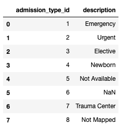

# Lab 13: Project 6 Hints

This lab provides help on solving q6 and q7 of the project (feel free
to skip if you've already figured out how to do those).  The challenge
is that one .csv file actually contains three tables, each of which we
would like to convert to a dictionary.

Our strategy will be as follows:
1. read the original .csv to a string
2. split it to three parts, and write each to it's own CSV file, outside of the zip
3. read each individual CSV with pandas
4. get a dictionary from the DataFrame

Before getting started, download the P6 data here:
https://github.com/tylerharter/cs320/raw/master/s20/p6/dataset_diabetes.zip

## Step 1: Original to String

Run the following:

```python
from zipfile import ZipFile

with ZipFile("dataset_diabetes.zip") as zf:
    with zf.open("dataset_diabetes/IDs_mapping.csv") as f:
        data = f.read()
type(data)
```

As you can see, the type of `data` is `bytes`.  Unfortunately,
`ZipFile.open` opens the compressed files in binary mode by default.

Run this in a cell:

```python
str(data, "utf-8")
```

You should see something like this:

`'admission_type_id,description\r\n1,Emergency\r\n...`

What is `\r`?

Look at the "Escape sequence" column here:
https://en.wikipedia.org/wiki/Newline#Representation

Note that newlines are often represented different on different
systems.  On Mac and Linux, you get `\n` (called a "line feed") that
you would expect.  Strangely, on Windows, newlines are represented by
two characters together: `\r\n` (a "carriage return" followed by a
"line feed").

Clearly, our data was generated by the Windows format.  In general in
Python, if we can process data using something called [universal newlines](https://docs.python.org/3/glossary.html#term-universal-newlines), we don't have to worry about the distinction, and we'll always get `\n`, regardless of what is in the file.

Look at the `TextIOWrapper` object: https://docs.python.org/3/library/io.html#io.TextIOWrapper.  Note that "if newline is None, universal newlines mode is enabled", and that the default argument for `newline` is `None`.  So using a `TextIOWrapper` with the defaults will solve our problem:

```python
from zipfile import ZipFile
from io import TextIOWrapper

with ZipFile("dataset_diabetes.zip") as zf:
    with zf.open("dataset_diabetes/IDs_mapping.csv") as f:
        data = TextIOWrapper(f).read()
type(data)
```

Yay, now we have a string!  Run the following in a cell:

```python
data
```

You should see something like this:

`'admission_type_id,description\n1,Emergency\n...`

No more pesky Windows-style carriage returns. :)

## Step 2: Creating Three CSV Files

If you run `print(data)`, you'll see this:

```
admission_type_id,description
1,Emergency
2,Urgent
3,Elective
4,Newborn
5,Not Available
6,NULL
7,Trauma Center
8,Not Mapped
,
discharge_disposition_id,description
1,Discharged to home
2,Discharged/transferred to another short term hospital
```

As you can see, the different tables in the file are separated by
lines that have a single comma.  Let's split this data to files named
`admission_type_id`, `discharge_disposition_id`, etc.  First get the parts:

```python
parts = data.split("\n,\n")
len(parts)
```

Hopefully you got three!

Complete the code to write the

for p in parts:
    name = p[:p.index(",")] + ".csv"
    print(name)
    # TODO: write the string p to a file named name.
    # no need to use the CSV module!

## Step 3: CSVs to DataFrame

Can you read the CSVs just created?

```python
import pandas as pd
df = pd.read_csv("admission_type_id.csv")
df
```



Read all three into CSVs into DataFrames.

## Step 4: DataFrame to dictionary

We would like the `admission_type_id` column entries to be the keys in
a dictionary and the `description` column entries to be the
corresponding values (and similar for the other data).  Remember that
if we can get the data into a pandas Series, it's easy to convert to a
dict.

Try each of the following (each builds on the previous) to see the strategy:

1. `df.set_index("admission_type_id")`
2. `df.set_index("admission_type_id")["description"]`
3. `dict(df.set_index("admission_type_id")["description"])`

## Conclusion

Hopefully getting those three dictionaries from that original CSV will
help you need to covert `admission_source_id` and
`discharge_disposition_id` values in the main DataFrame to
descriptions!