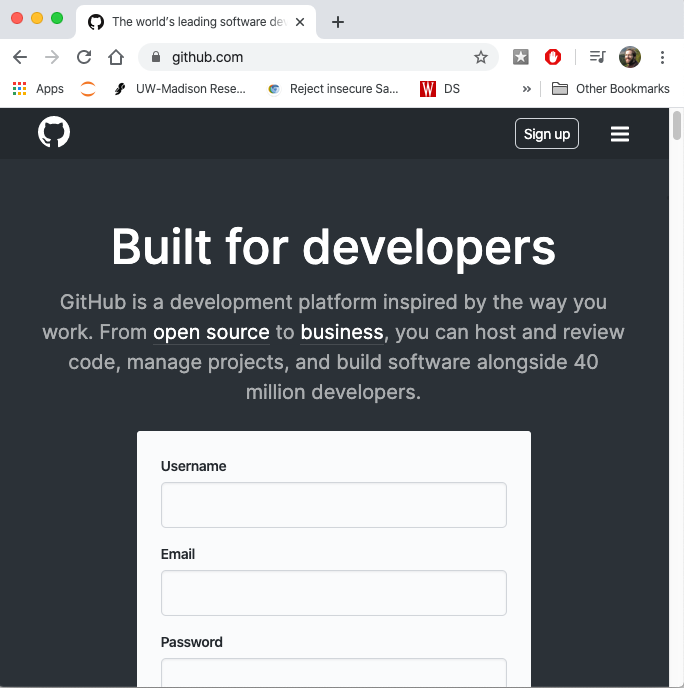
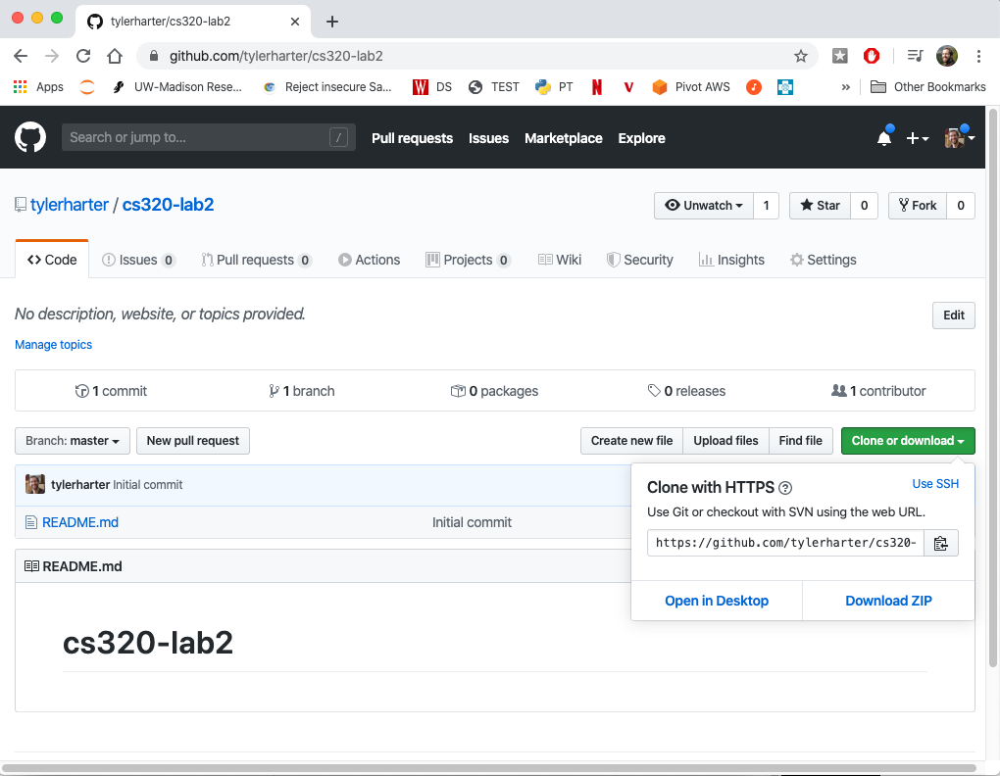
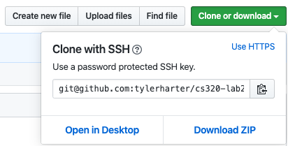
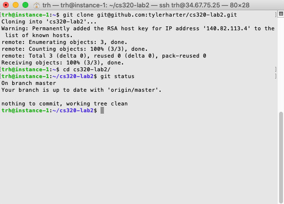

# Lab 2: Git Practice

In this lab, you'll practice using git and GitHub.  Git is a
collaborative tool, so make sure you **form a group of 2-3 people** to do
this lab together.

You can do this lab on your virtual machine, which should already have
git installed (and even not, installing git on Ubuntu can be done with
a simple `apt` command, like this: `sudo apt install git`).

It's probably a good idea to install git on your own laptop at some
point.  Windows directions: https://git-scm.com/download/win.  Mac
directions:
https://www.ics.uci.edu/~pattis/common/handouts/macmingweclipse/allexperimental/macxcodecommandlinetools.html.
You're welcome to do this lab directly on your laptop (not through the
virtual machine), though if you run into any tricky issues installing
or using git directly on your laptop, we might ask you to switch to
using your virtual machine.

## Step 1: Practice Git Branching

Let's start by practicing in the Git simulator <a
href="https://tyler.caraza-harter.com/cs320/s20/learnGitBranching/index.html"
target="_blank">here</a>.  Try to run commands to get to the following state (if you get stuck, check the [solution here](solution.md)):

Useful commands for the above problem:
* `git commit`: make a new commit
* `git branch bname`: create a branch named `bname`
* `git checkout bname`: move `HEAD` to the commit referenced by the `bname`
* `git checkout c1`: move `HEAD` to the `c1` commit
* `git merge bname`: merge changes on the `bname` branch into the current branch
* `git branch -D bname`: delete the branch named `bname`

Ready for a real challenge?  Try to get to this state (no answer to
check for this one, so you'll need to work for it!):

**Hint:** start by creating commits on four branches, b1, b2, b3, and b4.
Merge b2 into b1 and b4 into b3.  Then merge the two merge commits
with a third merge commit.

## Step 2: Create GitHub Account

Everybody in your group should go to http://github.com/ and create a
GitHub account (choose a name that wouldn't embarrass you on a
resume):

Later, running certain git commands will make you type your GitHub
password each time, unless you setup an SSH key to use instead of a
password (you likely setup an SSH key during the first lab to access
your virtual machine).  It's recommended (but not required) that you
configure GitHub with an SSH key following [these directions](ssh.md).

## Step 3: Create and Fork/Clone a Repo

Identify one person to be the **team leader** -- it should be whoever
has an upcoming birthday the soonest.

The **leader** should go to https://github.com/new and create a public
repo called "cs320-lab2", initialized with a README (the other people
working on the lab will have another role to play):

This should create a repo at https://github.com/tylerharter/cs320-lab2
(with the leader's GitHub name instead of "tylerharter").  All team
members should go there and click the "Clone or download" link:

The preferred option for any team member that configured their SSH
keys is to click "Use SSH" (the HTTPS option would also work, it but
would require frequent typing of your password later):

Everybody should copy that clone address, then run the command `git
clone ADDRESS` in the shell, replacing "ADDRESS" with whatever was
copied.  This will create a new directory to which you can `cd` and
run `git status`.  These three steps should look something like this:

## Step 4: Making a Change and Pull Request

We'll pretend that your group is creating some pages for a new company
you're starting together.  **Agree on a company name now for your
group.**

**Leader Only:** you should create some initial pages (other team
  members will later make additions.  Type `nano README.md` from in
  the `cs320-lab2` directory.  Type in your company name and a brief
  description.  Save the file by typing `CTRL-O` (control and "O"
  keys at same time).

Exit with `CTRL-X` and edit a `team.md` file by typing `team.md`; put
in the leader's name, and a note for others to add themselves:

