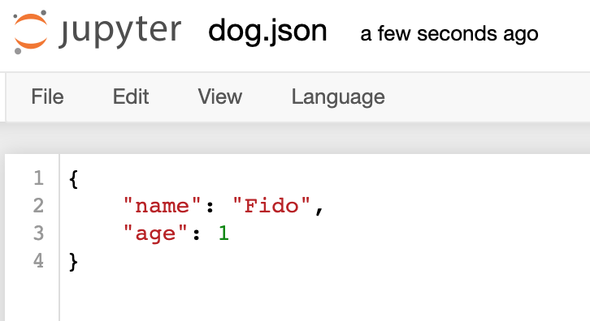

# Part 1: Review Files and JSON

## Writing

Let's try writing a file.  Paste the following and run it (it's buggy!):

```python
f = open("file.txt")
f.write("line1")
f.write("line2")
f.close() # you need the parentheses, even without arguments!
```

The code fail because the file wasn't opened in write mode.  Add "w"
as a second positional arguments to `open`, then try again.

Does the above code actually produce two lines?  Open `file.txt`
through Jupyter and check.  Try modifying the "line1" and "line2"
strings to get two different lines, so that `file.txt` looks like this:

```
line1
line2
```

## Reading

Create a file named `dog.json` in Jupyter.  You can use the "New / Text File" menu, like this:


Copy the following:

```json
{
    "name": "Fido",
    "age": 1
}
```

Paste it into `dog.json`, and be sure to SAVE it:



Now, back in your notebook, run this:

```python
f = open("dog.json")
input1 = f.read()
input2 = f.read()
f.close()
```

What is `type(input1)`?

Print out `input1`, then print `input2`.  Notice that `input2` is the
empty string?  That's because the first read call consumes all the
input, and there's nothing left for the second read call.  To get the
data again, you could re-open the file, then re-read it again.

Note that `f` is a file object.  Calling `.read` is only one way to
get the contents.  File objects are iterators, meaning that you could also loop over `f` -- try it:

```python
f = open("dog.json")
for line in f:
    print("LINE: " + line, end="")
f.close()
```

You can also create lists from iterators.  Try that:

```python
f = open("dog.json")
lines = list(f)
f.close()

print("GOT", len(lines), "lines")
```

## `with`

It's easy to forget to close a file.  Python has a special `with`
statement that can do it automatically for you.  This:

```python
f = open("dog.json")
lines = list(f)
f.close()
```

Is equivalent to this (try it):

```python
with open("dog.json") as f:
    lines = list(f)
# f is automatically closed after the with block
```

## JSON

Your data may be in the following forms:

1. a file object
2. a string
3. a dict (or other Python data type)

`json.load` converts from (1) to (3).  `json.loads` converts from (2)
to (3).  Fix the following code so it uses the appropriate load
function:

```python
import json

with open("dog.json") as f:
    dog = json.loads(f) # fixme
```

Check that `type(dog)` is a `dict`.

Now fix this one too:

```python
data = '{"name": "Fido", "age": 1}'
dog = json.load(data) # fixme
```

And one more:

```python
with open("dog.json") as f:
    data = f.read()
    dog = json.load(data) # fixme
```
