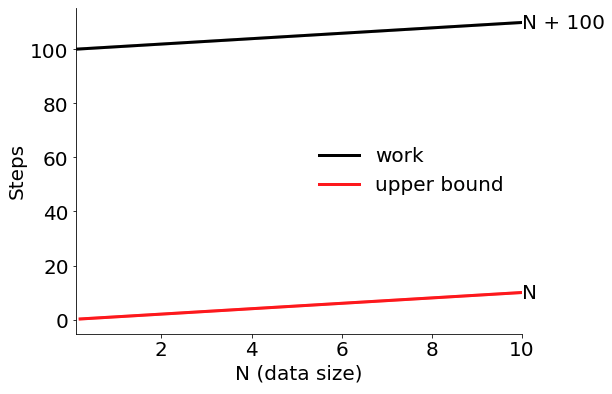
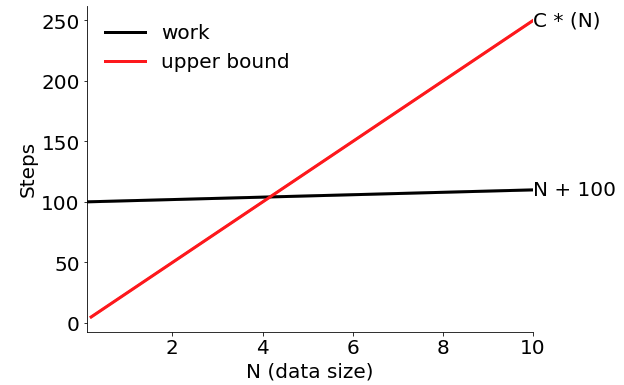
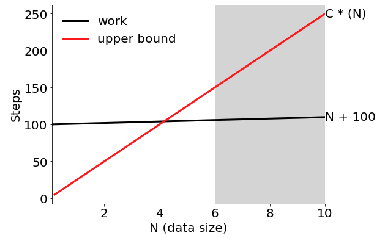

# Part 2: Visualizing Order of Growth

In this part, you'll get to visually experiment with different C
values and lower bounds on N in order to show that a function fits a
certain order of growth.  To start, do some imports:

```python
import pandas as pd
import matplotlib
from matplotlib import pyplot as plt
from math import log2, log10, ceil
```

Also remember to do `%matplotlib inline`

Now paste the following code in a cell (you don't need to understand it for the purposes of this lab):

```python
matplotlib.rcParams["font.size"] = 20

def get_ax():
    fig, ax = plt.subplots(figsize=(8,6))
    ax.spines["right"].set_visible(False)
    ax.spines["top"].set_visible(False)
    ax.set_xlim(1, 10)
    return ax

def scale_ax():
    ax = get_ax()
    ax.set_xlabel("N (data size)")
    ax.set_ylabel("Steps")
    return ax

def plot_func(ax, f, C=1, color="k", label="work"):
    f = f.upper()
    start = ax.get_xlim()[0]
    width = ax.get_xlim()[1] - ax.get_xlim()[0]
    s = pd.Series()
    for i in range(100):
        N = start + width * (i+1)/100
        s[N] = eval(f)
    s.sort_index().plot(ax=ax, color=color, linewidth=3, label=label)
    plt.text(s.index[-1], s.iloc[-1], f, verticalalignment='center')
    
def upper_bound(ax, order, C=1, minN=None):
    f = order
    if C != 1:
        f = "C * (%s)" % order
    plot_func(ax, f, C=C, color="r", label="upper bound")
    if minN != None:
        ax.axvspan(minN, ax.get_xlim()[1], color='0.85')
    ax.legend(frameon=False)
```

## Exercise 1: show `N+100` is in `O(N)`.

You need to show that some multiple of `N` is an upper bound on
`N+100` for large values of `N`.  Paste+run this code:

```python
ax = scale_ax()
ax.set_xlim(0, 10) # TODO: change upper bound
plot_func(ax, "N + 100")

upper_bound(ax, order="N") # TODO: pass C and minN
```

It should look like this:



Clearly `g(N)=N` is not an upper bound on `g(N)=N+100`, but remember
that you are allowed to do the following:

1. multiple `g(N)` by a constant `C`
2. require that `N` be large

To use your first capability, pass in a `C` value of of 25, changing the call to `upper_bound(...)` to be like this:

```python
upper_bound(ax, order="N", C=25)
```

It should look like this:



Better, but now the red line is only an upper bound for large `N`
values.  Let's set a lower bound on `N`, like this:

```python3
upper_bound(ax, order="N", C=25, minN=6)
```

It should look like this:



<b>In general for all of these exercises, your job is to choose `C` and
  `minN` values so that the red line is above the black line in the
  shaded portion.</b>

Finally, you should make sure the upper bound keeps holding for large
N values.  If this were a math course, you would prove this is true
for all large N values.  But since this is a programming course, let's
just make the `xlim` really big and make sure there are no obvious
problems, like this:

```python
ax.set_xlim(0, 1e6) # 1 million
```

Looks good!


## Exercise 2: show `100*N` is in `O(N)`.

Start with this:

```python
ax = scale_ax()
ax.set_xlim(0, 10)
plot_func(ax, "100*N")

upper_bound(ax, order="N")
```

Do you need to set `minN` for this one, or is choosing the right `C` good enough?

## Exercise 3: show `N**2 + 5*N + 25` is in `O(N**2)`

Start with this:

```python
ax = scale_ax()
ax.set_xlim(0, 10)
plot_func(ax, "N**2 + 5*N + 25")

upper_bound(ax, order="N**2")
```

## Exercise 4: *try* to show `2*N + (N/15)**4` is in `O(N)`

Start with this:

```python
ax = scale_ax()
ax.set_xlim(0, 10)
plot_func(ax, "2*N + (N/15)**4")

upper_bound(ax, order="N")
```

Use `C=3` and `minN=1`.

What happens when you increase the x limit to 75?

```python
ax.set_xlim(0, 75)
```

It turns out `2*N + (N/15)**4` is NOT in `O(N)` after all.  What
Big O order of growth does `2*N + (N/15)**4` have?

## Exercise 5: show `log2(N)` is in `O(log10(N))`

Start with this:

```python
ax = scale_ax()
ax.set_xlim(1, 100)
plot_func(ax, "log2(N)")

upper_bound(ax, order="log10(N)")
```

Any `C` value that is at least `log2(10)` will work here.  In general,
any log curve with base M is just a constant multiple of another log
curve with base N.  Thus, it is common to just save an algorithm is
`O(log N)`, without bothering to specify the base.

## Exercise 6: show `ceil(log2(N))` is in `O(log N)`

Start with this:

```python
ax = scale_ax()
ax.set_xlim(1, 100)
plot_func(ax, "ceil(log2(N))")

upper_bound(ax, order="log2(N)")
```

## Exercise 7: show `N * ceil(log2(N))` is in `O(N log N)`

Start with this:

```python
ax = scale_ax()
ax.set_xlim(1, 100)
plot_func(ax, "N * ceil(log2(N))")

upper_bound(ax, order="N * log2(N)")
```

## Exercise 8: show `F(N) = 0+1+2+...+(N-1)` is in `O(N**2)`

```python
ax = scale_ax()
ax.set_xlim(1, 100)
plot_func(ax, "sum(range(int(N)))")

upper_bound(ax, order=????)
```