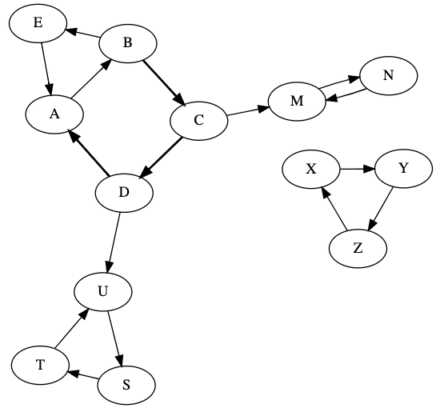

# Graphs

Let's practice graphs by looking at a slightly new problem.  You and
your friends live on different nodes in a directed graph (maybe that's
a problem in and of itself, but it's not the one we're interested in
here).

The problem: if you want to meet your friend, can you get a nice list
of all the potential nodes where you could meet?

Let's reduce this to a simpler problem: what nodes can you reach?  If
we know that, and which ones your friend can reach, the original
question is a piece of cake.

Previously, we've seen how we can used recursive DFS (depth-first
search) and non-recursive BFS (breadth-first search) to find paths.
We used *visited* sets to keep from going in cycles (if you're not
careful, you can get a *stack overflow* with a recursive DFS, or keep
growing the BFS `todo` queue until memory is exhausted).

Now, we're more interested in that `visited` set than we are in
finding an actual path.  We could run either DFS or BFS then look at
`visited` to learn which nodes are reachable from a given starting
point.  We'll use recursive DFS in this example.

## The Graph

Paste+Run the following:

```python
from graphviz import Digraph

class visit_graph:
    def __init__(self):
        self.nodes = {}
        self.visited = None

    def node(self, name):
        name = str(name).upper()
        self.nodes[name] = Node(self, name)

    def edge(self, src, dst):
        src, dst = str(src).upper(), str(dst).upper()
        for name in [src, dst]:
            if not name in self.nodes:
                self.node(name)
        self.nodes[src].children.append(self.nodes[dst])

    def _repr_svg_(self):
        g = Digraph(engine='neato')
        for n in self.nodes:
            g.node(n)
            children = self.nodes[n].children
            for i, child in enumerate(children):
                g.edge(n, child.name, penwidth=str(len(children) - i), len="1.2")
        return g._repr_svg_()
    
class Node:
    def __init__(self, graph, name):
        self.graph = graph
        self.name = name
        self.children = []

    def __repr__(self):
        return "node %s" % self.name
```

Now let's create a graph with it:

```python
g = visit_graph()
# group 1
g.edge("A", "B")
g.edge("B", "C")
g.edge("C", "D")
g.edge("D", "A")
g.edge("B", "E")
g.edge("E", "A")
# group 2
g.edge("X", "Y")
g.edge("Y", "Z")
g.edge("Z", "X")
# group 3
g.edge("S", "T")
g.edge("T", "U")
g.edge("U", "S")
# group 4
g.edge("M", "N")
g.edge("N", "M")
# connections from group 1 to 3 and 4
g.edge("D", "U")
g.edge("C", "M")

g
```

It ought to look something like this:



## Finding Reachable Nodes

Add+complete a `dfs` method in `Node`:

```python
    def dfs(self):
        if self.name in self.graph.visited:
            return
        ????.add(self.name)
        for child in self.children:
            child.????()
```

Also add+complete a `meetup` method in `visit_graph`:

```python
    def meetup(self, you, friend):
        # where can you get to?
        you_reach = set()
        self.visited = you_reach
        self.nodes[you].dfs()

        # what about your friend?
        friend_reach = set()
        self.visited = friend_reach
        self.nodes[friend].????()

        # take the set intersection
        return you_reach & friend_reach
```

## Trying it Out

Now we can use the `meetup` method to see where people starting on two
different nodes could potentially meet each other.

Try running following six examples.  But first, write down what you
think the final set will be in each case.

You can learn a LOT by making a prediction about what will happen when
you run some code, then comparing your predictions to what actually
happens.

1. `g.meetup("S", "T")`
2. `g.meetup("A", "T")`
3. `g.meetup("A", "Z")`
4. `g.meetup("A", "N")`
5. `g.meetup("U", "M")`
6. `g.meetup("A", "B")`

## Key Concepts
 * node, edge (directed and non-directed)
 * path, shortest path
 * connected, weakly connected
 * important structures to remember: graph, directed graph, DAG, tree, binary tree, BST, linked list
 * parent+child, ascestor+descendant, root+leaf
 * BFS vs. DFS

## Resources
 * https://github.com/tylerharter/cs320/blob/master/s20/lab4/part1.md
 * https://github.com/tylerharter/cs320/blob/master/s20/lab5/part1.md
 * https://github.com/tylerharter/cs320/blob/master/s20/lab5/part3.md
 * https://tyler.caraza-harter.com/cs320/s20/reading/lec-10-graphs.html
 * https://tyler.caraza-harter.com/cs320/s20/reading/lec-12-dict-graph-search.html
 * https://tyler.caraza-harter.com/cs320/s20/reading/lec-13-bfs.html
 * https://tyler.caraza-harter.com/cs320/s20/reading/lec-14-dense-graphs.html
 * https://tyler.caraza-harter.com/cs320/s20/materials/lec-12.pdf
 * https://tyler.caraza-harter.com/cs320/s20/materials/lec-13.pdf
 * https://tyler.caraza-harter.com/cs320/s20/materials/lec-14.pdf
