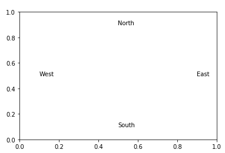

# Object Oriented Programming

## Part 1: Creating a Class

Create a `Point` class and two point instances (complete the code!):

```python
from matplotlib import pyplot as plt
import time

class Point:
    def __init__(self, x, y):
        self.create_time = time.time()
        self.x = x
        self.y = ????

    def dist(self, other_pt):
        return ((self.x-other_pt.x) ** 2 + (self.y-other_pt.y) ** 2)**0.5

    def length(self):
        return self.dist(Point(0, 0))

pt1 = Point(3, 4)
pt2 = Point(3, 10)
```

What methods does `Point` have?

<details>
<summary>Answer</summary>
__init__, dist, length (more if we count ones inherited from object)
</details>

What attributes does `Point` have?

<details>
<summary>Answer</summary>
create_time, x, y (notice that only two of these were passed in as parameters; the constructor computed create_time itself!)
</details>

## Part 2: Calling Methods

Simplify the following calls using the method calling syntax:

```python
type(pt1).length(pt1)
type(pt2).length(pt2)
type(pt1).dist(pt1, pt2)
```

<details>
<summary>Answer</summary>
<pre>
pt1.length()
pt2.length()
pt1.dist(pt2)
</pre>
</details>

## Part 3: Special Methods

Add a `__lt__` method so that points will be sorted by `create_time`.  Also add a `__repr__` method.

Test your solution!  This code:

```python
pt1 = Point(0, 0)
pt2 = Point(1, 1)
pt3 = Point(0, 2)
pt4 = Point(-1, 1)
pt5 = Point(0, 0)
points = [pt5, pt3, pt1, pt2, pt4]
points.sort()
print(points)
```

Should print this:

```
[Point(0, 0), Point(1, 1), Point(0, 2), Point(-1, 1), Point(0, 0)]
```

<details>
<summary>Solution Part 1</summary>
<pre>
def __lt__(self, other_pt):
    return self.create_time < other_pt.create_time
</pre>
</details>

<details>
<summary>Solution Part 2</summary>
<pre>
def __repr__(self):
    return "Point({}, {})".format(self.x, self.y)
</pre>
</details>

## Part 4: Inheritance

Add+complete the following class, which should inherit from `Point`:

```python
class NamedPoint(????):
    def __init__(self, x, y, name):
        ???? # TODO: call parent constructor
        self.name = name

    def draw(self, ax):
        ax.text(self.x, self.y, self.name)

    def __repr__(self):
        return "NamedPoint({}, {}, {})".format(self.x, self.y, self.name)
```

<details>
<summary>Solution</summary>
<pre>
class NamedPoint(Point):
    def __init__(self, x, y, name):
        Point.__init__(self, x, y)
        self.name = name
    ...
</pre>
</details>

Test it!

```python
n = NamedPoint(0.5, 0.9, "North")
s = NamedPoint(0.5, 0.1, "South")
e = NamedPoint(0.9, 0.5, "East")
w = NamedPoint(0.1, 0.5, "West")
points = sorted([e, s, w, n])

ax = plt.subplot()
for p in points:
    print(p)
    p.draw(ax)
```

You should see this text:

```
NamedPoint(0.5, 0.9, North)
NamedPoint(0.5, 0.1, South)
NamedPoint(0.9, 0.5, East)
NamedPoint(0.1, 0.5, West)
```

Note the following from this:
* it is still sorting based on creation order since `NamedPoint` inherits `__lt__` from `Point`
* `__repr__` was overridden in `NamedPoint` with something more informative

You should also get this plot:



## Key Concepts
 * methods and attributes
 * receiver parameter
 * constructor
 * special methods, and when they're invoked: `__init__`, `__str__`, `__repr__`, `__len__`, `__enter__`, `__exit__`, `__eq__`, `__lt__`, `_repr_html_`, `__getitem__`, `__setitem__`
 * inheritance (don't worry about cases where a class inherits from multiple parents)
 * overriding methods

## Resources
 * https://tyler.caraza-harter.com/cs320/s20/materials/lec-06.pdf
 * https://tyler.caraza-harter.com/cs320/s20/materials/lec-07.pdf
 * https://tyler.caraza-harter.com/cs320/s20/materials/lec-08.pdf
 * http://greenteapress.com/thinkpython2/html/thinkpython2016.html
 * http://greenteapress.com/thinkpython2/html/thinkpython2018.html
 * http://greenteapress.com/thinkpython2/html/thinkpython2019.html
