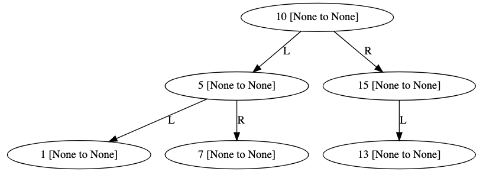
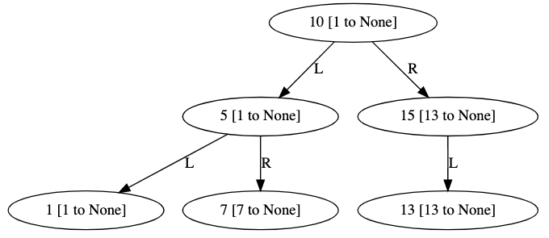
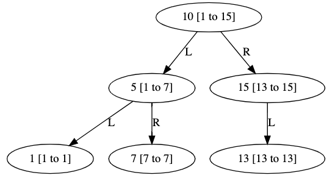

# Trees

In this example, we'll write some code to determine if a binary tree is a BST.

## Value Ranges per Node

Start with the following code:

```python
from graphviz import Digraph

class Node:
    def __init__(self, val):
        self.val = val
        # child node
        self.left = None
        self.right = None
        # smallest/largest values in subtree rooted by this node
        self.min_val = None
        self.max_val = None
        
    def _repr_svg_(self, g=None):
        if g == None:
            g = Digraph()
        label = str(self.val)
        label += " [{} to {}]".format(self.min_val, self.max_val)
        g.node(str(self.val), label)
        if self.left:
            self.left._repr_svg_(g)
            g.edge(str(self.val), str(self.left.val), label="L")
        if self.right:
            self.right._repr_svg_(g)
            g.edge(str(self.val), str(self.right.val), label="R")
        return g._repr_svg_()
    
    def set_range(self):
        # build list of root value, and smallest
        # found in child subtrees (if we have children)
        min_vals = [self.val]

        for child in [self.left, self.right]:
            if child == None:
                continue
            child.set_range()
            min_vals.append(child.min_val)
        self.min_val = min(min_vals)
```

This is a node for a general binary tree.  Your goal is to eventually
add an `.is_bst()` method that will tell you if the tree is a BST
(Binary Search Tree).

Checking whether a tree is a BST (as we do here) is a bit different
than examples we've done before, where we are careful to put new nodes
in places that guarantee we'll get a BST.

The search rule says that a binary tree is a BST if we can take any
node N in the tree, and the following is true:
1. all the values in the left subtree under that node have values less than N's value
2. all the values in the right subtree under that node have values greater than N's value

To check this, it will be very useful to compute the range of values
covered by each node and its descendants.

Try creating an example tree, which happens to be a BST:

```python
root = Node(10)
root.left = Node(5)
root.left.left = Node(1)
root.left.right = Node(7)
root.right = Node(15)
root.right.left = Node(13)
root
```

You should see this:



You can see that in addition to node values, we get ranges in
brackets.  Currently it says `None`, but we can run the partially
complete `set_range` method to get the lower bounds of the ranges:

```python
root.set_range()
root
```



Study the `set_range` method carefully, then improve it so that `max_val` also
gets set for every node.  If you get it right, the tree should look
something like this:



## `is_bst`

Start by adding this incomplete method:

```python
    def is_bst(self):
        if self.left != None:
            # step 1: is this node's val bigger than all those to the left?
            if self.left.max_val >= self.val:
                return False
            
            # step 2: do our left children also obey this property?
            # TODO: finish this part

        if self.right != None:
            # step 1: is this node's val bigger than all those to the left?
            # TODO: finish this part
            
            # step 2: do our left children also obey this property?
            if not self.right.is_bst():
                return False

        return True
```

You'll need to modify the above function so it works in general.  Note
that we need to there are two steps necessary to both the right and
left.  We completed step 1 to the left and step 2 to the right, so you
can take inspiration from that when completing step 2 to the left and
step 1 to the right.

Work on `is_bst` until you get the correct return value for the six test cases:

### Test 1

```python
root = Node(3)
root.left = Node(1)
root.right = Node(5)
root.set_range()
print(root.is_bst()) # should be True
root
```

### Test 2

```python
root = Node(3)
root.left = Node(4)
root.right = Node(5)
root.set_range()
print(root.is_bst()) # should be False
root
```

### Test 3

```python
root = Node(3)
root.left = Node(1)
root.right = Node(2)
root.set_range()
print(root.is_bst()) # should be False
root
```

### Test 4

```python
root = Node(3)
root.left = Node(1)
root.left.right = Node(4)
root.right = Node(5)
root.set_range()
print(root.is_bst()) # should be False
root
```

### Test 5

```python
root = Node(3)
root.left = Node(1)
root.right = Node(5)
root.right.left = Node(2)
root.set_range()
print(root.is_bst()) # should be False
root
```

### Test 6

```python
root = Node(10)
root.left = Node(5)
root.left.left = Node(1)
root.left.right = Node(7)
root.right = Node(15)
root.right.left = Node(13)
root.set_range()
print(root.is_bst()) # should be True
root
```

## Key Concepts
 * root, leaves
 * types of trees: BSTs, binary trees
 * BSTs: balance, search, adding items, checking if values are in search order

## Resources
 * https://tyler.caraza-harter.com/cs320/s20/reading/lec-11-search-trees.html
 * https://github.com/tylerharter/cs320/blob/master/s20/lab5/part1.md
 * https://github.com/tylerharter/cs320/tree/master/s20/p2
