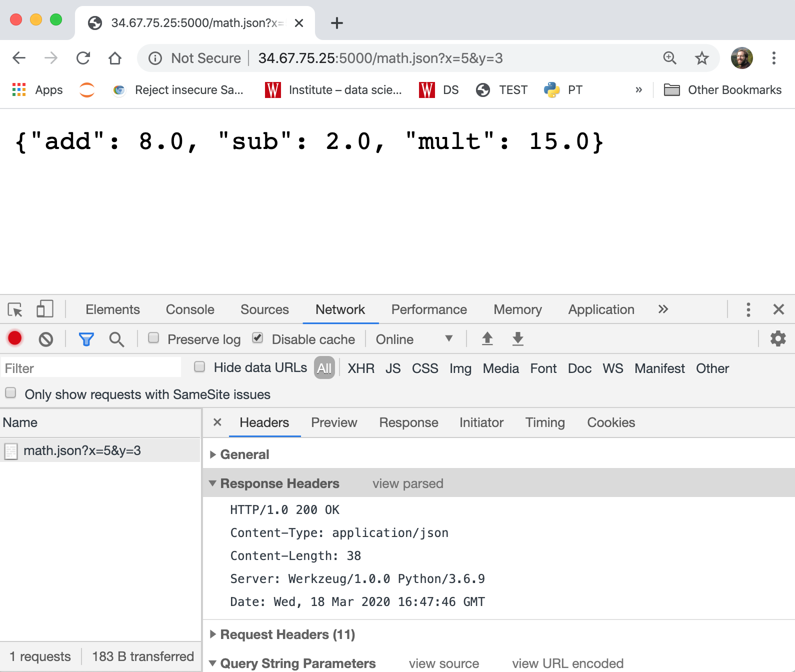
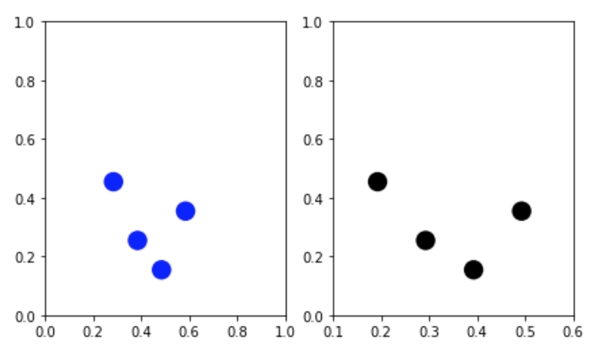

# March 23 Lecture

We'll wrapup web scraping in the first two videos, then start talking
about advanced plotting is the third video.

## 1. Response Objects

### Watch: [11-minute video](https://youtu.be/_3x-KTxv6sY)

### Practice: `jsonify`

To understand how `jsonify` works, here you'll write your own
`my_jsonify` that behaves the same way.  This function does three
things at once:

1. converts data (Python dict, list, etc) to a string containing JSON that can be used as the response body
2. creates a Response object using the string from step 1
3. sets the "Content-Type" header to "application/json"

Paste the following example to a .py file, and complete `my_jsonify`.

```python
from flask import Flask, request, Response
import json

app = Flask(__name__)

def my_jsonify(data):
    resp_body = json.dumps(????)
    r = Response(resp_body, headers={"????": "????"})
    return r

@app.route("/math.json")
def home():
    x = float(request.args.get("x", 0))
    y = float(request.args.get("y", 0))
    results = {"add": x+y, "sub": x-y, "mult": x*y}
    return my_jsonify(results)

if __name__ == "__main__":
    app.run("0.0.0.0")
```

Try going to `http://YOUR-IP:5000/math.json?x=5&y=3` in Chrome to see
different math operators applied to 5 and 3.  Open the dev tools and
check that you're getting "application/json" for the "Content-Type" in
addition to the correct answers.  It ought to look like this:



## 2. Rate Limiting

### Watch: [21-minute video](https://youtu.be/14GVG4-UkFI)

### Practice: compliant crawling

Copy/paste this example from a video to a `fruits.py` file on your VM
and run it:

```python
from flask import Flask, request, Response
import json, time

app = Flask(__name__)

fruits = ["apple", "banana", "kiwi", "cantaloupe", "berries", "orange"]

# key: client IP addr
# val: last time request served (in seconds since 1970)
last_req = {}

def rate_limit(fn):
    def wrapper():
        # policy: on request every 2 seconds, per IP address
        client_ip = request.remote_addr
        next_allowed = last_req.get(client_ip, 0) + 2
        now = time.time()
        
        should_allow = now >= next_allowed
        if not should_allow:
            return Response("backoff!!", status=429, 
                            headers={"Retry-After": next_allowed-now})
        last_req[client_ip] = now
        return fn()
    wrapper.__name__ = fn.__name__
    return wrapper

@app.route("/fruit")
@rate_limit
def fruit():
    idx = int(request.args.get("idx", 0))
    if idx >= len(fruits):
        return ""
    return fruits[idx]

if __name__ == "__main__":
    app.run("0.0.0.0")
```

Now paste and finish the fruit scraper from the video example to a
notebook.  After entering your IP, try running it and looking
carefully at how `r.headers` looks when printed before figuring out
how long to sleep.

```python
import requests, time

my_ip = "????" # TODO: put your VM's IP addr here

def nice_get(url):
    print("GET", url)
    r = requests.get(url)
    if r.status_code == 429:
        # told to backoff...
        # we'll wait however long requested, then try once more

        print("Response Headers Dict:", r.headers)

        # TODO: pull "Retry-After" from headers,
        # convert to float, and pass to sleep call:

        # time.sleep(????)
        r = requests.get(url)
    r.raise_for_status()
    return r.text

def fruit_url(idx):
    return ("http://"+my_ip+":5000"+
            "/fruit?idx=" + str(idx))

def grab_fruits():
    fruits = []
    i = 0
    while True:
        url = fruit_url(i)
        fruit = nice_get(url)
        if fruit != "":
            fruits.append(fruit)
        else:
            return fruits
        i += 1
        
grab_fruits()
```

## 3. Matplotlib Coordinate Systems

### Watch: [13-minute video](https://youtu.be/FMOIuX94aPU)

### Practice: scatter, from scratch

Paste+run the following:

```python
import pandas as pd

df = pd.DataFrame([
    {"x":0.1, "y":0.4},
    {"x":0.2, "y":0.2},
    {"x":0.3, "y":0.1},
    {"x":0.4, "y":0.3}
])
df
```

Now paste+run this:

```python
fig, (ax1, ax2) = plt.subplots(ncols=2, figsize=(7, 4))
ax2.set_xlim(0.1, 0.6)

points1 = ax1.transData.transform(df[["x", "y"]].values) / fig.dpi
print(points1)

def scatter(ax, points):
    for x, y in points:
        p = plt.Circle((x, y), 0.1, facecolor="blue",
                       transform=fig.dpi_scale_trans)
        ax.add_artist(p)

scatter(ax1, points1)
```

`AxesSubplot.transData.transform` (not covered in lecture) can convert
an array of points from the coordinate system of the AxesSupblot to
absolute coordinates, in DPI.  Dividing by `fig.dpi` then gives us
inches, which are used by the above `scatter` method.

Can you modify the above code so it draws the same scatter points as
black dots on the right?  It ought to look like this:



You'll need to (1) make another `.transform` call based on the `ax2`
coordinate system, (2) make an additional call to `scatter`, and (3)
add a parameter to `scatter` to control the `facecolor`.

**Note:** after I made this lecture, I realized the scatter plots in
  the picture weren't quite placed correctly.  I'll talk about why in
  the next lecture.
  