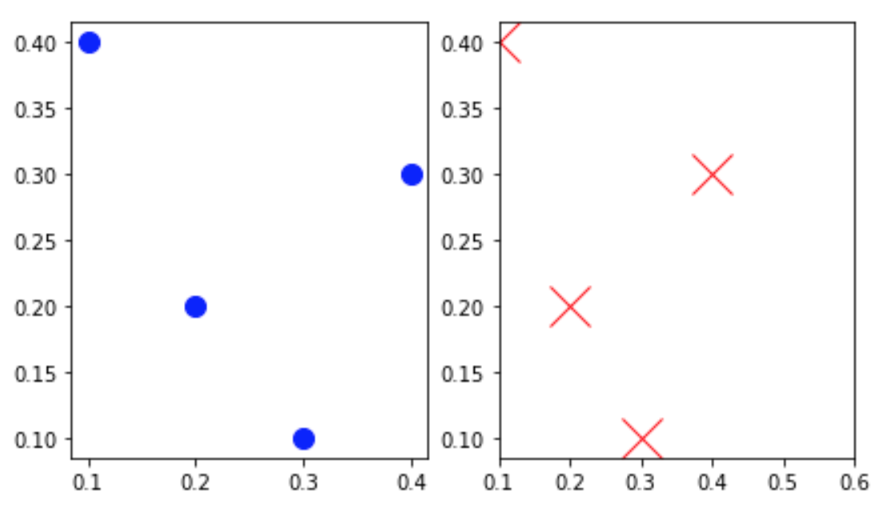

# March 25 Lecture

## 1. Bounding Boxes

### Watch: [5-minute video](https://youtu.be/hJYfWO6B9J4)

### Practice: Markers

A better way to create a custom scatter is to use matplotlib markers
rather than circles.  Try the following:

```python
import pandas as pd
from matplotlib import pyplot as plt

df = pd.DataFrame([
    {"x":0.1, "y":0.4},
    {"x":0.2, "y":0.2},
    {"x":0.3, "y":0.1},
    {"x":0.4, "y":0.3}
])

fig, (ax1, ax2) = plt.subplots(ncols=2, figsize=(7, 4))
ax2.set_xlim(0.1, 0.6)

points = df[["x", "y"]].values
print(points)

def scatter(ax, points, style="bo", size=10):
    for x, y in points:
        ax.plot(x, y, style, markersize=size)

scatter(ax1, points)
# scatter(ax2, points, ????) # TODO: make large red X's
fig.savefig("good.png", bbox_inches=None)
fig.savefig("bad.png", bbox_inches="tight")
```

Then, read the "Notes" section here: https://matplotlib.org/3.1.1/api/_as_gen/matplotlib.axes.Axes.plot.html#matplotlib.axes.Axes.plot

Use what you learn to draw large, red X's in the `ax2` region.  It
ought to look like this:



## 2. More Patches: Text, Lines, and Rectangles

### Watch: [23-minute video](https://youtu.be/SmINP4dIrYE)

### Practice: labeled-lines plotter

In the lecture demo, I was hardcoding the column names/indexes (shame
on me!).  In this practice, you'll complete a function that makes
lines with labels for any DataFrame, with any numbers of columns.

First, paste the following for some generic setup and to generate a
3-column DataFrame:

```python
from numpy.random import normal
import pandas as pd
import matplotlib
from matplotlib import pyplot as plt

matplotlib.rcParams["font.size"] = 16

df = pd.DataFrame({
    "X": normal(10, 20, 100),
    "Y": normal(15, 20, 100),
    "Z": normal(5, 5, 100),
}, index=range(0,100)).cumsum()

df
```

Second, paste+complete the following:

```python
def labeled_lines(df, xlabel="label me", ylabel="label me"):
    ax = df.plot.line(legend=????)
    ax.set_xlabel(xlabel)
    ax.set_ylabel(ylabel)

    ax.spines["right"].set_visible(False)
    ax.spines["top"].set_visible(False)
    
    last_x = df.index[-1]
    for i in range(len(df.columns)):
        last_y = df.iloc[-1, ????]
        line_name = df.columns[????]
        ax.text(last_x, last_y, line_name, va="center", ha="left")
    return ax

labeled_lines(df)
```

## 3. geopandas Maps

### Watch: [23-minute video](https://youtu.be/YWUQM5tBaJo)

### Practice: Filtering and Coloring

Start with this example:

```python
world_df = geopandas.read_file(geopandas.datasets.get_path("naturalearth_lowres"))
world_df = world_df[world_df["continent"] != "Oceania"]
world_df["color"] = "0.7"
world_df.loc[world_df["pop_est"] > 2e8, "color"] = "red"
world_df.plot(color=world_df["color"])
ax.set_axis_off()
```

Modify it so that:
1. it includes Oceania, but excludes Antarctica
2. countries with >200 million are still red, but those in the 100-200 million range are yellow

It should look like this:


