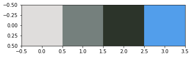

# May 1 Lecture

## 1. K-Means for Color Segmentation

### Watch: [11-minute video](https://youtu.be/fOd8Rl9BC2k)

### Practice: Wisconsin Capital Photo

Download a resized version [this image](https://en.wikipedia.org/wiki/Madison%2C_Wisconsin#/media/File:Capitol_Madison,_WI.jpg) with this command:

```
wget https://raw.githubusercontent.com/tylerharter/cs320/master/s20/lec/may1/capital.jpg
```

Complete the following to read and view the image:

```python
from matplotlib import pyplot as plt
img = plt.im????("capital.jpg")
plt.im????(img)
```

<details>
    <summary>ANSWER</summary>
    <code>read</code> and <code>show</code>
</details>

Can you extract the four main colors in the image, like this?



```python
km = KMeans(n_clusters=4)
km.fit(img.reshape(????))
plt.imshow(km.cluster_centers_.reshape(????).astype(int))
```

<details>
    <summary>ANSWER</summary>
    <code>-1,3</code> and <code>1,4,3</code>
</details>

How accurate is the image when using only those 4 colors?  Complete
the following using `int`, `img.shape`, `labels_`, and
`cluster_centers_`.

```python
img2 = km.????.astype(????)[km.????].reshape(????)
plt.imshow(img2)
```

## 2. K-Means vs. Agglomerative Clustering

### Watch: [14-minute video](https://youtu.be/rDNMQFYGu74)

## 3. Agglomerative Clustering in sklearn

### Watch: [13-minute video](https://youtu.be/_snvL4CQNWc)

### Practice: Linkage Type

Create and plot some goofy clusters (one within the other) with this:

```python
import numpy as np
import pandas as pd
from sklearn import datasets
from sklearn.cluster import AgglomerativeClustering

xy, _ = datasets.make_circles(n_samples=1000, factor=.5, noise=.05)
df = pd.DataFrame(np.vstack(xy))
df.plot.scatter(x=0, y=1)
```

Before the `scatter` call, fit an agglomerative model, and assign each point to a cluster:

```python
clusters = AgglomerativeClustering().fit_predict(xy)
```

Then add the following to the `scatter` call, using a color map to celebrate the end of the semester: `, c=clusters, cmap="summer"`.

How does it change if you pass `linkage="single"` to AgglomerativeClustering?

Compare other linkage options
[here](https://scikit-learn.org/stable/_images/sphx_glr_plot_linkage_comparison_001.png)
to gain intuition.
