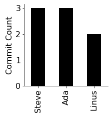
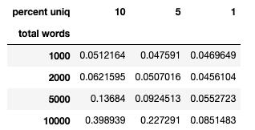
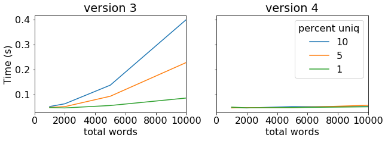
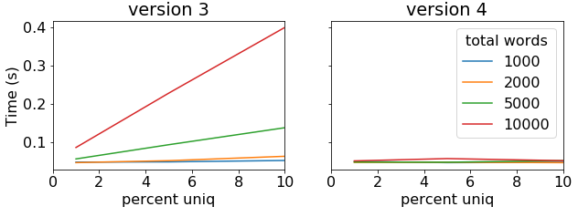
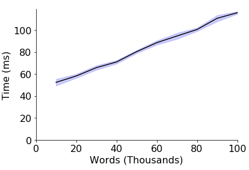

# Project 1 (don't start yet, under revision!!!!): 

## Corrections/Clarifications

* none yet

## Overview

You manage a team of three developers (Ada, Linus, and Steve), and you
want to evaluate their work on the WC project (a tool for efficiently
counting how many times different words appear in a file).
Fortunately, they have all been making contributions to a shared git
repository, so you can see who did what, and evaluate the improvements
to the code.

## Background

Git is an integral part of any modern software development. It is a program that 
enables it's users to collaborate on code, track changes to files, see who wrote what 
and so forth. In this project we will be exploring the git repo(sitory) containing 
the WC source code that has been provided as `repo.zip`.
 

## Setup

You'll need to install a few pip packages, if you don't already have them (connect to your VM with SSH to do the installs):

```
pip3 install pylint beautifulsoup4 pandas matplotlib gitpython
```

You should create a directory/folder named `p1` somewhere on your
virtual machine where you'll do your work.  Download the following to your `p1` directory:

* https://github.com/tylerharter/cs320/blob/master/s20/p1/test.py
* https://github.com/tylerharter/cs320/blob/master/s20/p1/expected.html
* https://github.com/tylerharter/cs320/raw/master/linter/lint.py
* https://github.com/tylerharter/cs320/raw/master/s20/p1/repo.zip

An easy way to download a file on Linux is to `cd` to the directory
you want and run `wget <URL>` there.  For example, after `cd`'ing to
the `p1` directory, you could download the first file with this:

```
wget https://github.com/tylerharter/cs320/blob/master/s20/p1/test.py
```
Once you've done this for all the required files, 
you can unzip your `repo.zip` file from the terminal with this command:

```
unzip repo.zip
```

If you don't have the `unzip` program, you might need to install it first with `apt`:

```
sudo apt install unzip
```

Check that the repo has been correctly extracted.
If you `cd repo` and then list the files in that directory with `ls -a` 
you should see four entries as follows:

```
.  ..  .git  wc.py 
```

By convention, folders that start with `.` are hidden. This is why we had 
to run `ls` with the `-a` flag, it shows all. The first and second 
directories, namely `.` and `..` are special. They represent the current directory
(repo/) and it's parent (p1/ in this case) respectively.

The `.git` directory is managed by git and contains a lot of metadata about the code 
and it's changes through time. We will never be using this directly, but just know that 
what makes a directory a git repository is this hidden folder.

Try using the following `git` command:

```
git log
```

This will print every commit that has occurred. You can use the up/down 
keys to scroll through them all if needed. To exit this view, press `q`.
You should see eight commits, like this:

```
commit 4e4128313b8d5b5e5d04f2e8e585f64f7c5831a4 (HEAD -> master)
Author: Steve <steve@example.com>
Date:   Mon Jan 20 15:00:00 2020 -0600

    only make one pass over list to count all

commit f637df3f45bc389e1035cc3aadcf5d81a55f0dc4
Author: Steve <steve@example.com>
Date:   Sat Jan 18 18:00:00 2020 -0600

    only make one pass over list to count all

commit c10b5a6cb4f06c96f6f221df2d5ec33af767d5c5
Author: Ada <ada@example.com>
Date:   Thu Jan 16 13:00:00 2020 -0600

    optimize: only compute count once per unique word

commit f37e610ce055a3d894baac2d9449e6eb77c72320
Author: Steve <steve@example.com>
Date:   Wed Jan 15 12:00:00 2020 -0600

    do not repeatedly re-read file, use with to automatically close

commit 6f5ca9327e986315ffcacddce5d9d6195c0913b7
Author: Ada <ada@example.com>
Date:   Mon Jan 13 16:00:00 2020 -0600

    ignore case, usage line

commit 761627a3ad9ee681f27211326e9149f01764ceee
Author: Linus <linus@example.com>
Date:   Mon Jan 13 11:00:36 2020 -0600

    bugfix

commit b0df6dbe111f9e28fc3a9c9b841cde5c20c365f9
Author: Linus <linus@example.com>
Date:   Fri Jan 10 14:00:36 2020 -0600

    support wildcards

commit 6d7beafb8e79b7a92fed8e67673a33bb7f607dbe
Author: Ada <ada@example.com>
Date:   Thu Jan 9 13:53:20 2020 -0600

    count a specific word
```

Try running the `wc.py` program in the repo directory:

```
python3 wc.py
```

You should see a usage line, like this:

```
Usage: python3 wc.py <file.txt> (ALL|<word>)
```

This means the `wc.py` program expects two arguments, a file name, and
either the text "ALL" or a specific word (`|` means "or").  Create a
file with `echo`, and try a few examples with both modes:

```
echo "A A A B C C" > example.txt
python3 example.txt A
python3 example.txt B
python3 example.txt ALL
```

Echo is good for short examples, but you can use an in-terminal editor
to write more.  `vim` and `emacs` are popular editors, but `nano` is
an easy one to use now.  Run this:

```
nano example.txt
```

Now you can type some more words.  Note the menu on the bottom.  The
`^` means the `CTRL` key.  So hitting control and "O" at the same time
saves the file, and hitting control and "X" at the same time exits
nano.  After saving and exiting, run the `wc.py` program again to make
sure it is working properly.

Run `nano wc.py` to see the code for the word-count program.  Now exit
nano.  Let's see how the file has changed over time.

Run `git checkout 6d7beafb8e79b7a92fed8e67673a33bb7f607dbe`.  The
"6d7...dbe" part was the first commit you should have seen when you
ran the `git log` command earlier. This will revert back to the original 
state of the WC project as it was back then, but don't worry, you will 
not lose the current state as it was also saved in a commit.

Note: the git tool will say "You are in 'detached HEAD' state" -- don't
worry, it's not as gruesome as it sounds :)

Now run `nano wc.py`.  This is the first version of `wc.py` -- you
should see it is very different than that latest version that we
looked at first.

For the questions, start a new Python notebook in the `p1` directory.  When answering
question 1, start with a `#q1` comment, and so on.  You'll be
switching between commits more, but you'll be using the `git` module
to do it with Python code rather than running the commands yourself.

## Part 1: Repo Analysis

#### Q1: How many commits are in the repo?

You can control the repo from Python by creating a `Repo` object:

```python
from git import Repo
dirname = "repo"
repo = Repo(dirname)
repo.git.checkout("master")
```

Read a bit about the `Commit` object and `iter_commits` method here:
https://gitpython.readthedocs.io/en/stable/tutorial.html#the-commit-object.

#### Q2: How many commits were there by each author?

Answer with a dictionary. 

#### Q3 [PLOT]: How many commits did each developer contribute?

It should look like this:



Important details:
* y-axis label
* larger font than the the default
* figure should be compact (shrink with `figsize`)
* don't box the data in on the top and right

Here's a useful function you might use for getting AxesSubplot objects without the top/right borders:

```python
def get_ax():
    ax = plt.subplot()
    ax.spines["top"].set_visible(False)
    ax.spines["right"].set_visible(False)
    return ax
```

If you haven't created plots in Python for a while, you can review the CS 220/301 readings here: https://github.com/tylerharter/caraza-harter-com/tree/master/tyler/cs301/fall19/readings

#### Q4: Which developers have committed code on a weekend?

Answer with a Python set.  If you have a `Commit` object `c` (say from `.iter_commits()`), you can get its date with `c.authored_date`.

Dates and times are often represented as integer *timestamps* that count the number of seconds since Jan 1, 1970 
(this is known as UNIX timestamp, and is widely used because it's simpler 
than dealing with timezones/leap years/etc). You can convert these to a `datetime` object in Python that's easier to work with.  For example, try running this in a cell:

```python
from datetime import datetime # yes, both the module and type are named datetime
dt = datetime.fromtimestamp(1579744630)
print(type(dt), dt)
```

Try copy/pasting the current timestamp (from
https://www.unixtimestamp.com/) to replace the integer value above,
and run the code again.  Does it come out right?

There are lots of useful methods for datetime object so we encourage you to check them out, like this one: https://docs.python.org/3/library/datetime.html#datetime.datetime.weekday

#### Q5 [TABLE]: How has the size of the wc.py code grown over time?

Expected:


#### Q6 [PLOT]: How has the size of the wc.py code grown over time?

Expected:


## Part 2: Testing

In CS 301 (now called CS 220) you were not required to write functions that 
met certain criteria. Going further, we will require you to do so more and more as 
it provides us with a standard way to grade, but also forces you to write useful functions. 
When asked to implement a function, we will provide you with a **function prototype** which 
is essentially the blueprint of that function, what it should be called, how it should behave, and 
what inputs and outputs it should produce. 

Note that you should remove the 
`pass` statement as it will have no effect once you write the function.

Complete the following function:

```python
def run_wc(body, commit=None):
    pass
```

Specifications:
* **description**: run a specific version of `wc.py` on a given text and return it's output
* `body`: a string that the function should write to a file named `test.txt` before running `wc.py test.txt ALL` to count the words in that text.
* `commit`: a git commit that the function should checkout the specified version of wc.py before running it; if `commit` is `None`, use the latest commit.
* **return value**: the function should capture the output of the `wc.py` program and parse it as JSON, returning the parsed result.  If `wc.py` crashes, return `None`.

Paste the following test cases in a cell:

```python
# test inputs to exercise wc.py

# expected result: {'X': 1, 'Y': 1, 'Z': 1}
test1 = """X Y Z"""

# expected result: 
test2 = """A B
A C
"""

# expected result: {'A': 2, 'B': 1, 'C': 1}
test3 = """A B
a c
"""
```

#### Q7: What does `run_wc(test1)` return?

#### Q8: What does `run_wc(test3)` return?

---

Complete the following function:

```python
def test_table(body, expected):
    pass
```

Specifications:
* **description**: run every version of `wc.py` on a given output, and check which version produce correct output
* `body`: a string to pass along to `run_wc`
* `expected`: a dictionary with word counts that `run_wc` should return when it is working correctly
* **return value**: a DataFrame with one row per commit (oldest first) and four columns:
1. `commit`: the commit hex
2. `msg20`: the commit message (capped at 20 characters)
3. `author`: the commit author's names
4. `pass`: whether or not `run_wc` returns the same thing as `expected` for each commit

---

#### Q9: What does `test_table(test1, {'X': 1, 'Y': 1, 'Z': 1})` return?

Expected:


#### Q10: What does `test_table(test2, {'A': 2, 'B': 1, 'C': 1})` return?

Expected:


#### Q11: What does `test_table(test3, {'A': 2, 'B': 1, 'C': 1})` return?

Expected:


**To get full points**, write a short comment here about which of the three
  test inputs in most useful for evaluating the wc.py program.

## Part 3: Benchmarking

Complete the following function:

```python
def time_run_sec(uniq_words, total_words, word_size=6, commit=None):
    pass
```

Specifications:
* **description**: randomly generate input for `wc.py` and time how long it takes to run
* `uniq_words`: the function should randomly generate this many words and put them in a list
* `total_words`: the function should randomly sample this many words from the above list to produce an input string
* `word_size`: how many characters long each word should be
* `commit`: what version of `wc.py` to run on the random input
* **return value**: how many seconds it took to run `wc.py` (not counting the time to generate the input file)

Hint: Try taking a look at the random module's `choice` function...

For the following questions, we'll be measuring the performance of
`wc.py`.  We're only interested in versions that are passing the tests,
and we've given these versions nicer names.  For your convenience,
paste the following dictionary into your notebook:

```
versions = {
    "v0-baseline": "6f5ca9327e986315ffcacddce5d9d6195c0913b7",
    "v1-open-once": "f37e610ce055a3d894baac2d9449e6eb77c72320",
    "v2-pass-per-uniq": "c10b5a6cb4f06c96f6f221df2d5ec33af767d5c5",
    "v3-single-pass": "4e4128313b8d5b5e5d04f2e8e585f64f7c5831a4",
}
```

#### Q12: How long does each version take for 5000-word inputs consisting of 100 unique words?

Answer with a compact, horizontal, log-scale plot, like this:


Note: Your function should return the runtime in seconds, but we expect the graph to be in milliseconds. 

#### Q13: How long does each version take for 5000-word inputs consisting of 1 unique word?

Expected:


**To get full points**, write a short comment here with a hypothesis
  about when the v3 version does better than the v2 version.

## Part 4: Complexity

We want to explore the performance of `wc.py` for different
combinations of `total_words` and `uniq_words`.  Write a function that
can perform measurements to produce a DataFrame something like the
following (this is for your own convenience -- we aren't picky about the
details for this function).



Consider the bottom-right cell in the above DataFrame.  This
corresponds to an run where there were 10000 total words consisting of
100 unique words (1% of 10000) -- it took 0.0851483 seconds to run
`wc.py` in this scenario.

#### Q14 [PLOT]: How does the number of total words and unique percent affect the performance of versions 3 and 4?

Expected:



#### Q15 [PLOT]: Same question as Q14.

In this and the previous experiment, we want to understand how time
depends on three variables: total, unique, and version.  For Q14, we
represented these variables with x-axis, line color, and plot side
respectively.

For Q15, let's mix it up and use x-axis for unique and line color for
total.

Hint: When plotting a DataFrame in Pandas, each column is a line,
and the index corresponds to the x-axis.  So swapping line color with
x-axis position can be accomplished by transposing the DataFrame
before plotting (something like `df.T.plot.line(...)`).

Expected:



**To get full points**, write a short comment about whether Q14 or Q15
  more clearly shows performance trends.

#### Q16 [PLOT]: How does v4 scale with more words, keeping unique percent at 10?  

Show standard deviation around the line.

Computing and plotting standard deviation based on trials is a bit
involved, so we'll give you some helper code (finish it):

```python
df = DataFrame()
df.index.name = "total"
df.columns.name = "trial"
for i in range(10):
    total_words = 10000 * (i+1)
    print(total_words)
    uniq = total_words // 10
    for trial in range(5):
        df.loc[total_words/1000, trial] = ???? # TODO: call time_run_sec
df
```

This should get you a DataFrame something like this:


We want to compute the mean and standard deviation over the
trials/columns.  Run the following and look at the resulting Series:

```python
mean = df.mean(axis=1)
std = df.std(axis=1)
```

Now plot the mean, and add a standard deviation range with this:

```
plt.fill_between(mean.index, mean-std, mean+std, color='b', alpha=0.2)
```

It should look something like this:



## Part 5: Counter Class

You're going to make a new class named `Counter` that acts like a
dictionary, but makes it easier to count unique words.  Keys are
always strings and values are always integers.  You should be able to
create a Counter like this:

```python
c = Counter()
```

Expectations:
* `c["KEY"]` is the same as `c["key"]`
* `c["KEY"]` should default to 0 if a value hasn't already been set for "KEY"
* `print(c)` should look like printing a `dict` where all keys are upper case
* `c.max_keys()` should return a list of key(s) that map to the highest value (it returns a list rather than a single key string, as there may be ties -- in which case the keys should be in ascending order alphabetically)

Note: There is a built in Counter class that comes with Python. It is generally 
extremely useful but the one we ask you to implement here is slightly different. 
See: https://docs.python.org/2/library/collections.html#collections.Counter

Your class will need to implement the following special methods:
* https://docs.python.org/3/reference/datamodel.html#object.__setitem__
* https://docs.python.org/3/reference/datamodel.html#object.__getitem__
* https://docs.python.org/3/reference/datamodel.html#object.__repr__

After you get the Counter class working, you can just paste our
provided code for the following questions as a way to test that
Counter behaves as expected. (So for Part 5, your Counter class is the only code you should need to write.)

#### Q17: What does the following code produce?

Code:

```python
c = Counter()
c["apple"]
```

Expected:

```
0
```

#### Q18: What does the following code produce?

Code:

```python
c = Counter()
c["apple"] += 1
c["banana"] += 1
c["BANANA"] += 1
c["kiwi"] += 2
c["banana"]
```

Expected:

```
2
```

#### Q19: What does the following code produce?

Code:

```python
c
```

Expected:

```
{'APPLE': 1, 'BANANA': 2, 'KIWI': 2}
```

#### Q20: What does the following code produce?

Code:

```python
c.max_keys()
```

Expected:

```
['BANANA', 'KIWI']
```

---

Congrats! You've just implemented your first class. Can you see why having 
this class might be helpful for the development of the WC project?
