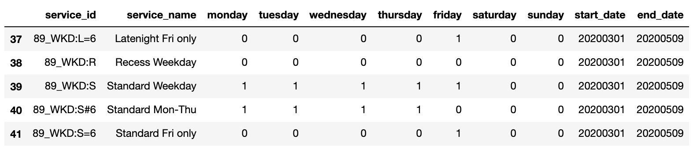
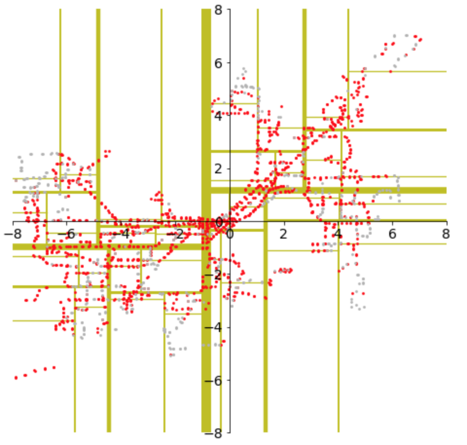

# Project 2: Madison Metro

## Corrections/Clarifications

* none yet

## Overview

In this project, your goal is to make a new module, `bus`, to help
people analyze the Madison Metro system.  Making a module is a little
different than making a notebook.  We won't be asking you a single
question, but you'll need to make sure your module follows our
spec -- it needs to have the exact classes required, and the
methods in those class will need to behave as intended.

A few key features of your module:
* search for bus trips by route
* quickly search for bus stops in a rectangle or circle (using a binary tree)
* identify trips on which passengers may bring bikes
* visualize stops, distinguishing which ones are wheelchair accessible
* compare weekend service to weekday service, as in the following (the gray ones are not accessible):


## Setup

For this one, download the following to a `p2` directory:
* `examples.ipynb`: this will show how somebody might use your module -- this is a good first place to look
* `tester.py`: yes, we changed the name (sorry!)
* `expected.json`: tester.py will compare your answers with this
* `mmt_gtfs.zip`: contains all schedule data.  **Don't unzip it because your module is required to directly read files from inside the zip without extracting first.**  The data is a copy from here: http://transitdata.cityofmadison.com/
* `bus.py` create this from scratch

If you like, you can run `tester.py` from a terminal, or paste the following in a notebook:

```python
%%capture --no-stdout
import tester
tester.run_all_tests()
```

We recommend that as you write features in your module, you also have
a notebook open that imports your module.  Test each feature as you
add it (otherwise debugging a lot of code at once will be painful).

## Requirements

### Location

We need some coordinate system for this project.  Rather than deal
with latitude and longitude, we'll assume the earth is flat (which
isn't horribly innacurate for the amount of area we're dealing with).
This will allow us to have x and y coordinates, which will be in miles
relative to the capital.  For example, (1,2) refers to a point that is
one mile to the east of the capital and two miles north.

Here is a `Location` class you can use to represent coordinates in
this system:

```python
from math import sin, cos, asin, sqrt, pi

def haversine_miles(lat1, lon1, lat2, lon2):
    lat1, lon1, lat2, lon2 = map(lambda a: a/180*pi, [lat1, lon1, lat2, lon2])
    dlon = lon2 - lon1
    dlat = lat2 - lat1
    a = sin(dlat/2) ** 2 + cos(lat1) * cos(lat2) * sin(dlon/2) ** 2
    c = 2 * asin(min(1, sqrt(a)))
    d = 3956 * c
    return d

class Location:
    capital_lat = 43.074683
    capital_lon = -89.384261

    def __init__(self, latlon=None, xy=None):
        if xy != None:
            self.x, self.y = xy
        else:
            if latlon == None:
                latlon = (Location.capital_lat, Location.capital_lon)

            self.x = haversine_miles(Location.capital_lat, Location.capital_lon,
                                     Location.capital_lat, latlon[1])
            if latlon[1] < Location.capital_lon:
                self.x *= -1
            self.y = haversine_miles(Location.capital_lat, Location.capital_lon,
                                     latlon[0], Location.capital_lon)
            if latlon[0] < Location.capital_lat:
                self.y *= -1

    def dist(self, other):
        return sqrt((self.x - other.x) ** 2 + (self.y - other.y) ** 2)

    def __repr__(self):
        return "Location(xy=(%0.2f, %0.2f))" % (self.x, self.y)
```

Try it with a couple known locations:

```python
memorial_union = Location(43.076833, -89.399135)
union_south = Location(43.071821, -89.408072)
print(memorial_union, union_south)
print("distance:", memorial_union.dist(union_south))
```

Is it correct that both these locations are west of the capital
(negative x coord)?  And that they're about a half mile apart?

### Classes

At a minimum, you'll need the following classes:

* BusDay (most important)
* Trip
* Stop
* Location (given earlier)

Add these now, then run tester.py.  You should get 8% of the points
just for having classes with these names in your bus.py file, even if
they don't have any methods yet.

### BusDay Class

An object of type `BusDay` desribes the bus trips and routes available
in Madison for a specific day.  Our tests create BusDay objects for
Feb 21 (a Friday) and Feb 22 (a Saturday).  In general, bus
availability is limited on weekends.

Users of you're module should be able to create `BusDay` objects like this:

```python
from datetime import datetime
from bus import BusDay
fri = BusDay(datetime(2020, 2, 21))
```

Your BusDay constructor (`__init__`) should pull information for the
specified day from the `mmt_gtfs.zip` file, which you should assume is
in the same directory.

### Services

Try running the following:

```
import pandas as pd
from zipfile import ZipFile

with ZipFile('mmt_gtfs.zip') as zf:
    with zf.open("calendar.txt") as f:
        df = pd.read_csv(f)
        
df.tail()
```

You should see something like the following:



A given service is offered on a given day if (a) that day is in the
start_date/end_date range and (b) it's the right day of week,
indicated by a 1.  You might notice some services have zeros on every
day -- these are special cases, handled by the calendar_dates.txt
file.  For simplicity, we'll ignore those (even if you want to handle
the special cases for fun, make that a feature that's easy to disable,
because our tests assume your code's schedule is only based on
calendar.txt).

Your BusDay objects should have an attribute named `service_ids`,
which is a sorted list of services available that day, with no
repeats.  For example, if `bd` is a `BusDay` object for Feb 22, then
`bd.service_ids` should produce `['88_SAT', '88_SAT:L', '88_SAT:S']`.

Getting `service_ids` right should give you about 20% of the grade.

### Trips

A trip is like a row in a timetable for a particular route.  Buses may
run many trips per day in service of, say, route 80 in Madison.

It should be possible to create a Trip object from your Trip class like this:

```python
t = Trip(904927, 1, True)
```

In order, the parameters represent `trip_id`, `route_id`, and
`bikes_allowed` -- the constructors should use these values to
initialize object attributes by the same names.

Calling `repr(t)` should create a string like "Trip(904927, 1, True)".

You should create a `BusDay.get_trips` method for finding trips
available on a particular day.  Assuming `bd` is a `BusDay`:

* `bd.get_trips()` should return a list of all Trip objects for that day
* `bd.get_trips(80)` should return only those for route 80 (it should work for any route ID)

The returned list should be sorted by trip_id ascending.  The data to
generate the trip data can be found in trips.txt.  You will need to
filter trips so that only those with a service_id active for the day
in question are returned.

Getting trips working should give you 18% of the grade.

### Stops

It should be possible to create a Stop object from your Stop class like this:

```python
loc = Location(43.076833, -89.399135)
Stop(5, loc, True)
```

In order, the parameters represent `stop_id`, `route_id`, and
`wheelchair_boarding` -- the constructors should use these values to
initialize object attributes by the same names.

If `bd` is a `BusDay`, there should be several ways to get stops
available that day:

* `bd.get_stops()` should return a list of all stop objects
* `bd.get_stops_rect((x1, x2), (y1, y2))` should return all stops in the rectangle defined by the two x and two y limits
* `bd.get_stops_circ((x, y), radius)` should return all stops in the circle defined by the center and radius

All units are in miles.  Remember also that x and y coordinates are
miles to the left/right or above/below the capital building.

All your methods for getting stops should sort the stops by stop_id,
ascending.

You'll need to filter the stops so that only ones used for the given
day are returned.  **This is a bit tricky:** you can figure out which
stops are used for which trips using stop_times.txt, and you already
know which trips are for a given day because each trip is associated
with a service_id.  Remember that the first thing you did in this
project was determine which services are available for the given day.

**Requirement:** although you could implement `get_stops_rect` by
  looping over every stop and checking if it is in the range, that
  would not be efficient.  Instead, you must implement a binary tree
  to carve of the geometric space, allowing for a more efficient
  search.  The tree should work like this:

* start with a single root node containing all stops
* recursively split nodes in half, for six levels.  In other words, there will be 64 = 2**6 leaf nodes, each 6 edges away from the root
* at each split, divide the stops perfectly in half, as best you can (left child gets stops[:len(stops)//2] and right child gets others).  If many stops were to have the same coordinates, this process might mean some stops might go left while others with identical locations go right -- this is OK for this project
* at the root level, split into East and West halves.  At the next level, split into North and South.  Keep alternating the orientation of the splits in this way
* implement rectangle search recursively.  In the leaves, just loop over all the buses and collect those in the rectangle.  For non-leaf nodes, construct results by recursively getting results from the children.  When the search rectangle falls into just one childs area, do not recursively search both childern.  Of course, a large search rectangle may overlap multiple children.

Your `get_stops_circ` method should work by identifying the stops in a
rectangle that bounds the circle, then make a second filtering pass to
only keep those in the circle.

### Visualization

`BusDay` should have two visualization methods, both of which should
take as `ax` parameter referring to a matplotlib `AxesSubplot` object.

Calling `bd.scatter_stops(ax)` should produce add scatter points to an
existing AxesSubplot.

For testing purposes, we have a few requirements (creating the right
picture via other means may not be enough to allow you to pass):

* use DataFrame.plot.scatter(...)
* explicitly set a color using a keyword argument (e.g., `color="red"`)
* stops that are wheelchair accessible should be color red ("red"), and others should be a gray (specifically, "0.7" is the shade we're looking for)

Calling `bd.draw_tree(ax)` should show the binary tree splits on the
map.  Lines for splits nearer the root should be thicker.  The line
color is not important.

It should be possible to use both visualizations together, like this:

```python
ax = get_ax()
fri.scatter_stops(ax)
fri.draw_tree(ax)
```

The resulting plot should look something like this:



For our tests to recognize your lines, you'll need to draw them using
the `ax.plot` method, something like this:

```python
ax.plot((1, 1), (-8, 8), lw=5, color="purple")
```

The above creates a think, purple, vertical line.

## Conclusions

This is a tricky project, and it's easy to do things inneficiently if
you're not careful.  As a baseline, your instructor solved this
project with 225 lines of code for bus.py, and can pass the tests in 3
seconds.  If the project is becoming several times bigger or slower
for you, it's a good idea to drop by office hours and discuss your
strategy.  For performance issues, brainstorming will be more useful
if you've used `time.time()` to become knowlegable about what parts of
your code are slow.

Have fun with this one!  If you use your module to do any cool
analysis beyond what is required for P2, I'll be curious to see the
results.
