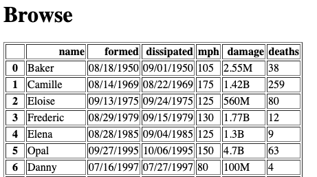

# Project 3: Building a Data Website

## Corrections/Clarifications

* March 3: Fixes to tester.py for issues with rounding, nans, and strings on browse.html
* March 5: Added note at [bottom of this page](#hints) about nesting decorators with Flask.  Note that your instructor didn't use this for the project solution, but multiple students wanted to, and it's tricky, so we're describing it
* March 5: More fixes to tester.py for extra spaces in middle of strings and final touches on rounding
* March 7: we now support upper case letters in URLs, thanks to the pull request by [vmpatil](https://github.com/vmpatil)!
* March 8: added hand-in directions

## Handin

To hand in this assignment, you need to put your files in a .zip.  You
can create this from the terminal.  Let's say you're already in a
directory named `p3`.  You can run this to create a compressed p3.zip
file alongside your directory:

```
zip ../p3.zip main.py main.csv *.html
```

If you haven't installed `zip` before, you might see this:

```
Command 'zip' not found, but can be installed with:

apt install zip
Please ask your administrator.
```

Follow the suggestion by running the `apt install zip` command
suggested.  Of course, only the root user can install software with
`apt`, so you'll need to tweak thee suggested command by adding `sudo`
to the beginning.

Once you have the .zip ready, you can download it your laptop (via
Jupyter) then upload it to the site.

## Overview

In this project, you'll build a website for sharing a dataset -- you
get to pick the dataset!  Feel free to use a dataset you know from CS
220/301 (https://tyler.caraza-harter.com/cs301/fall19/schedule.html),
or better, find something entirely new on
https://www.kaggle.com/datasets or elsewhere.

You'll use the flask framework for the site.  The site will have ways
for humans to browse the data, as well as web APIs for other people's
programs to search the data.

Creating a web application is a very new kind of programming,
different from writing code in a notebook or creating a `.py` module.
So get started soon!  Our office hours are always boring the first
week a project is released and crazy the week it is due, so starting
early is a good way to get a larger slice of TA/instructor time.

Your `.py` file may be short, perhaps <100 lines, but it will probably
take a LOT of time to get those lines right.

## Handing in Work

When you're done, you'll hand in a .zip file containing `main.py`,
`main.csv`, and any `.html` files necessary.

**Note:** we don't have a good way for you to upload a .zip file to the
website yet, but we will before the deadline.  Watch for an
announcement with more details.

## Setup

Install some things:

```
pip3 install Flask lxml html5lib
```

Download `tester.py` -- as always, run it often!  You'll create the rest of the files from scratch.  
**Note:** Running `tester.py` locally can be very helpful and time-saving for you if you haven't already been doing so. For the most part, this will let you know how your code will perform against our tests. While we still may take points off, this is a good way to ensure nothing is very off from what we're expecting. 

# Requirements

## Data

You get to choose the dataset for this project.  Find a CSV you like
somewhere, then download it as a file named `main.csv`.

The file should have between 10 and 1000 rows and between 3 and 15
columns.  Feel free to drop rows/columns from your original data
source if necessary.

Leave a comment in your `main.py` about the source of your data.

Two good places to check while looking for a dataset are [Kaggle](https://www.kaggle.com/datasets) and 
Google's [Dataset Search](https://datasetsearch.research.google.com/). 

## Pages

Your web application should have four pages:
* index.html
* browse.html
* api.html
* donate.html

We have some requirements about what is on these, but you have quite a
bit of creative freedom for this project.

To get started, consider creating a minimal `index.html` file:

```html
<html>
  <body>
    <h1>Welcome!</h1>

    <p>Enjoy the data.</p>
  </body>
</html>
```

Then create a simple flask app in `main.py` with a route for the
homepage that loads `index.html`:

```python
import pandas as pd
from flask import Flask, request, jsonify

app = Flask(__name__)
# df = pd.read_csv("main.csv")

@app.route('/')
def home():
    with open("index.html") as f:
        html = f.read()

    return html

if __name__ == '__main__':
    app.run(host="0.0.0.0") # don't change this line!
```

Try launching your application by running `python3 main.py`:
```
trh@instance-1:~/p3$ python3 main.py
 * Serving Flask app "main" (lazy loading)
 * Environment: production
   WARNING: This is a development server. Do not use it in a production deployment.
   Use a production WSGI server instead.
 * Debug mode: off
 * Running on http://0.0.0.0:5000/ (Press CTRL+C to quit)
```

This program runs indefinitely, until you kill it with `CTRL+C` (meaning press `CTRL` and `C` at the same time).
Unfortunately, you may need to restart each time for new changes to
show up (unless you find a way to configure flask otherwise).

Open your web browser and go to `http://your-ip:5000` to see your page
("your-ip" is the IP you use to SSH to your VM).

Requirements:

* Going to `http://your-ip:port/browse.html` should return the content for `browse.html`, and similarly for the other pages.
* The index.html page should have hyperlinks to all the other pages.
* You should put whatever content you think makes sense on the pages.  Just make sure that they all start with an `<h1>` heading, giving the page a title.

## Browse

The `browse.html` page should show an HTML table with all the data
from `data.csv`.  Don't truncate the table (meaning we want to see all
the rows).  Don't have any other tables on this page, so as not to
confuse our tester.

The page might look something like this:



**Hint 1:** you don't necessarily need to have an actual `browse.html`
file just because there's a `browse.html` page.  For example, here's a
`hi.html` page without a corresponding `hi.html` file:

```python
@app.route('/hi.html')
def hi_handler():
    return "howdy!"
```

For browse, instead of returning a hardcoded string, you'll need to
generate a string containing HTML code for the table, then return that
string.

**Hint 2:** look into `_repr_html_` for DataFrames (or possibly `to_html()`).

## API

Your website should have some flask routes built especially for other
programs to download from; these will return JSON instead of HTML.

You can design the API, but we require the following features:
* a way to get a dict corresponding for a particular row of interest in the .csv
* a way to get a list of dicts, with each dict representing a row in the .csv
* a way to get a list of dicts, representing a subset of the rows, based on some kind of filtering

Any searching should be based on query strings (something like `?field=value`).

Your `api.html` page should document the API, giving at least one
example of a resource path for each use case.  E.g., maybe an API for
grabbing hurricane data might look like the following:


Requirement: each example URL should be inside `pre` tags, like this:

```html
<pre>
/hurricane.json?name=Bob
</pre>
```

Based on the above, a developer can infer they can write code like the following:

```python
import requests
url = "http://the-vm-ip-here:5000/hurricane.json?name=Bob" # TODO: replace IP
r = requests.get(url)
r.raise_for_status()
print(r.json())
```

In this case, the developer using the website might see this output:

```
{'damage': '1.5B', 'deaths': 15, 'dissipated': '08/29/1991', 'formed': '08/16/1991', 'mph': 115, 'name': 'Bob'}
```

Of course, the page for your endpoint might be different, and the data
probably will be too, because you're encouraged to find your own
dataset, not necessarily related to storms.

**Hint 1:** if somebody visits `yourpage.html?key=value`, you can get
  `value` with Flask's help with the following snippet inside the
  route handler: `request.args.get("key")`.

**Hint 2:** You need to make sure the `Content-Type` of your HTTP
  responses is "application/json".  The easiest way to do this is with
  flask's `jsonify` method, something like this: `return jsonify(????)`

## Donations

On your donations page, write some text, making your best plea for funding.

Then, let's find out the best design for the homepage, so that people
are most likely to click the link to the donations page.

We'll do an A/B test.  Create two version of the homepage, A and B.
They should differ in some way, perhaps trivial (e.g., maybe the link
to donations is blue in version A and red in version B).

The first 10 times your homepage is visited, alternate between version
A and B each time.  After that, pick the best version (the one where
people click to donate most often), and keep showing it for all future
visits to the page.

**Hint 1:** consider having a global counter in `main.py` to keep track of
how many times the home page has been visited.  Consider whether this
number is 10 or less and whether it is even/odd when deciding between
showing version A or B.

**Hint 2:** when somebody visits `donate.html`, we need to know if
  they took a link from version A or B of the homepage.  The easiest
  way is with query strings.  On version A of the homepage, instead of
  having a regular link to "donate.html", link to
  "donate.html?from=A", and in the link on version B to
  donate.html, use "donate.html?from=B".  Then the handler for
  the "donate.html" route can keep count of how much people are
  using the links on both versions of the home page. (Hint 1 of the previous 
  section is a good refresher for pulling A/B out of the query string.) 

## Emails

There should be a button on your site that allows people to share
their email with you to get updates about changes to the data:


When the button is clicked, some JavaScript code will run that does the following:
1. pops up a box asking the user for their email
2. sends the email to your flask application
3. depending on how your flask application responds, the JavaScript will either tell the user "thanks" or show an error message of your choosing

We'll give you the HTML+JavaScript parts, since we haven't taught that in class.

Add the following `<head>` code to your `index.html`, before the `<body>` code:

```html
  <head>
    <script src="https://code.jquery.com/jquery-3.4.1.js"></script>
    <script>
      function subscribe() {
        var email = prompt("What is your email?", "????");

        $.post({
          type: "POST",
          url: "email",
          data: email,
          contentType: "application/text; charset=utf-8",
          dataType: "json"
        }).done(function(data) {
          alert(data);
        }).fail(function(data) {
          alert("POST failed");
        });
      }
    </script>
  </head>
```

Then, in the main body of the HTML, add this code for the button somewhere:

```html
<button onclick="subscribe()">Subscribe</button>
```

Whenever the user clicks that button and submits an email, it will
POST the data to the `/email` route in your app, so add that to your
`main.py`:

```python
@app.route('/email', methods=["POST"])
def email():
    email = str(request.data, "utf-8")
    if re.match(r"????", email):
        with open("emails.txt", "a") as f: # open file in append mode
            ????
        return jsonify("thanks")
    return jsonify(????)
```

Fill in the `????` parts in the above code so that it:
1. use a regex that determines if the email is valid
2. writes each valid email address on its own line in `emails.txt`
3. sternly warns the user if they entered an invalid email address to stop being so careless (you choose the wording)

## Concluding Thoughts

Get started early, test often, and above all, have fun with this one!

## Hints

### 1. Nested Decorators with Flask

You don't need to use nested decorators to solve P3, but you may if
you like.  There are a couple things that make this tricky.

Consider this code:

```python
@decA
@decB
def f():
    ....
```

The decorators are run from the inside out, so `decB` gets a chance to
swap out the function before `decA` runs.

This means that if you want Flask to call a wrapper created by your
own decorator, you need to do it like this (`@app.route` before `@counte_me`):

```python
counts = {}

def count_me(fn):
    counts[fn.__name__] = 0
    def wrapper():
        counts[fn.__name__] += 1
        print(counts)
        return fn()

    wrapper.__name__ = fn.__name__
    return wrapper

@app.route('/')
@count_me
def home():
    ...
```

If you look closely at the above example, you'll notice this bit that we didn't do in any class examples:

```python
wrapper.__name__ = fn.__name__
```

Flask refuses to map different routes to multiple functions with the
 same name, even if those functions sharing a name are different.  The
 workaround is to give your `wrapper` function a new name (in this
 case, the same name as decorated function).
