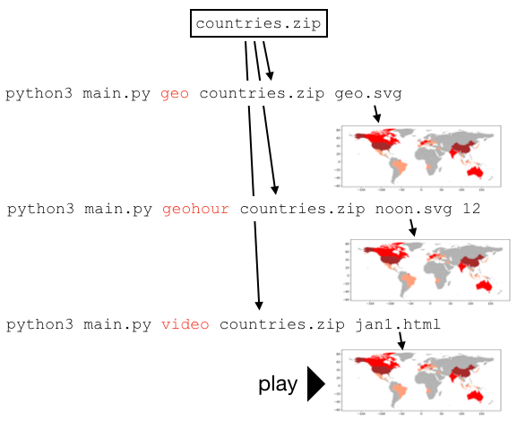

# P4: EDGAR Data

In this project, you'll be building a command line tool for processing
compress EDGAR web logs.  In the US, public companies need to
regularly file various statements and reports to the SEC's (Securities and
Exchange Commission) EDGAR database.  EDGAR data is publicly available
online; furthermore, web requests to EDGAR from around the world are
logged and published.  The logs list the pages visited and weakly
anonymized IP addresses of visitors, allowing good guesses about what
docs various hedge funds and others are looking at.  For those
interested in the nitty-gritty details of what could be done with this
data, take a look at this early-stage work:
[Hedge Funds and Public Information Acquisition](https://papers.ssrn.com/sol3/papers.cfm?abstract_id=3127825).

EDGAR logs are huge.  Logs for *just one day* might be about 250 MB
compressed as a .zip (or 2 GB uncompressed!).  It will be very useful
to have command line tools to sample and otherwise process this data.
Your tool (which will consist of a single `main.py`) will have three
commands for dealing with these zips: `sample`, `sort`, and `country`.

Your tool will also provide three commands for visualizing where web
requests to EDGAR are originating: `geo`, `geohour`, and `video`.
These will generate either images or videos.  For example, `geo`
generates the following:


## Corrections/Clarifications

* March 15: tests released (please download `tester.py` and `expected.json`)
* March 19: remove commas in pip3 command
* March 25: `geo` solution posted [here](geo-solution.md).

## What's Most Challenging?

There are six commands you need to implement for this project.  On
Wed, March 25th, we'll give away our code for one of these six.  Vote
on which one here:

https://forms.gle/1wtbgDHiKLVxhWNt7

Get an early start so you know which part you want us to solve for you!

## Testing

We'll get you a `tester.py` soon!  (sorry for the delay)

## EDGAR Data

Take a look at the list of daily zips and CSV documentation on the EDGAR site:
* https://www.sec.gov/dera/data/edgar-log-file-data-set.html
* https://www.sec.gov/files/EDGAR_variables_FINAL.pdf

Each zip contains a single CSV file with the same name (e.g.,
`log20170101.zip` contains `log20170101.csv`).

You have two choices:
* manually download `log20170101.zip` from EDGAR using wget, then take a sample of 1% of the rows to produce a smaller `jan1.zip` using your `sample` command (described later)
* just download the `jan1.zip` file we provided by doing the sampling

You'll be creating lots of zip files for this projects, so you'll want
to know some command line techniques to troubleshoot.

View names of files in a zip file:

```
unzip -l jan1.csv
```

View start of a file inside of a zip file:

```
unzip -p jan1.zip jan1.csv | head
```

Change `head` to `tail` to see the end of the file.  You may want to
use these to compare the various zip files you produce to the versions
we've posted to GitHub.

## IP2Location(:tm:) LITE IP-COUNTRY Dataset

You need to associate IP addresses with countries for this project.
There's a Creative Commons dataset here we'll use:
https://lite.ip2location.com/database/ip-country.  We've uploaded a
copy of this `IP2LOCATION-LITE-DB1.CSV.ZIP` file to GitHub for you to
manually download.

One weird thing about this dataset is that regular IP address, like
`"34.67.75.25"`, get converted to integers, like `574835481`.  Rather
than dive into the details around this, consider adapting the
following, with citation, of course!

https://stackoverflow.com/questions/9590965/convert-an-ip-string-to-a-number-and-vice-versa

Other than that, poke around the IP dataset and documentation and see
if you can figure it out, asking questions on Piazza as necessary.
Note that IP ranges are ascending (will help you later).

## Packages

You'll need to install some packages.  `click` will make it easy to
build command line tools:

```
pip3 install click
```

And these will help you make maps:

```
pip3 install geopandas shapely descartes
```

## Starter Code

Your tool will be named `main.py`.  It will be possible to run
`python3 main.py COMMAND ...` where COMMAND will be replaced by
specific operations, such as `sample` or `sort.

Start with this code:

```python
import click

@click.command()
@click.argument('zip1')
@click.argument('zip2')
@click.argument('mod', type=click.INT)
def sample(zip1, zip2, mod):
    print("zip1:", zip1)
    print("zip2:", zip2)
    print("mod:", mod)
    # TODO: finish this

@click.group()
def commands():
    pass

commands.add_command(sample)

if __name__ == "__main__":
    commands()
```

Look at every place "sample" appears -- where will you need to make
changes to add completely new commands later?

Try running a few things from the terminal:

```sh
python3 main.py --help # lists available commands
```

```sh
python3 main.py sample # shows what arguments sample command needs
```

```sh
python3 main.py sample samp.zip samp2.zip 10 # click module automatically runs sample(...)
```

## Data Pipeline Commands

`sample`, `sort`, and `country` are commands that will take a .zip as
input and produce a new .zip as output.  The zips will contain a
single .csv by the same name.  It will be possible to chain the
transformations together into a pipeline, to make a series of changes
to the data:


Each box represents a .zip file, and the `python3 main.py ...` parts
are showing how somebody could use your tool to transform the data
from one stage to the next.  We've also share all our intermediate
versions to help you debug and so you can make progress on later
commands even if you're stuck on earlier ones.

We've already run our version of the `sample` command to produce
`jan1.csv`, so you can download that one as a starting point if you
like (the `log20170101.zip` would take a long time to download).

### 1. `sample` Command

This one takes three arguments:
* input zip
* output zip
* stride

If stride is 10, then rows 0, 10, 20, 30, etc. will be in the sample.
If stride is 100, then 0, 100, 200, 300, etc. will be in the sample.

For this command (and those following), there won't always be enough
memory to read the entire CSV in with Pandas, so you should use
Python's `csv` module for looping over one row at a time.

Here's a function that might be useful for pulling in on row at a time:

```python
def zip_csv_iter(name):
    with ZipFile(name) as zf:
        with zf.open(name.replace(".zip", ".csv")) as f:
            reader = csv.reader(TextIOWrapper(f))
            for row in reader:
                yield row
```

Here's an example snippet that might use the above to print off IP addresses:

```python
reader = zip_csv_iter("jan1.zip")
header = next(reader)
ip_idx = header.index("ip")
for row in reader:
    print(row[ip_idx])
```

Running the above will give output like this:

```
104.197.32.ihd
208.77.214.jeh
54.197.228.dbe
108.39.205.jga
52.45.218.ihf
104.197.32.ihd
183.195.251.hah
68.180.231.abf
107.178.195.bbb
107.3.20.gcd
...
```

Yes, those aren't quite real IP addresses, as explained in the next section...

### 2. `sort` Command

In this one, it's OK if you read in the complete CSV, then sort,
perhaps something like this:

```python
reader = zip_csv_iter(????)
header = next(reader)
rows = list(reader)
rows.sort(????)

# TODO: write the new zip file
```

Although not expected, it's definitely cool if you find a way to write
this so that it can even work on very large input zip files that don't
fit in memory (like `log20170101.zip` on your virtual machine).

The sorting needs to be done **numerically**, so you'll need to
convert the IP addresses to integers as [discussed earlier](#ip-data).

One problem: EDGAR tries to anonymize data, so you see IP addresses
like `104.197.32.ihd`.  "ihd" is replacing what was originally digits.

You should substitute zeros for the anonymizing digits (for example,
`104.197.32.000`) so that you can convert the IPs to ints with the
StackOverflow example.  The substitution could be done with `re.sub`,
among other ways.  The substitution should only occur for sorting, and
the `104.197.32.ihd` should be what is written to the output zip file.

### 3. `country` Command

This one uses the IP2Location(:tm:).  The compressed output table
should be the same as the input, except with an extra column for
country at the end.

The `country` command only needs to work on .zip files where IPs are
already sorted in ascending order (perhaps it's output from the `sort`
command you just created).

The fact that both the IP2Location(:tm:) data and the input zip to the
`country` command are sorted in ascending order by IP means it should
be possible to implement `country` as an O(N) function, where N is
number of rows.  Searching through all the IP2Location(:tm:) data
again for each row of input data could be pretty slow.

## Visualization Commands

Once you know have the country data for all the requests, there are a
lot of fun ways to visualize the data.  As shown in the following, the
`geo` and `geohour` commands will produce .svg files, where countries
generating more requests are drawn darker.  The `video` command will
generate a 24-frame animation, showing where requests are coming
from, hour-by-hour.



### 4. `geo` Command

Give this a try:

```python
import geopandas
world = geopandas.read_file(geopandas.datasets.get_path('naturalearth_lowres'))
world.plot()
```


The `geo` command will produce a similar map, with at least three improvements:

1. make it larger
2. don't show Antarctica -- the penguins probably aren't operating a hedge fund there anyways
3. countries that sent more traffic to EDGAR should be shaded darker

You can otherwise decide the color scheme, and it can be continuous or
discrete (for example, one color for 1000+, another for 100-999, etc).

Many of the country names are identical in the IP2Location(:tm:) and
EDGAR log datasets.  In cases where the names are slightly different,
you don't need to worry about shading for that country.

### 5. `geohour` Command

Same as above, but an integer between 0 and 23 is passed in.  The rows
is filtered on the `time` column before the plot is generated.

### 6. `video` Command

Imagine running `geohour` for all hours of the day, then combining the
images to make a video.  That's basically what this command does.

We'll be using
[FuncAnimation](https://matplotlib.org/3.2.0/api/_as_gen/matplotlib.animation.FuncAnimation.html#matplotlib.animation.FuncAnimation)
to create the video, then call
[.to_html5_video(...)](https://matplotlib.org/api/_as_gen/matplotlib.animation.Animation.to_html5_video.html),
which is why we have `.html` in the video's file name.

The final thing can look something like [this](https://tyler.caraza-harter.com/cs320/s20/materials/p4-vid.html).