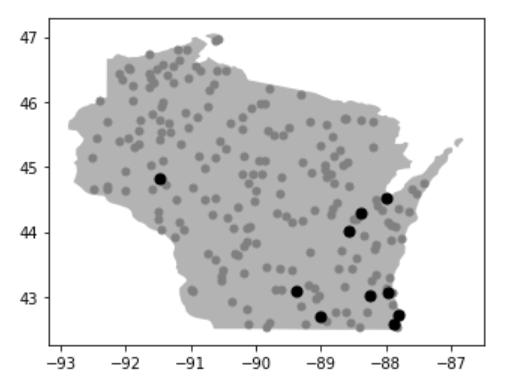
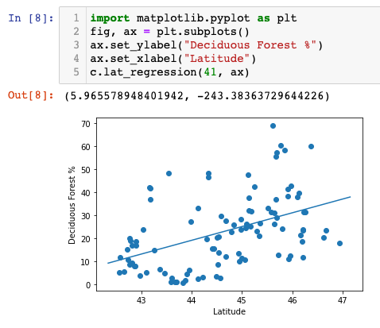

# WORK IN PROGRESS, DON'T START YET!!!

# P5: Wisconsin Land Use

In this project, you'll explore how land is used in Wisconsin (for
cities, forests, farming, etc).  [This
dataset](https://www.mrlc.gov/data/nlcd-land-cover-conus-all-years)
breaks the United States into 30m squares and categorizes how those
chunks of land have been used from 2001 to 2016 (this data is
collected every 2-3 years, so there only 7 years of data over this
range).

Take a look
[here](https://www.mrlc.gov/data/legends/national-land-cover-database-2016-nlcd2016-legend)
to see the different ways land is used.

Although the data covers the whole US, we'll be looking at a sampling
of places in WI.  Here's an example of the land use around Madison:


You'll write a Python module to help others analyze this data (like
the bus module for P2).  The module will help pull data from a sqlite3
database, a zip file, and numpy matrices representing land use.

## Corrections/Clarifications

* none yet

## Dataset

The [original dataset](https://s3-us-west-2.amazonaws.com/mrlc/NLCD_Land_Cover_L48_20190424_full_zip.zip) for the whole US is large (roughly 10GB, compressed).

Thus, we only take data for the following points in WI:



The 100 gray dots are randomly chose, and the black dots are the 10
largest cities.  There are seven years of data for each of the city
points, but only 2016 data for the randomly sampled points.

We're giving you two files with data about these locations:
`images.zip` and `images.db`.  Both are generated by
build-dataset.ipynb (you're welcome to look how if you're curious, but
it's not really related to what you'll do).

### Zipped Images

Look inside `images.zip`:

```
unzip -l images.zip
```

You'll see a bunch of .npy files, meaning they contain numpy matrices
(these contain the use data).

#### [Read This](map.md) to learn how to generate a map from the matrices.

How do you know where those images are for?  That's where `images.db`
comes in.

### Sqlite Database

Run the following:

```python
import os
import sqlite3
import pandas as pd

assert os.path.exists("images.db")
c = sqlite3.connect("images.db")

pd.read_sql("SELECT tbl_name FROM sqlite_master", c)
```

Run some SQL queries to see what is in each of the tables.

Note, you'll often want to combine (or *join*) data from the two
tables into one big "table", so you can see both time (from `images`
table) and location (from `places` table).

## Requirements

You'll need to several functions and classes to your module, which
should be in a file named `land.py`.

### 1. `Connection` class

Create a `Connection` class in land.py, building on the following:

```python
import zipfile
import sqlite3

def open(name):
    pass # TODO

class Connection:
    def __init__(self, name):
        self.db = sqlite3.connect(name+".db")
        self.zf = zipfile.ZipFile(name+".zip")

    def close(self):
	# TODO
```

People should be able to use your module like this:

```python3
import land

c = land.open("images")
# use connection
c.close()
```

Or this:

```python3
with land.open("images") as c:
    pass # use connection
```

Make sure `db` and `zf` get closed at the end.

`Connection` should have `list_images`, `image_year`, `image_name`,
and `image_load` methods that behave as follows:

```python
with land.open("images") as c:
    # gets alphabetically sorted list of images
    # expected: ['area0.npy', 'area1.npy', 'area10.npy', 'area100.npy', ...]
    print(c.list_images()) 

    # get name from DB corresponding to this image
    # expected: 2001 (of type int, not int64)
    print(c.image_year("area0.npy"))

    # get name from DB corresponding to this image
    # should be "madison"
    print(c.image_name("area0.npy")) 
    
    # get numpy area that encodes area usage
    # should be a 2-dimensional numpy array
    print(c.image_load("area0.npy"))
```

For the last three, you may either do a query each time, or load the
data to a pandas DataFrame when a `Connection` is created.

The last three functions take an image name and return some
corresponding data.  "Year" comes from the `images` table in the DB.
"Name" is trickier: the `images` table associates the file name with a
`place_id`, which can then be used in the `places` table to get a name

### 2. `Connection.lat_regression` method

Use least-squares to get a formula:

`percent = slope*lat + intercept`

`percent` is the portion (between 0 and 100) that is expected to have
usage code `use_code` at a given altitude.

If `c` is a `Connection` then `c.lat_regression(use_code, ax)` should
return this information as a `(slope, intercept)` tuple.

For example, `c.lat_regression(41, None)` returns `(5.965578948401942,
-243.38363729644226)`.

This means that for every degree of latitude you go north, you can
roughly expect another 6% to be Deciduous Forest (the land type for
code 41).  Or, based on this information, we might note that Madison's
latitude is 43.0731, so we might expect about 13.3% (`5.96 * 43.07 +
-243.38`) of the nearby areas to be Deciduous Forest.

Install scikit-learn (`pip3 install sklearn`) and use
`LinearRegression` to do the regression:

https://scikit-learn.org/stable/modules/generated/sklearn.linear_model.LinearRegression.html

If the `ax` value passed is not None, `lat_regression` should plot the
computed points and fit line in that area.  For example, somebody
might use your function like this:



### 3. `City` class

### 4. `City.year_regression` method

### 5. `City.animate` method
