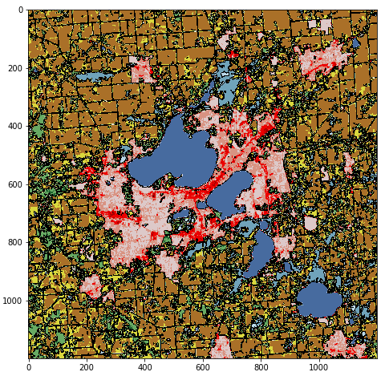

# Viewing a Map

In a notebook, run the following:

```python
from zipfile import ZipFile
import io
import numpy as np
from matplotlib import pyplot as plt
from matplotlib.colors import ListedColormap

with ZipFile("images.zip") as zf:
    with zf.open("area0.npy") as f:
        buf = io.BytesIO(f.read())
        madison = np.load(buf)
madison.shape
```

We see that the Madison map is 1200x1200 pixels.  Let's visualize this as a map:

Look at the land use codes for the top-left slice of the map:

```python
madison[:10,:10]
```

```
array([[81, 82, 82, 82, 82, 82, 82, 82, 82, 82],
       [81, 81, 82, 82, 82, 82, 82, 82, 82, 82],
       [81, 81, 81, 82, 82, 82, 82, 82, 82, 82],
       [81, 81, 81, 81, 82, 82, 82, 82, 82, 82],
       [81, 81, 81, 81, 82, 82, 82, 82, 82, 82],
       [82, 81, 81, 81, 82, 82, 82, 82, 82, 82],
       [82, 81, 81, 81, 82, 82, 82, 82, 82, 82],
       [82, 81, 81, 81, 82, 82, 82, 82, 82, 82],
       [82, 81, 81, 81, 82, 82, 82, 82, 82, 82],
       [82, 82, 82, 82, 82, 82, 82, 82, 82, 82]], dtype=uint8)
```

Looking up codes 81 and 82
[here](https://www.mrlc.gov/data/legends/national-land-cover-database-2016-nlcd2016-legend),
we see that this corner of the map is mostly for pasture and crops.

Let's look at the map:

```python
plt.figure(figsize=(8,8))
plt.imshow(madison)
```


It's recognizable as Madison, but the colors don't match the codes.
We need to create something called a colormap in matplotlib that lets
us choose specific colors for specific codes.  This isn't a key part
of the project, so you can just paste the following:

```python
use_cmap = np.zeros(shape=(256,4))
use_cmap[:,-1] = 1
uses = np.array([
    [0, 0.00000000000, 0.00000000000, 0.00000000000],
    [11, 0.27843137255, 0.41960784314, 0.62745098039],
    [12, 0.81960784314, 0.86666666667, 0.97647058824],
    [21, 0.86666666667, 0.78823529412, 0.78823529412],
    [22, 0.84705882353, 0.57647058824, 0.50980392157],
    [23, 0.92941176471, 0.00000000000, 0.00000000000],
    [24, 0.66666666667, 0.00000000000, 0.00000000000],
    [31, 0.69803921569, 0.67843137255, 0.63921568628],
    [41, 0.40784313726, 0.66666666667, 0.38823529412],
    [42, 0.10980392157, 0.38823529412, 0.18823529412],
    [43, 0.70980392157, 0.78823529412, 0.55686274510],
    [51, 0.64705882353, 0.54901960784, 0.18823529412],
    [52, 0.80000000000, 0.72941176471, 0.48627450980],
    [71, 0.88627450980, 0.88627450980, 0.75686274510],
    [72, 0.78823529412, 0.78823529412, 0.46666666667],
    [73, 0.60000000000, 0.75686274510, 0.27843137255],
    [74, 0.46666666667, 0.67843137255, 0.57647058824],
    [81, 0.85882352941, 0.84705882353, 0.23921568628],
    [82, 0.66666666667, 0.43921568628, 0.15686274510],
    [90, 0.72941176471, 0.84705882353, 0.91764705882],
    [95, 0.43921568628, 0.63921568628, 0.72941176471],
])
for row in uses:
    use_cmap[int(row[0]),:-1] = row[1:]
use_cmap = ListedColormap(use_cmap)
```

Now try again, setting `cmap`, `vmin`, and `vmax`:

```python
plt.figure(figsize=(8,8))
plt.imshow(madison, cmap=use_cmap, vmin=0, vmax=255)
```

