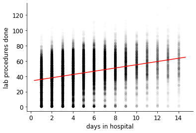
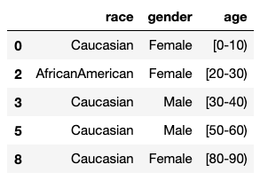

# IN PROGRESS!!!!

# DON'T START YET!!!!!

# P6: Hospital Readmission

When patients are admitted to a hospital, the type of care they
receive may affect whether they'll be readmitted again in the near
future.  In this project, we'll look at data about length of stay and
readmissions for patients with diabetes.

You'll be answering questions (using the `#qN` format) in a .ipynb
notebook file, much like you did for P1.  You'll be primarily using
sklearn to learn about the data.  The main challenge will be getting
the data into a form that can readily used as sklearn input.

## Corrections/Clarifications
* none yet

## Dataset

Take a quick look at the following paper:

Beata Strack, Jonathan P. DeShazo, Chris Gennings, Juan L. Olmo,
Sebastian Ventura, Krzysztof J. Cios, and John N. Clore, "<a
href="http://downloads.hindawi.com/journals/bmri/2014/781670.pdf">Impact
of HbA1c Measurement on Hospital Readmission Rates: Analysis of 70,000
Clinical Database Patient Records</a>," BioMed Research International,
vol. 2014, Article ID 781670, 11 pages, 2014.

Pay close attention to criteria the researchers used to build this
dataset (start of section 2.2 on page 2) and the description of
various fields (Table 1 on page 3).

The data described can be found here:
https://archive.ics.uci.edu/ml/datasets/diabetes+130-us+hospitals+for+years+1999-2008.
We've included the `dataset_diabetes.zip` file for you to use here on
GitHub.

The most important data is in the `diabetic_data.csv` file inside this
zip.  Load that a DataFrame and get familiar with the columns.  Note
that missing data is represented by question marks ("?") --
unfortunately, not all hospitals collected the same information about
visits.

## Part 1: Train/Test Split

In machine learning, it is easy to accidentally train models that
simply memorize details of the data rather than capturing meaningful
patterns -- this is called overfitting.

To check whether this is happening, models are usually trained on a
training set, then evaluated on both the training set and a separate
test set.  A model that does much worse on test data than training
data likely overfitted.

You should split the rows of the original DataFrame (from
`diabetic_data.csv`) into DataFrames named `train` and `test`.

Training+test datasets are often formed by randomly splitting the
original data in some way.  To simply our auto-grading, you will
instead split based on the following rule:

Add up all the digits in the `encounter_id` and `patient_nbr` columns
together.  If the sum is even for a row, that row should go to
`train`; else, it should go to `test`.

For example, the first row has encounter_id 2278392 and patient_nbr
8222157.  This is a training row as (2+2+7+8+3+9+2) + (8+2+2+2+1+5+7)
= 60, an even number.


#### Q1: What are the shapes of the `train` and `test`?

After you've built the DataFrames, just paste this in a cell to answer this question:

```python
#q1
train.shape, test.shape
```

#### Q2: Is `time_in_hospital` similar between test and training?

Answer with a tuple giving the means and standard devations for this
field in both datasets, like this:

```python
#q2
(
    train["time_in_hospital"].mean(),
    test["time_in_hospital"].mean(),
    train["time_in_hospital"].std(), 
    test["time_in_hospital"].std(),
)
```

We're doing this to sanity check that our scheme for splitting the
into the two datasets into test/training (checking the oddness of the
sum of digits) isn't producing very disimilar subsets.

#### Q3: Is `readmitted` similar between test and training?

Answer with a nested dict, like this:

```python
#q3
{
    "train": dict(train["readmitted"].value_counts()),
    "test": dict(test["readmitted"].value_counts()),
}
```

#### Q4: How much data is missing in each column?

Answer with a dictionary, where each key is the name of a column
containing at least some missing data, and the value is the percent
(out of 100) of data that is "?".  Don't include columns with no
missing data in the dictionary.

## Part 2: Heat Maps

Answer the following questions with respect to the training data (not
the original dataset!).

#### Q5: How common is each pairing of `admission_source_id` to `discharge_disposition_id`?

Output should be a DataFrame, like the "Question 5" one in
`expected.html`.  The index contains every unique
`admission_source_id` and the columns correspond to every unique
`discharge_disposition_id`.  Each cell is an integer, representing how
many rows have each admission/discharge combo.

The order of the rows/columns in the output is not important to the
tester.

To satisfy the tester, you will need to tweak the display options so
data is not hidden by ellipses (`...`):

https://pandas.pydata.org/pandas-docs/stable/user_guide/options.html

You may want to reset the display option after the question.

#### Q6: How common is each pairing of admission source to discharge disposition?

This is the same as last time, but now codes are replaced with
descriptions, like in the "Question 6" table in `expected.html`.

This question is actually very challenging because the
`dataset_diabetes/IDs_mapping.csv` file is weirdly formatted.  We
didn't make it so -- this is an example of real-world messiness you'll
often encounter as a data scientist.  Basically, there are three CSVs
jammed together into one .csv file.  Each of the three is separated by
a line that is empty, except for one comma.

Once you pull the data out of `IDs_mapping.csv`, you may want to use
the following function to add real index/column names to your
DataFrame from `#q5`, without recomputing everything from scratch:

https://pandas.pydata.org/pandas-docs/stable/reference/api/pandas.DataFrame.rename.html

#### Q7: How common is each pairing of admission source to discharge disposition? [Heat Map]

This is the same as the last one, but now, instead of producing a table, you should produce a heatmap, like this:


Hints:

* here's an example of how to create a square heatmap from a DataFrame (not that your DataFrame is NOT square): https://www.pythonprogramming.in/generate-a-heatmap-in-matplotlib-using-pandas-data.html
* we used the `cmap="binary"` to make darker values correspond to larger numbers
* a few combinations dominate -- to make the others visible, take the `log2` of each number before calling `plt.imshow`.  As `log2(0)` is not defined, add 1 to each cell before taking the `log2`.  Why is it valid for us to make these seemingly arbitrary transformations?  Because color is inherently subjective (unlike, say, distance along an axis), so we only care about the relative, namely that darker=more.

## Part 3: Regressions

Add a column to your train and test datasets named `visits` that sums
the three kinds of prior visits already recorded in the data:
`number_outpatient`, `number_inpatient`, `number_emergency`.

#### Q8: What is the relationship between number of prior visits and length of stay for the current visit? [PLOT]

Answer with a plot like this:


Requirements:
* scatter points should be somewhat transparent
* font size of at least 12 required
* top+right spines (borders) should be removed
* slope should be computed using `LinearRegression` in sklearn with no special configuration

For tester.py to auto-grade this, the last line in your `#q8` cell should be this:

```python
check_regression(ax)
```

The `check_regression` function extracts important details of the plot to a dict, which tester.py can test.  Paste the `check_regression` function somewhere earlier in your notebook, without modifying it:

```python
# do not change this function!
def check_regression(ax):
    plot = {}
    plot["font12plus"] = min(ax.xaxis.label.get_size(),
                             ax.yaxis.label.get_size(),
                             ax.get_xticklabels()[0].get_size()) >= 12
    plot["transparency"] = ax.collections[0].get_alpha() != None
    plot["x-label"] = ax.get_xlabel().lower()
    plot["y-label"] = ax.get_ylabel().lower()
    plot["spines"] = ax.spines['right'].get_visible() or ax.spines['top'].get_visible()
    plot["x-mean"], plot["y-mean"] = ax.collections[0].get_offsets().data.std(axis=0)
    plot["x-std"], plot["y-std"] = ax.collections[0].get_offsets().data.mean(axis=0)
    plot["slope"] = None
    for line in ax.get_lines():
        x = line.get_xdata()
        y = line.get_ydata()
        for i in range(1, len(x)):
            slope = (y[i]-y[i-1]) / (x[i] - x[i-1])
            intercept = y[i] - x[i] * slope
            if plot["slope"] is None:
                plot["slope"] = slope
                plot["intercept"] = intercept
            elif not (np.isclose(plot["slope"], slope) and 
                      np.isclose(plot["intercept"], intercept)):
                plot["slope"] = None
                plot["intercept"] = None
                break
    return plot
```

#### Q9: How well does the regression perform on both the train and test datasets?

Look at the metrics for evaluating regressions here: https://scikit-learn.org/stable/modules/model_evaluation.html

Then use the a`explained_variance_score`, giving a tuple of size two,
with the regression's scores on train and test respectively.

Expected: `(0.0009184071670116367, 0.001087944356748527)`

Based on these results, we conclude that our linear model doesn't do a
good job capturing the variance in the data (the best score possible
is 1).

#### Q10: What is the relationship between the length of stay and number of procedures performed during that time? [PLOT]

It should look like the following.  Use `check_regression` as before
to test it.



#### Q11: How well does the regression perform on both the train and test datasets?

Answer the same way you did for Q9.

Expected: `(0.10234075960861977, 0.1004406985134011)`

Still not amazing, but at least now we're explaining 10% of the
variance.  Also, no signs of overfitting, as the two scores are
similar.

## Part 4: Transformer

Take a look at the demographic data in our training dataset:

```python
train[["race", "gender", "age"]].head()
```



Unfortunately, we can't do a regression over this data in its current form.  Try it:

```python
lr = LinearRegression()
lr.fit(train[["race", "gender", "age"]], train[["time_in_hospital"]])
```

You'll get `ValueError: could not convert string to float: 'Caucasian'`.

We'll need to transform the data to make it purely numeric so that we
can do the regression.  The age column is the easiest to fix: we'll
pick numbers in the middle of each range (for example, we'll represent
`[0-10]` as `5`).

The `gender` and `race` columns are trickier.  We could each unique
string in these columns a different numeric code, but this will not
lead to meaningful results for a linear regression.

Instead, we should create more columns, for each unique value
("Female", "Male", "African", "Asian", etc).  When constructing a row
for a person, we'll put a 1 in each column when that category applies
to them.  This general strategy of transforming one column with
categorical data into a group of columns containing one `1` per row is
a general machine learning technique called *one-hot encoding*.

Complete the following code to create a class that can transform the
original data using one-hot encoding:

```python
from sklearn.base import TransformerMixin

def range_mid(r):
    r = r.strip("[]()")
    return int(r.split("-")[0]) # TODO: fix the logic here!

class DemographicTransformer(TransformerMixin):
    def fit(self, train_df, y=None):
        # TODO: compute self.race_columns to contain every unique
        #  value in the race column of train_df, in sorted order,
        #  excluding "?"

        return self

    def transform(self, df1):
        df2 = pd.DataFrame()

        # TODO: uncomment after fit function is finished
        # for race in self.race_columns:
        #     df2[race] = (df1["race"] == race).astype(int)

        for gender in ["Female", "Male"]:
            df2[gender] = (df1["gender"] == gender).astype(int)

        df2["age"] = df1["age"].apply(range_mid)
        self.output_features_ = list(df2.columns)
        return df2
```

Inheriting from `TransformerMixin` automatically gives us a
`fit_transform` method that calls our own `fit` and `transform`
methods in one step.

Why do we need separate `fit` and `transform` methods?  We'll
eventually want to transform both train and test data.  What if the
test data contains some values in the race column that didn't show up
in the same column in the training data?  We wouldn't want our
transformation to produce different one-hot encodings for our test
data than for our traing data, or any further analysis (like linear
regression) wouldn't work.

So the `fit` is used to figure out the columns based on the training
data only, and the `transform` can be used on both training and
testing data to fill those columns.

#### Q12: what is `DemographicTransformer().fit_transform(train).head()`?

It should look like table 12 in `expected.html`.

#### Q13: what is the fitted relationship between length of stay and the demographic data?

You can create an sklearn pipeline to automatically feed the data
through your transformer, then to a linear regressor:

```python
lr = LinearRegression()
pipe = Pipeline([
    ("dem", DemographicTransformer()),
    ("lr", LinearRegression()),
])
y = "time_in_hospital"
pipe.fit(train, train[[y]])
```

Then, you can find an answer by inspecting different parts of the pipeline:

* `pipe["dem"].output_features_` gives the one-hot features you computed
* `pipe["lr"].coef_` gives the coefficients on those columns
* `pipe["lr"].intercept_` gives the intercept

Answer with a string representing the equation, with the coefficients (rounded to two places) and column names:

Expected: `'stay = 0.32*AfricanAmerican + -0.29*Asian + 0.04*Caucasian + -0.14*Hispanic + -0.10*Other + 3.42*Female + 3.28*Male + 0.02*age + -0.45'`

#### Q14: how well does that equation explain the variance?

Answer using the same format as `#q19`

Expected: `(0.014362012823362136, 0.012415699517403067)`

Not very well, apparently!

## Part 5: Classification


## Part 6: Gradient Descent with PyTorch

Earlier, in `#q10`, we used sklearn to find the coefficients that
minimized the mean-squared error, thus producing a least-squares fit
line that we could draw over the scatter plot.

Alternatively, we could have used PyTorch's ability to compute
gradients to iteratively improve on some arbitrary initial
coeeficients, each time changing them a little to make the
mean-squared error smaller.  Note that although this approach
(gradient descent) is slightly slower than sklearn in this case, it
will often be faster for regressions over many variables and data
points.

Run this code to optimized the fit line over 1000 iterations:

```python
from torch import tensor

# STEP 1
# optimize coef such that the difference between y and
# A@coef is minimized
x = "time_in_hospital"
y = "num_lab_procedures"

A = train[[x]].copy()
A["ones"] = 1
A = tensor(A.values, dtype=float)
b = tensor(train[[y]].values, dtype=float)
coef = tensor([[0], [0]], dtype=float).requires_grad_()

learning_rate = 0.01
for i in range(1000):
    predicted = A @ coef
    mse = ((predicted - b) ** 2).mean()
    mse.backward()
    coef.data -= coef.grad * learning_rate
    coef.grad.zero_()
        
# STEP 2
# show scatter and fit line based on coef
fig, ax = plt.subplots()
train.plot.scatter(x=x, y=y, c="k", alpha=0.01, ax=ax)
ax.spines["top"].set_visible(False)
ax.spines["right"].set_visible(False)
ax.set_xlabel("days in hospital")
ax.set_ylabel("lab procedures done")

xlim = np.array(ax.get_xlim())
coef_np = coef.detach().numpy()
ax.plot(xlim, xlim * coef_np[0] + coef_np[1], color="red")
```

#### Q20: how quickly does the fit line converge to the correct position? [animation]

To answer, create a 25-frame animation (200 millisecond interval),
showing the position of the fitline after every 40 iterations of the
optimization loop above.

It should look like this: [gradient-descent.mp4](gradient-descent.mp4).

Recommended: once you have the animation working, try playing with
larger and smaller values for `learing_rate` to gain an intuition for
this important configuration.
