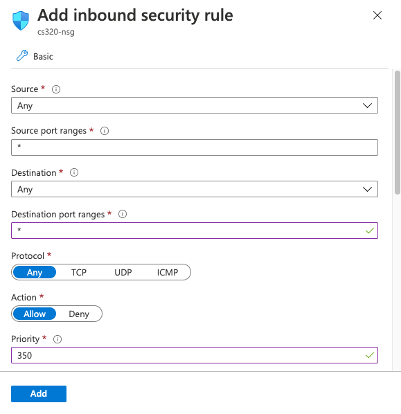

# Azure Option for Virtual Machine

## Creating an Account

Go here: https://azure.microsoft.com/en-us/free/students/


Click "Activate now".  Click @wisc.edu account if it shows up.
Otherwise, click "use another account" and type your @wisc.edu email.


Fill your profile details and click "Next".  Check "I agree" and "Sign up".

You can view the credits remaining on your Azure Student account at https://www.microsoftazuresponsorships.com/. 

## New Virtual Machine

Search for "Virtual machines" and click it:


Click the "+Add" button to create a new virtual machine:


Give your machine a name and choose a region near you ("Central US"
will probably be fastest for remote access for those working from
Wisconsin).  Make sure the image is "Ubuntu Server 18.04 LTS - Gen1"
(probably the default already, but double check).

**Very Important:** change the "Size" to "Standard_B1s", which costs
  <$10/month.  Larger sizes will quickly burn through any free credit
  you might have.


Other important options:

 - **Authentication type**: "SSH public key" (choose your **username**)
 - **SSH public key source**: "Generate new key pair"
 - **Key pair name**: "cs320"
 - **Select inbound ports**: check all options (80, 443, 22)

**Important:** write down the **username** you chose

There are a bunch of other pages that you could get to with buttons
like "Next: Disks" and "Next: Networking".  We'll take the defaults,
so feel free to skip these with the "Review + create" button.

Click "Create", then click "Download private key and create
resource".save the .pem file somewhere safe).  Click "Go to resource".

**Important:** remember where you saved the .pem file.  Without it,
  you won't be able to access your VM later.

You'll see a page like the following:


**Important:** note down the "Public IP address" -- you'll be using it later.

## Firewall

What is a firewall?  First, a little review from 220.

Remember from CS 220/301 that a computer (typically) has an *IP address*
(something like 123.234.210.001), and other computers knowing that IP
address can communicate with programs running on that computer.

If there are multiple running programs, they are differentiated by
*port numbers*.  For example, sending a message to 123.234.210.001:220
sends a message to the program on port 220 running on a computer with
address 123.234.210.001 (note the `:` between the IP address and port
number).  Sending a message to 123.234.210.001:320 might send a
message to a different program on that same machine.  Analogy: an IP
address is like the address of an apartment building (the computer),
and a port number is like the apartment number of a specific unit;
programs are the residents living in the units.

A Firewall (among other things) can block access to certain ports for
outsiders, to provide security.  We will unblock all ports for our
virtual machine.  This is not the most secure option, but it is
convenient, and fine for the purposes of this course.

Click "Networking" on the page for your VM:


Click "Add inbound port rule".  The following will pop up on the right:



Add "*" to the destination port ranges.  This is the most convenient
option but not the most secure.  It's fine for a class, but not
advisable in other scenarios (e.g., if you were hosting a web
application on the VM).

## SSH

A "shell" is a program that runs in the terminal that lets you
navigate through files/directories and run programs.  "SSH" stands for
"secure shell", and it is a program that lets you remotely access
another computer (for example, your virtual machine).

For these directions, make sure you have this information handy (which
we asked to write down earlier):

1. your username
2. location of the .pem file you downloaded
3. your VM's IP address

Open the terminal (on Mac, it is called terminal; on Windows, open
PowerShell).  Use `cd` to navigate to the location where you have your
.pem file.  Run `ls` to make sure you can see the ".pem" file.

On some systems, you need to change the permissions on the .pem file
before you can use it.  Try running `chmod 400 cs320.pem` (and don't
worry too much if it doesn't work).

Now run this:
```
ssh -i cs320.pem USERNAME@YOUR_IP_ADDRESS
```


This starts an *ssh session*.  This means that any command you type
don't run on your computer.  They run on your virtual machine.  For
example, if you do a "pip3 install ..." here, you'll be installing a
python package to your virtual machine, not your laptop.

## Jupyter

You might already know `pip` (well, on Ubuntu you'll run `pip3`
instead) can install Python packages.  `apt` is similar program on
Ubuntu that is more general purpose -- it's useful for all programs,
not just Python things.

The first thing you should do is install the latest updates on your virtual machine, using `apt`:

```
sudo apt update
sudo apt upgrade
```

Putting `sudo` in front of a command means Ubuntu should "do" the
command as the "super user" (the admin).  Only the admin can install
updates and install software.

We'll now use `apt` to install `pip3`, and then we'll use `pip3` to
install Jupyter.

```
sudo apt install python3-pip
pip3 install jupyter
```

When you start Jupyter notebook remotely, you'll want to set a
password for connecting to it.  Make it a good one, or anybody will be
able to take over your VM! (Whenever you need to enter something, like
a password, in the terminal, don't worry if nothing is appearing as
you're typing. Your keystrokes are still registering; the terminal
just isn't displaying them!)  Run the following:

```
mkdir -p ~/.jupyter
python3 -m notebook password
```

Now let's start Jupyter.  Run the following:

`nohup python3 -m notebook --no-browser --ip=0.0.0.0 --port=2020`

Putting "nohup" in front of a background means the program (in this
case `jupyter`) should keep running in the background, even if you
close the terminal.  "nohup" stands for "no hangup".

Now, open up a new browser window, and type `YOUR_IP_ADDRESS:2020` for
your VM's URL (IP should be the External IP of the virtual machine).
You can enter the same password that you set for Jupyter earlier.

After you login, make sure the setup works (e.g., you can create a
notebook and run code).

Good work on getting Jupyter running on your virtual machine!  We
suggest you bookmark the login page so you can come back to it later.

## Stopping your VM

Once done, you may want to stop your VM to release resources and ensure you aren't billed. 
You can do so via the dashboard:

