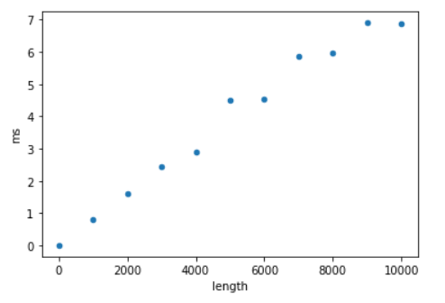
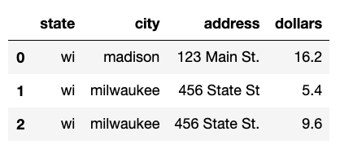

# Lab 10: Regression and SQL JOIN

## Part 1: time to shuffle

This method randomly re-arranges the items in a list:
https://docs.python.org/3/library/random.html#random.shuffle.  The
longer the list, the longer it takes.

Lets see if we can predict how long it will take to shuffle one
million numbers by (1) measuring how long it takes to shuffle one to
ten thousand numbers, (2) fitting a LinearRegression model to the
time/size measures, and (3) predicting/extrapolating to one million.

Create this table (we'll soon fill in the millisecond column):

```python
import time, random
import pandas as pd
from sklearn.linear_model import LinearRegression

times_df = pd.DataFrame({"length": [i * 1000 for i in range(11)], "ms": None}, dtype=float)
times_df
```

Complete and test the following function so that it uses `time.time()`
to measure how long it takes to do the shuffle, then returns that
amount of time in milliseconds:

```python
def measure_shuffle(list_len):
    nums = list(range(list_len))
    t0 = ????
    random.shuffle(nums)
    t1 = ????
    return ????
```

Now use `measure_shuffle` to fill in the `ms` column from our table
earlier (replace `????` with the column names in `times_df`) and plot
the relationship.

```python
for i in times_df.index:
    length = int(times_df.at[i, "length"])
    times_df.at[i, "ms"] = measure_shuffle(length)

times_df.plot.scatter(x="????", y="????")
```



Now train a model on the measured times, and use that to predict how
long it will take to shuffle a million numbers:

```python
lr = LinearRegression()
lr.fit(times_df[[????]], times_df[????])
lr.predict([[1000000]])
```

Call `measure_predict` with 1000000 to see how good your prediction
was.  When I did this, the model predicted 943.0 milliseconds, but it
actually took 887.6 milliseconds.  Not bad, considering we're
extrapolating to 100x larger than our largest measurement!

Note: LinearRegression worked well because `random.shuffle` uses an
O(N) algorithm.  Think about what would happen if you used a
LinearRegression to extrapolate the time it takes to do a non-O(N)
piece of work.  Or, better, replace `random.shuffle(nums)` with
`nums.sort()`, which as complexity O(N log N), as re-check how
accurate the predictions are.

## Part 2: SQL JOIN

Let's review SQL, then learn a very important new operator, JOIN.
First, create a database with information about sales at two grocery
store locations:

```python
import pandas as pd
import sqlite3

df = pd.DataFrame([
    {"state": "wi", "city": "madison", "address": "123 Main St.", "item": "apples", "quantity": 3, "price": 1},
    {"state": "wi", "city": "madison", "address": "123 Main St.", "item": "oranges", "quantity": 4, "price": 0.8},
    {"state": "wi", "city": "madison", "address": "123 Main St.", "item": "cantaloupe", "quantity": 5, "price": 2},
    {"state": "wi", "city": "milwaukee", "address": "456 State St", "item": "apples", "quantity": 6, "price": 0.9},
    {"state": "wi", "city": "milwaukee", "address": "456 State St.", "item": "oranges", "quantity": 8, "price": 1.2},
])
connection = sqlite3.connect("grocery.db")
df.to_sql("sales", connection, if_exists="replace", index=False)
```

Take a look at the data:

```python
pd.read_sql("SELECT * FROM sales", connection)
```

To review `GROUP BY`, take a look at this query that computes how much
revenue each kind of fruit generates and run it:

```python
pd.read_sql("SELECT item, SUM(quantity*price) AS dollars FROM sales GROUP BY item", connection)
```

Now, try to write a query that counts sales per location.

<details>
    <summary>ANSWER</summary>
    <code>
    pd.read_sql("SELECT state, city, address, SUM(quantity*price) AS dollars FROM sales GROUP BY state, city, address", connection)
    </code>
</details>

Notice a problem?  The issue is that all address information is
repeated for each location.  That wastes space, but much worse, it
opens the possibility for typos leading to results such as this:



To avoid these issues, it's common in practice to break up such a
table into two smaller tables, perhaps named `locations` and `sales`.
A `location_id` field might make it possible to combine the
information.

```python
df = pd.DataFrame([
    {"location_id": 1, "state": "wi", "city": "madison", "address": "123 Main St."},
    {"location_id": 2, "state": "wi", "city": "milwaukee", "address": "456 State St."},
])
df.to_sql("locations", connection, if_exists="replace", index=False)

df = pd.DataFrame([
    {"location_id": 1, "item": "apples", "quantity": 3, "price": 1},
    {"location_id": 1, "item": "oranges", "quantity": 4, "price": 0.8},
    {"location_id": 1, "item": "cantaloupe", "quantity": 5, "price": 2},
    {"location_id": 2, "item": "apples", "quantity": 6, "price": 0.9},
    {"location_id": 2, "item": "oranges", "quantity": 8, "price": 1.2},
])
df.to_sql("sales", connection, if_exists="replace", index=False)
```

Take a look at each table:

* `pd.read_sql("SELECT * FROM sales", connection)`
* `pd.read_sql("SELECT * FROM locations", connection)`

Note that you *could* figure out the location for each sale in the
`sales` table by using the `location_id` to find that information in
`locations`.

There's an easier way, `INNER JOIN` (there are other kinds of joins
that we won't discuss in CS 320).

Try running this:

```
pd.read_sql("SELECT * FROM locations INNER JOIN sales", connection)
```

Notice that the `INNER JOIN` is creating a row for every combination
of the 2 rows in `locations` and the 5 rows in `sales`, for a total of
10 result rows.  Most of these results are meaningless: many of the
output rows have `location_id` appearing twice, with the two values
being inconsistent.

We need to add an `ON` clause to match up each `sales` row with the
`locations` row that has the same `location_id`.  Add `ON
locations.location_id = sales.location_id` to the end of the query:

```python
pd.read_sql("SELECT * FROM locations INNER JOIN sales ON locations.location_id = sales.location_id", connection)
```

The `location_id` was only useful for matching up the rows, so you may
want to drop in in pandas (there's not a simple way in SQL):

```python
pd.read_sql("""
  SELECT * FROM 
  locations INNER JOIN sales 
  ON locations.location_id = sales.location_id""",
  connection).drop(columns="location_id")
```

We can also do similar queries as we could before when we only had one
table.  The `GROUP BY` will come after the `INNER JOIN`.  How much
revenue did each fruit generate?

```python
pd.read_sql("""
  SELECT item, SUM(quantity*price) AS dollars
  FROM locations INNER JOIN sales 
  ON locations.location_id = sales.location_id
  GROUP BY item""", connection)
```

Now, try write a query to answer the question, how much revenue was
there at each location?

<details>
    <summary>ANSWER (option 1)</summary>
    <code>
pd.read_sql("""
  SELECT state, city, address, SUM(quantity*price) AS dollars
  FROM locations INNER JOIN sales 
  ON locations.location_id = sales.location_id
  GROUP BY state, city, address""", connection)
    </code>
</details>

<details>
    <summary>ANSWER (option 2)</summary>
    <code>
pd.read_sql("""
  SELECT state, city, address, SUM(quantity*price) AS dollars
  FROM locations INNER JOIN sales 
  ON locations.location_id = sales.location_id
  GROUP BY locations.location_id""", connection)
    </code>
</details>
