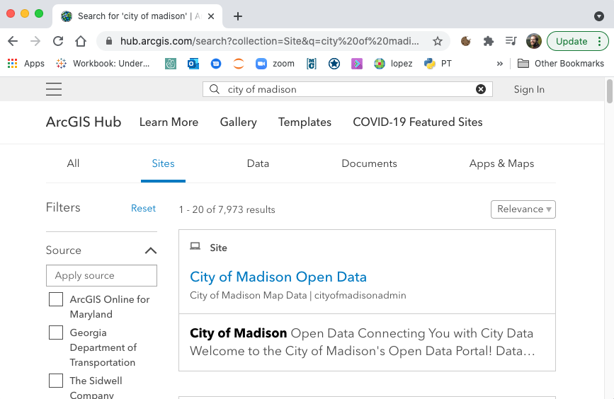
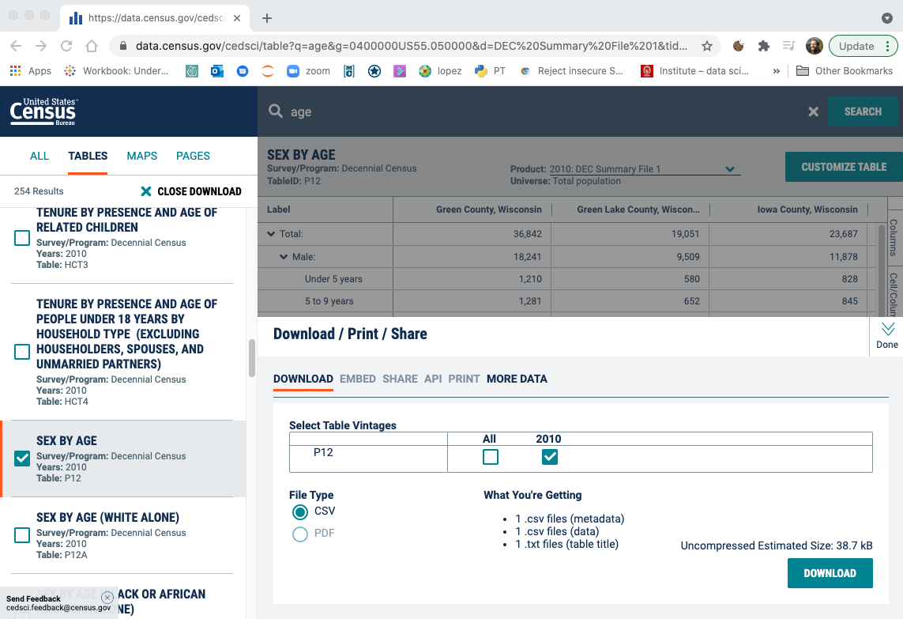
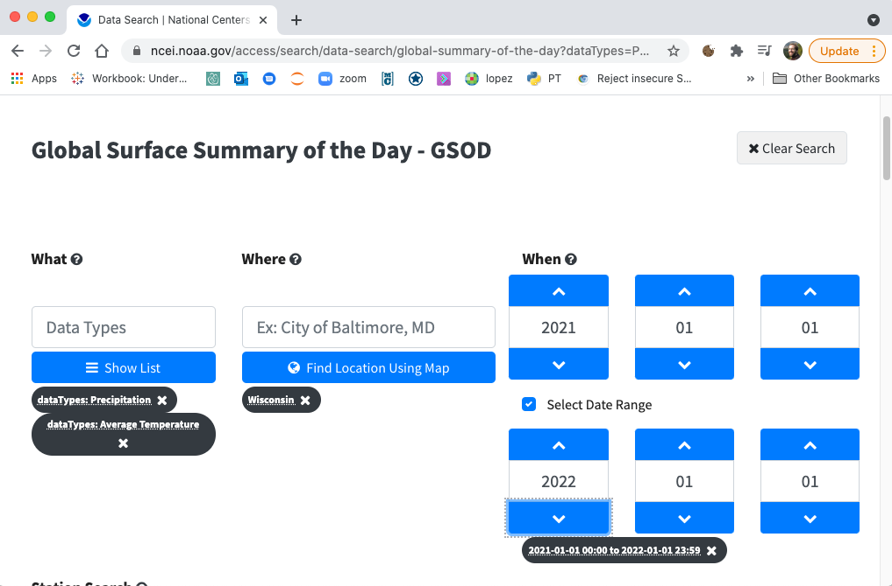

# Lab: Datasets for Final

The description for the 320 final exam is here:
https://github.com/tylerharter/cs320/tree/master/s21/final.  You'll
need to find a dataset to use for your analysis and paper.  If you
have already done so, feel free to skip this lab.  Otherwise, we'll
provide some ideas here.

## 1. Data Portals

Many government data portals are hosted on ArcGIS Hub:
https://hub.arcgis.com/search?collection=Site

Go to the site, and do a couple searches on the top:

1. "City of Madison" -- top hit is Madison's open data portal: https://data-cityofmadison.opendata.arcgis.com/
2. "County of Dane" -- top hit is Dane's open data portal: https://gis-countyofdane.opendata.arcgis.com/
3. "Wisconsin Department of Health Services" -- top hit is WI DHS open data portal: https://data.dhsgis.wi.gov/

These three have lots of interesting datasets to explore.  Of course,
there are many other data portals you may find of interest.

## 2. US Census

The US Census Bureau conducts a number of regular surveys.  Recently,
the 2020 decennenial census ("DEC", every 10 years) was conducted, but
not published yet.

As an example, let's find per-county data in WI on the distribution of residents by age and sex.

1. Go to https://data.census.gov/ and click "Advanced Search"
2. Click "Surveys" to see the list of available surveys
3. "DEC Summary File 1" has lots of interesting demographic information at high granularity -- select that
4. Under "Geography", click "County", then select "Wisconsin", then select "All counties Wisconsin"
5. Click "Search", then click "VIEW ALL TABLES"
6. There are many tables you could look through on the left.  Let's click "FILTER", then type "age" in the "SEARCH QUERY", then click "SEARCH"
7. Scroll down through the tables on the left (expanding as necessary) until you find "SEX BY AGE" (`Table: P12`), and click it.  You'll see a preview of the dat
8. Click the "DOWNLOAD" button (next to "FILTER" in the top left) to get check boxes by each dataset.  Place a check by the "SEX BY AGE" dataset
9. Scroll back up on the left, then click "DOWNLOAD SELECTED (1)", then download the CSV file
10. you'll get a zip with several files.  You'll want the CSV that contains the text "data_with_overlays"

https://data.census.gov/cedsci/all?d=DEC%20Summary%20File%201

## 3. NOAA: National Oceanic and Atmospheric Administration

NOAA has sensors around the world collecting many forms of weather and
other data.  Let's try to get a few months of temperature and
precipitation data from weather stations in Wisconsin.

1. go to https://www.ncdc.noaa.gov/data-access
2. on the left, go to "Land-Based Station", "Datasets", GSOD ("summary of day" statistics)
3. choose precipitation and average temperaturen under "What"; choose "Wisconin" under "Where", and choose dates from Jan 1st, 2021, to Jan 1st, 2022 under "When"
4. below there is an option to download data for individual stations in WI.  Instead, click "+ Select All", then click "Configure and Add"
5. set "Include Station Location" and "Include Station Location" to "Yes"
6. click "Proceed to Cart" (don't worry, you don't need to pay!)
7. type your email address on the right, then click "Submit"
8. watch you're inbox.  You'll probably get an email that they're working on it, then another a minute or two later with the actual data CSV

