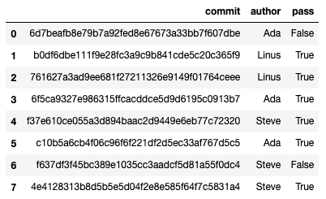
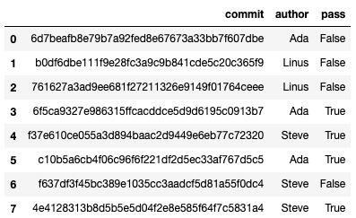

# Project 1: Counting Fast

## Corrections/Clarifications

* Jan 28: fix expected.html to work with both versions of beautifulsoup4
* Feb 10: reword "not counting the time to generate the input file" to "not counting the time to generate the random text that is passed to run_wc"
* Feb 22: clarified that "partner" should be blank for submissions

## Overview

You manage a team of three developers (Ada, Linus, and Steve), and you
want to evaluate their work on the WC project (a tool for efficiently
doing a "word count" and displaying how many times different words
appear in a file).  Fortunately, they have all been making
contributions to a shared git repository, so you can see who did what,
and evaluate the improvements to the code.

Git is an integral part of any modern software development. It is a
program that enables it's users to collaborate on code, track changes
to files, see who wrote what and so forth. In this project we will be
exploring the git repo(sitory) containing the WC source code that has
been provided as `repo.zip`.

## Setup

You'll need to install a few pip packages, if you don't already have them (connect to your VM with SSH to do the installs):

```
pip3 install pylint beautifulsoup4 pandas matplotlib
```

You should create a directory/folder named `p1` somewhere on your
virtual machine where you'll do your work.  Download the following to your `p1` directory:

* https://github.com/tylerharter/cs320/raw/master/s21/p1/tester.py
* https://github.com/tylerharter/cs320/raw/master/s21/p1/expected.html
* https://github.com/tylerharter/cs320/raw/master/linter/lint.py
* https://github.com/tylerharter/cs320/raw/master/s21/p1/repo.zip

An easy way to download a file on Linux is to `cd` to the directory
you want and run `wget <URL>` there.  For example, after `cd`'ing to
the `p1` directory, you could download the first file with this:

```
wget https://github.com/tylerharter/cs320/raw/master/s21/p1/tester.py
```
Once you've done this for all the required files, 
you can unzip your `repo.zip` file from the terminal with this command:

```
unzip repo.zip
```

If you don't have the `unzip` program, you might need to install it first with `apt`:

```
sudo apt install unzip
```

Check that the repo has been correctly extracted.
If you `cd repo` and then list the files in that directory with `ls -a` 
you should see four entries as follows:

```
.  ..  .git  wc.py 
```

By convention, folders that start with `.` are hidden. This is why we had 
to run `ls` with the `-a` flag, it shows all. The first and second 
directories, namely `.` and `..` are special. They represent the current directory
(repo/) and it's parent (p1/ in this case) respectively.

The `.git` directory is managed by git and contains a lot of metadata about the code 
and it's changes through time. We will never be using this directly, but just know that 
what makes a directory a git repository is this hidden folder.

Try using the following `git` command:

```
git log
```

This will print every commit that has occurred. You can use the up/down 
keys to scroll through them all if needed. To exit this view, press `q`.
You should see eight commits, like this:

```
commit 4e4128313b8d5b5e5d04f2e8e585f64f7c5831a4 (HEAD -> main)
Author: Steve <steve@example.com>
Date:   Mon Jan 20 15:00:00 2020 -0600

    only make one pass over list to count all

commit f637df3f45bc389e1035cc3aadcf5d81a55f0dc4
Author: Steve <steve@example.com>
Date:   Sat Jan 18 18:00:00 2020 -0600

    only make one pass over list to count all

commit c10b5a6cb4f06c96f6f221df2d5ec33af767d5c5
Author: Ada <ada@example.com>
Date:   Thu Jan 16 13:00:00 2020 -0600

    optimize: only compute count once per unique word

commit f37e610ce055a3d894baac2d9449e6eb77c72320
Author: Steve <steve@example.com>
Date:   Wed Jan 15 12:00:00 2020 -0600

    do not repeatedly re-read file, use with to automatically close

commit 6f5ca9327e986315ffcacddce5d9d6195c0913b7
Author: Ada <ada@example.com>
Date:   Mon Jan 13 16:00:00 2020 -0600

    ignore case, usage line

commit 761627a3ad9ee681f27211326e9149f01764ceee
Author: Linus <linus@example.com>
Date:   Mon Jan 13 11:00:36 2020 -0600

    bugfix

commit b0df6dbe111f9e28fc3a9c9b841cde5c20c365f9
Author: Linus <linus@example.com>
Date:   Fri Jan 10 14:00:36 2020 -0600

    support wildcards

commit 6d7beafb8e79b7a92fed8e67673a33bb7f607dbe
Author: Ada <ada@example.com>
Date:   Thu Jan 9 13:53:20 2020 -0600

    count a specific word
```

Try running the `wc.py` program in the repo directory:

```
python3 wc.py
```

You should see a usage line, like this:

```
Usage: python3 wc.py <file.txt> (ALL|<word>)
```

This means the `wc.py` program expects two arguments, a file name, and
either the text "ALL" or a specific word (`|` means "or").  Create a
file with `echo`, and try a few examples with both modes:

```
echo "A A A B C C" > example.txt
python3 wc.py example.txt A
python3 wc.py example.txt B
python3 wc.py example.txt ALL
```

Echo is good for short examples, but you can use an in-terminal editor
to write more.  `vim` and `emacs` are popular editors, but `nano` is
an easy one to use now.  Run this:

```
nano example.txt
```

Now you can type some more words.  Note the menu on the bottom.  The
`^` means the `CTRL` key.  So hitting control and "O" at the same time
saves the file, and hitting control and "X" at the same time exits
nano.  After saving and exiting, run the `wc.py` program again to make
sure it is working properly.

Run `nano wc.py` to see the code for the word-count program.  Now exit
nano.  Let's see how the file has changed over time.

Run `git checkout 6d7beafb8e79b7a92fed8e67673a33bb7f607dbe`.  The
"6d7...dbe" part was the first commit you should have seen when you
ran the `git log` command earlier. This will revert back to the original 
state of the WC project as it was back then, but don't worry, you will 
not lose the current state as it was also saved in a commit.

Note: the git tool will say "You are in 'detached HEAD' state" -- don't
worry, it's not as gruesome as it sounds :)

Now run `nano wc.py`.  This is the first version of `wc.py` -- you
should see it is very different than that latest version that we
looked at first.

For the questions, start a new Python notebook in the `p1` directory.  When answering
question 1, start with a `#q1` comment, and so on.  You'll be
switching between commits more, but you'll be using the `git` module
to do it with Python code rather than running the commands yourself.

# Group Part (75%)

For this portion of the project, you may collaborate with your group
members in any way (even looking at working code).  You may also seek
help from 320 staff (mentors, TAs, instructor).  You <b>may not</b>
seek receive help from other 320 students (outside your group) or
anybody outside the course.

## Part 1: Repo Analysis

#### Q1: How many commits are in the repo?

You need to write code to answer, but it's helpful to think how you
would do this manually first.  You would probably do something like this:

1. change to the `repo` directory
2. run `git log`
3. count the commits

You can use `check_output` to run git commands.  For example,
`check_output(["git", "status"], cwd="repo")` changes to the "repo"
directory ("cwd" = "change working directory") and runs `git status`,
returning the output.  Something like this:

`b'On branch main\nnothing to commit, working tree clean\n'`

Adapt this example to run `git log` in the "repo" directory.  Capture
the bytes that are returned, convert it to a string, then split that
string into a list of lines.

That list will help you answer this question (loop over it and count
how many lines start with the word "commit") and the following
questions.

Note that there are modules (like `gitpython`) that make these steps a
bit easier -- they're not allowed for this project.

#### Q2: How many commits were there by each author?

Answer with a dictionary. 

#### Q3 [PLOT]: How many commits did each developer contribute?

It should look like this:


Important details:
* y-axis label
* larger font than the default
* figure should be compact (shrink with `figsize`)
* don't box the data on the top and right

Here's a useful function you might use for getting AxesSubplot objects without the top/right borders:

```python
def get_ax():
    ax = plt.subplot()
    ax.spines["top"].set_visible(False)
    ax.spines["right"].set_visible(False)
    return ax
```

If you haven't created plots in Python for a while, you can review the CS 220/301 readings here: https://github.com/tylerharter/caraza-harter-com/tree/master/tyler/cs301/fall19/readings

#### Q4: How has the size of the wc.py code grown over time?

Answer with a list, with an entry corresponding to the number of lines
in `wc.py` for each commit.  The earliest commit is at index zero.

It should look like this: `[21, 35, 35, 39, 40, 40, 40, 43]`

#### Q5 [PLOT]: How has the size of the wc.py code grown over time?

Expected:


## Part 2: Testing

In CS 220/301 you were not required to write functions
that met certain criteria. Going further, we will require you to do so
more and more as it provides us with a standard way to grade, but also
forces you to write useful functions.  When asked to implement a
function, we will sometimes provide you with a **function prototype**
which is essentially the blueprint of that function, what it should be
called, how it should behave, and what inputs and outputs it should
produce.

Note that you should remove the 
`pass` statement as it will have no effect once you write the function.

Complete the following function:

```python
def run_wc(body, commit=None):
    pass
```

Specifications:
* **description**: run a specific version of `wc.py` on a given text and return it's output
* `body`: a string that the function should write to a file named `test.txt` before running `wc.py test.txt ALL` to count the words in that text.
* `commit`: a git commit that the function should checkout the specified version of wc.py before running it; if `commit` is `None`, use the latest commit.
* **return value**: the function should capture the output of the `wc.py` program and parse it as JSON, returning the parsed result.  If `wc.py` crashes, return `None`.

Hint: When using `check_output` you may have noticed it returned a byte-string. In order to avoid this problem, try passing in 
the keyword argument universal_newlines=True to the `check_output` call.

Paste the following test cases in a cell:

```python
# test inputs to exercise wc.py

# expected result: {'X': 1, 'Y': 1, 'Z': 1}
test1 = """X Y Z"""

# expected result: 
test2 = """A B
A C
"""

# expected result: {'A': 2, 'B': 1, 'C': 1}
test3 = """A B
a c
"""
```

#### Q6: What does `run_wc(test1)` return?

#### Q7: What does `run_wc(test3)` return?

---

Complete the following function:

```python
def test_table(body, expected):
    pass
```

Specifications:
* **description**: run every version of `wc.py` on a given output, and check which version produce correct output
* `body`: a string to pass along to `run_wc`
* `expected`: a dictionary with word counts that `run_wc` should return when it is working correctly
* **return value**: a DataFrame with one row per commit (oldest first) and three columns:
1. `commit`: the commit hex
2. `author`: the commit author's names
3. `pass`: whether or not `run_wc` returns the same thing as `expected` for each commit

---

#### Q8: What does `test_table(test1, {'X': 1, 'Y': 1, 'Z': 1})` return?

Expected:



#### Q9: What does `test_table(test2, {'A': 2, 'B': 1, 'C': 1})` return?

Expected:


#### Q10: What does `test_table(test3, {'A': 2, 'B': 1, 'C': 1})` return?

Expected:



**To get full points**, write a short comment here about which of the three
  test inputs is most useful for evaluating the wc.py program.

## Part 3: Benchmarking

Complete the following function:

```python
def time_run_sec(uniq_words, total_words, word_size=6, commit=None):
    pass
```

Specifications:
* **description**: randomly generate input for `wc.py` and time how long it takes to run
* `uniq_words`: the function should randomly generate this many words and put them in a list
* `total_words`: the function should randomly sample this many words from the above list to produce an input string
* `word_size`: how many characters long each word should be
* `commit`: what version of `wc.py` to run on the random input
* **return value**: how many seconds it took to run `wc.py` (not counting the time to generate the random text that is passed to run_wc)

Hint: Try taking a look at the random module's `choice` function...

For the following questions, we'll be measuring the performance of
`wc.py`.  We're only interested in versions that are passing the tests,
and we've given these versions nicer names.  For your convenience,
paste the following dictionary into your notebook:

```
versions = {
    "v0-baseline": "6f5ca9327e986315ffcacddce5d9d6195c0913b7",
    "v1-open-once": "f37e610ce055a3d894baac2d9449e6eb77c72320",
    "v2-pass-per-uniq": "c10b5a6cb4f06c96f6f221df2d5ec33af767d5c5",
    "v3-single-pass": "4e4128313b8d5b5e5d04f2e8e585f64f7c5831a4",
}
```

#### Q11: How long does each version take for 5000-word inputs consisting of 100 unique words?

Answer with a compact, horizontal, log-scale plot, like this:


Note: Your function should return the runtime in seconds, but we expect the graph to be in milliseconds. 

#### Q12: How long does each version take for 5000-word inputs consisting of 1 unique word?

Expected:


**To get full points**, write a short comment here with a hypothesis
  about when the v3 version does better than the v2 version.

# Individual Part (25%)

You have to do the remainder of this project on your own.  Do not
discuss with anybody except 320 staff (mentors, TAs, instructor).

## Part 4: Complexity

We want to explore the performance of `wc.py` for different
combinations of `total_words` and `uniq_words`.  Write a function that
can perform measurements to produce a DataFrame something like the
following (this is for your own convenience -- we aren't picky about the
details for this function).


Consider the bottom-right cell in the above DataFrame.  This
corresponds to an run where there were 10000 total words consisting of
100 unique words (1% of 10000) -- it took 0.0851483 seconds to run
`wc.py` in this scenario.

#### Q13 [PLOT]: How does the number of total words and unique percent affect the performance of versions 2 and 3?

Expected:


## Part 5: Repo and Commit Classes

Complete the `Commit` and `Repo` classes (finish the methods and add
others necessary):

```python
class Commit:
    def __init__(self, commit_hex, author, message):
        pass

class Repo:
    def __init__(self):
        pass

    def commit(self, commit_hex, author, message):
        pass
```

If `repo` is a `Repo` instance, calling `repo.commit(...)` should
create a new `Commit` object, add the new Commit to some structures in
the `Repo` (list and/or dict), and return the Commit.    
  
`str(commit)` on a Commit object should give something like 'A39DE2[Aarushi]:
created the repo'.

`repo[????]` should produce a Commit object.  `????` could be an
integer index, in which case 0 would be the first commit, 1 would be
the second, and -1 would be the last, etc.

If `????` is a string, `repo[????]` should produce the Commit with
that commit hex.  The case of the string shouldn't matter, nor
white space.

#### Q14: what does running the following in a cell produce?

Code:

```python
repo = Repo()
c1 = repo.commit("A39DE2", "Aarushi", "created the repo")
c2 = repo.commit("D1E9C5", "Ben", "wrote some code")
c3 = repo.commit("AA0912", "Emma", "added a readme")
c4 = repo.commit("B143D0", "Hunter", "made some tests")
c5 = repo.commit("F0148D", "Jaime", "fixed a bug")
c6 = repo.commit("B978EE", "Wendy", "optimized the code")
c1.commit_hex, c2.author, c3.message, c4.commit_hex, c5.author, c6.message
```

Expected:
```
('A39DE2', 'Ben', 'added a readme', 'B143D0', 'Jaime', 'optimized the code')
```

#### Q15: what does running the following in a cell produce?

Code:

```python
str(c1), str(repo[1]), str(repo[-1])
```

Expected:
```
('A39DE2[Aarushi]: created the repo',
 'D1E9C5[Ben]: wrote some code',
 'B978EE[Wendy]: optimized the code')
```

#### Q16: what does running the following in a cell produce?

Code:

```python
str(repo["F0148D"]), str(repo["b143d0"]), str(repo["  AA0912  "])
```

Expected:
```
('F0148D[Jaime]: fixed a bug',
 'B143D0[Hunter]: made some tests',
 'AA0912[Emma]: added a readme')
```

## Submitting your Work

The submission process is mostly the same as in CS 220/301, so no need
to read this whole section if you're already familiar with it.  The
one big difference is that everyone individually this semester, so
partner must be "none" (do not list group members you collaborated with
on the group part as partners).

Before you can hand in the project, you need to add a few more details
at the top of your notebook (or, in other projects, .py file).  Paste
the following in a new cell:

```python
# project: p1
# submitter: NETID
# partner: none
# hours: ????
```

Replace `NETID` with your Net ID (usually the part before "@wisc.edu"
in your student email address).  For "hours", estimate how many hours
you spent on this project.  Our long-term goal is to make all seven
projects be roughly an equal amount of work -- your estimates will
help us towards that.

To hand in the notebook, complete the following steps:

1. save and run through the tests one last time (after you added your Net ID info)
2. go to https://tyler.caraza-harter.com/cs320/s21/submission.html
3. select "Project 1"
4. click "Choose File" and find your main.ipynb file
5. click "Submit"
6. check the "Submission Status" below; it is normal to see some "info:" messages, but make sure you correct any "error:" messages
7. click "View Submissions" to make sure your submission looks correct

You'll follow the same process for future projects.
