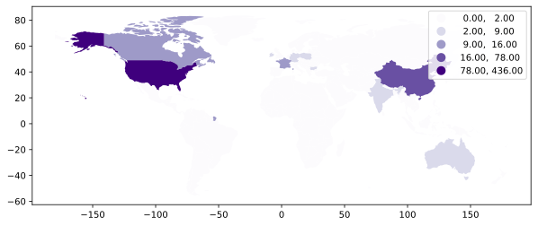
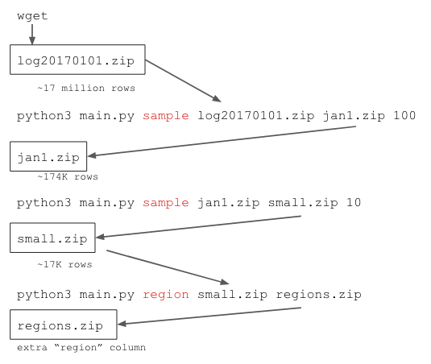
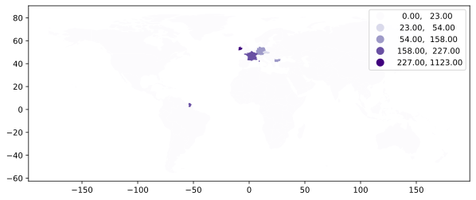

# DON'T START YET (still revising!!!)

# P5: EDGAR Data

In this project, you'll be building a command line tool for processing
compressed EDGAR web logs.  In the US, public companies need to
regularly file various statements and reports to the SEC's (Securities and
Exchange Commission) EDGAR database.  EDGAR data is publicly available
online; furthermore, web requests to EDGAR from around the world are
logged and published.  The logs list the pages visited and weakly
anonymized IP addresses of visitors, allowing good guesses about what
docs various hedge funds and others are looking at.  For those
interested in the nitty-gritty details of what could be done with this
data, take a look at this early-stage work:
[Hedge Funds and Public Information Acquisition](https://papers.ssrn.com/sol3/papers.cfm?abstract_id=3127825).

EDGAR logs are huge.  Logs for *just one day* might be about 250 MB
compressed as a .zip (or 2 GB uncompressed!).  It will be very useful
to have command line tools to sample and otherwise process this data.
Your tool (which will consist of a single `main.py`) will have two
commands for dealing with these zips: `sample` and `region`.

Your tool will also provide two commands for visualizing where web
requests to EDGAR are originating: `geocontinent`, `geohour`.
These will generate either images to visualize traffics in world map. For example, `geohour`
could generate the following:



## Corrections/Clarifications

* Not yet

## Packages

You'll need to install some packages.  `click` will make it easy to
build command line tools:

```
pip3 install click
```

And as a tool to convert ip address into integer,

```
pip3 install netaddr
```

And the followings will help you make maps:

```
pip3 install geopandas shapely descartes mapclassify
```


## EDGAR Data

Take a look at the list of daily zips and CSV documentation on the EDGAR site:
* https://www.sec.gov/dera/data/edgar-log-file-data-set.html
* https://www.sec.gov/files/EDGAR_variables_FINAL.pdf

Each zip contains a single CSV file with the same name (e.g.,
`log20170101.zip` contains `log20170101.csv`).

You have two choices:
* manually download `log20170101.zip` from EDGAR using wget, then take a sample of 1% of the rows to produce a smaller `jan1.zip` using your `sample` command (described later)
* just download the `jan1.zip` file we provided by doing the sampling

You'll be creating lots of zip files for this projects, so you'll want
to know some command line techniques to troubleshoot.

View names of files in a zip file:

```
unzip -l jan1.zip
```

View start of a file inside of a zip file:

```
unzip -p jan1.zip jan1.csv | head -n 5
```

expected result is

```
ip,date,time,zone,cik,accession,extention,code,size,idx,norefer,noagent,find,crawler,browser
104.197.32.ihd,2017-01-01,00:00:00,0.0,1111711.0,0001193125-12-324016,-index.htm,200.0,7627.0,1.0,0.0,0.0,10.0,0.0,
208.77.214.jeh,2017-01-01,00:00:00,0.0,789019.0,0001193125-06-031505,.txt,200.0,46327.0,0.0,0.0,0.0,10.0,0.0,
54.197.228.dbe,2017-01-01,00:00:00,0.0,800166.0,0001279569-16-003038,-index.htm,200.0,16414.0,1.0,0.0,0.0,10.0,0.0,
108.39.205.jga,2017-01-01,00:00:01,0.0,354950.0,0000950123-09-011236,-index.htm,200.0,8718.0,1.0,0.0,0.0,10.0,0.0,
```

You will be able to interpret the expected result easily. Each columns are separated by comma, and the first row is column names.

Change `head` to `tail` to see the end of the file.  You may want to
use these to compare the various zip files you produce to the versions
we've posted to GitHub.


## IP2Location(:tm:) LITE Dataset

You need to associate IP addresses with regions for this project.
There's a Creative Commons dataset here we'll use:
https://lite.ip2location.com/database/ip-country.  We've uploaded slightly modified version,  `ip2location` file to GitHub for you to manually download.

Note that although IP2Location calls this their "LITE IP-COUNTRY
Database", it's more accurately a regional database: there are
sometimes multiple entries for the same region.

Another weird thing about this dataset is that regular IP address, like
`"34.67.75.25"`, get converted to integers, like `574835481`.  Rather
than dive into the details around this, consider using `netaddr` module to convert ip from string to integer.

For example,

```
import netaddr
int(netaddr.IPAddress("34.67.75.25"))
```

will give you `574835481`. For more detail, you can refer to following references.

* https://stackoverflow.com/questions/10283703/conversion-of-ip-address-to-integer

* https://stackoverflow.com/questions/9590965/convert-an-ip-string-to-a-number-and-vice-versa

Other than that, poke around the IP dataset and documentation and see
if you can figure it out, asking questions on Piazza as necessary.
Note that IP ranges in ip2location.zip are ascending (will help you later).

Let's look into ip2location.zip.

```
unzip -p ip2location.zip ip2location.csv | head -n 5
```

Which will give you

```
low,high,code,region
0,16777215,-,-
16777216,16777471,US,United States of America
16777472,16778239,CN,China
16778240,16779263,AU,Australia
```

As you can see, this csv includes four columns: `low`, `high`, `code`, `region`. Each row represents the range of ip address and corresponding region code and region. For example, the ip address in between 16777216 ~ 16777471 corresponds to the region United States of America.

## Starter Code

Your tool will be named `main.py`.  It will be possible to run
`python3 main.py COMMAND ...` where COMMAND will be replaced by
specific operations, such as `sample` or `region`. For command line implementation, we will use `click` pacakage. You can refer to https://click.palletsprojects.com/en/7.x/quickstart/ as a reference.

Start with this code:

```python
import click

@click.command() # declare the below function is command
@click.argument('zip1') # parse first argument as zip1 input param
@click.argument('zip2') # parse second argument as zip2 input param
@click.argument('mod', type=click.INT) # parse third argument as mod input param
def sample(zip1, zip2, mod):
    print("zip1:", zip1)
    print("zip2:", zip2)
    print("mod:", mod)
    # TODO: finish this

@click.group() # make a command group
def commands():
  # You don't need to modify this function
    pass

commands.add_command(sample) # add 'sample' command to commands group
# commands.add_command(region) # add 'region' commnad to commands group
# ...

if __name__ == "__main__":
    commands() # it will make you be able to use commands we defined
```

Look at every place "sample" appears -- where will you need to make
changes to add completely new commands later?

Try running a few things from the terminal:

```sh
python3 main.py --help # lists available commands
```

```sh
python3 main.py sample # shows what arguments sample command needs
```

```sh
python3 main.py sample samp.zip samp2.zip 10 # click module automatically runs sample(...)
```


# Group Part (75%)

## Data Pipeline Commands

`sample` and `region` are commands that will take a .zip as
input and produce a new .zip as output.  The zips will contain a
single .csv by the same name.  It will be possible to chain the
transformations together into a pipeline, to make a series of changes
to the data:



Each box represents a .zip file, and the `python3 main.py ...` parts
are showing how somebody could use your tool to transform the data
from one stage to the next.  We've also share all our intermediate
versions to help you debug and so you can make progress on later
commands even if you're stuck on earlier ones.

We've already run our version of the `sample` command to produce
`jan1.csv`, so you can download that one as a starting point if you
like (the `log20170101.zip` would take a long time to download).

### 1. `sample` Command

`sample` command will do sampling data with specific stride and write another zip file based sampled data.

This one takes three arguments:

* input zip (zip1)
* output zip (zip2)
* stride (mod)

If stride is 10, then rows 0, 10, 20, 30, etc. will be in the sample.
If stride is 100, then 0, 100, 200, 300, etc. will be in the sample.

For this command (and those following), there won't always be enough
memory to read the entire CSV in with Pandas, so you should use
Python's `csv` module for looping over one row at a time.

Here's a function that might be useful for pulling in on row at a time:

```python
import csv
from zipfile import ZipFile
from io import TextIOWrapper

def zip_csv_iter(name):
    with ZipFile(name) as zf:
        with zf.open(name.replace(".zip", ".csv")) as f:
            reader = csv.reader(TextIOWrapper(f))
            for row in reader:
                yield row
```

If you are not faimilar with `yield` statement, it would be a good idea to review generator. You can review followings stuff.

* CS220 lecture materials (https://www.msyamkumar.com/cs220/f20/schedule.html) - Oct 28
* https://realpython.com/introduction-to-python-generators/

Here's an example snippet that might use the above to print off IP addresses:

```python
reader = zip_csv_iter("jan1.zip")
header = next(reader) # the list of all column names
ip_idx = header.index("ip")
for row in reader:
    print(row[ip_idx])
```

Running the above will give output like this: (Note that it will be a large amount of print lines)

```
104.197.32.ihd
208.77.214.jeh
54.197.228.dbe
108.39.205.jga
52.45.218.ihf
104.197.32.ihd
183.195.251.hah
68.180.231.abf
107.178.195.bbb
107.3.20.gcd
...
```

Yes, those aren't quite real IP addresses, as explained in the next section...

Now, you will need to know how to write a zip file. For this, you can modify the following example, which make another zip2 file from the first five rows (+ the row of column names) of zip1 file.

```
# save 5 rows of zip1 to zip2 
zip1 = "jan1.zip"
zip2 = "five_rows.zip"

reader = zip_csv_iter(zip1)
header = next(reader)

with ZipFile(zip2, "w") as zf:
    with zf.open(zip2.replace(".zip", ".csv"), "w") as raw:
        with TextIOWrapper(raw) as f:
            writer = csv.writer(f, lineterminator='\n')
            writer.writerow(header) # write the row of column names to zip2
            line_count = 0
            for row in reader:
                writer.writerow(row) # write a row to zip2
                line_count += 1
                if line_count == 5: # fifth row
                    break
```

After it, you will be able to check the `"five_rows.zip"` by the following codes.

```
reader = zip_csv_iter(zip2)
header = next(reader)
ip_idx = header.index("ip")

for row in reader:
    print(row[ip_idx])
```

Expected result for the above codes is

```
104.197.32.ihd
208.77.214.jeh
54.197.228.dbe
108.39.205.jga
52.45.218.ihf
```

After implementing sample, you might want to test your `sample` command with the following command line inputs.

```
python3 main.py sample jan1.zip sample_test.zip 1000
unzip -p sample_test.zip sample_test.csv | head -n 5
```

Expected result is

```
ip,date,time,zone,cik,accession,extention,code,size,idx,norefer,noagent,find,crawler,browser
104.197.32.ihd,2017-01-01,00:00:00,0.0,1111711.0,0001193125-12-324016,-index.htm,200.0,7627.0,1.0,0.0,0.0,10.0,0.0,
54.152.17.ccg,2017-01-01,00:05:57,0.0,948426.0,0001547522-16-000355,-index.htm,200.0,2764.0,1.0,0.0,0.0,10.0,0.0,
216.244.66.ahb,2017-01-01,00:13:20,0.0,1389170.0,0001209191-14-011469,xslF345X03/doc4.xml,301.0,629.0,0.0,0.0,0.0,10.0,0.0,
54.75.252.bfc,2017-01-01,00:20:50,0.0,947263.0,0000891092-16-019868,-index.html,200.0,2750.0,1.0,0.0,0.0,10.0,0.0,
```


### 2. `region` Command

`region` command will add 'region' column by investigating each row's ip address. Note that we can find the region of ip address in ip2location.zip.

`region` command takes two arguments:

* input zip (zip1)
* output zip (zip2)

`region` command will read data from input zip (zip1), add a column `"region"` using ip2location.zip, and then save the result to the output zip (zip2).

This command has two parts: sorting and adding a new region column. 
As explained why later, the sorting will come first. 

It's OK if you read in the complete CSV, then sort,
perhaps something like this:

```python
reader = zip_csv_iter(????)
header = next(reader)
rows = list(reader)
rows.sort(????)

# TODO: write the new zip file
```

Although not expected, it's definitely cool if you find a way to write
this so that it can even work on very large input zip files that don't
fit in memory (like `log20170101.zip` on your virtual machine).

The sorting needs to be done **numerically**, so you'll need to
convert the IP addresses to integers as discussed earlier.

One problem: EDGAR tries to anonymize data, so you see IP addresses
like `104.197.32.ihd`.  "ihd" is replacing what was originally digits.

You should substitute zeros for the anonymizing digits (for example,
`104.197.32.000`) so that you can convert the IPs to ints with `netaddr.IPAddress`.

The substitution could be done with `re.sub`, among other ways.  The substitution should only occur for sorting, and the `104.197.32.ihd` should be what is written to the output zip file.

**Important Note:** Whatever sorting method you choose to use should be **_stable_**. 
A sorting algorithm is stable if, in the case of ties, it preserves the original 
order of the entries. So, if there are two identical IPs, they will appear in the 
same order in the sorted list as in the original list if a stable sorting algorithm 
is used. If an unstable sorting algorithm is used then they aren't guaranteed to be in 
the same order (although they made be by chance). This [link](https://qr.ae/pNvGYH) 
goes a little more in-depth on stable vs unstable sorting algorithms with a nice 
example.
Python's sort and sorted methods are stable. Pandas' sort_values method isn't stable 
by default (although it is possible to make it stable). However, you're encouraged to 
use csv.reader and csv.writer from Python's csv module instead of Pandas 
(as noted in section 1). 
    
Now on to adding a region column. 

This part uses the IP2Location(:tm:).  The compressed output table
should be the same as the input, except with an extra column for
region at the end.

The fact that both the IP2Location(:tm:) data and the input zip to the
`region` command are sorted in ascending order by IP means it should
be possible to implement `region` as an O(N) function, where N is
number of rows.  Searching through all the IP2Location(:tm:) data
again for each row of input data could be pretty slow. 
(That is to say, write an O(N) implementation.)  

**Hint** Keeping an index for the IP2Location csv and only ever incrementing 
it should help keep the algorithm O(N).  

**Note:** As you may have noticed, it would be reasonable to also split 
sorting and adding the region column into two separate commands. When you 
come across dilemmas like in your own work, one question you could ask 
yourself is "Would I ever want the output of just the first part but not 
the second?" Taking this command for example, if you'd answer yes to 
the above question, you could think think about which is more inconvenient: 
having an extra command or having to remove a column when you just want 
sorted data?


After implementing sample, you might want to test your `region` command with the following command line inputs.

```
python3 main.py region small.zip small_region_added.zip
unzip -p small_region_added.zip small_region_added.csv | head -n 5
```

Expected result is

```
ip,date,time,zone,cik,accession,extention,code,size,idx,norefer,noagent,find,crawler,browser,region
1.180.212.jhi,2017-01-01,14:26:43,0.0,1104188.0,0001193125-16-759461,d281471d10q.htm,200.0,111067.0,0.0,0.0,0.0,9.0,0.0,,China
1.225.86.jdd,2017-01-01,11:35:32,0.0,895419.0,0000895419-16-000197,a10qform1qfy2017.htm,200.0,91276.0,0.0,0.0,0.0,9.0,0.0,,Korea (Republic of)
5.9.17.hfe,2017-01-01,20:07:08,0.0,1237746.0,0001193125-14-402080,d799788dex42.htm,200.0,404776.0,0.0,0.0,0.0,10.0,0.0,,Germany
5.9.106.igg,2017-01-01,11:24:20,0.0,1343254.0,0000000000-15-020498,filename1.pdf,200.0,120699.0,0.0,0.0,0.0,10.0,0.0,,Germany
```

, where you should be able to see the last column `region`.

## Visualization Commands

Once you know have the region data for all the requests, there are a
lot of fun ways to visualize the data.  As shown in the following, the
`geocontinent` and `geohour` commands will produce .svg files, where regions
which generate more requests are drawn darker. 

### 3. `geohour` Command

`geohour` takes three arguments

* input zip (zip name)
* Imgname
* hour

`geohour` will read data from input zip, make a svg figure that represents traffics of each regions in specified hour, and save the figure to imgname.

First, give this a try:

```python
import geopandas
world = geopandas.read_file(geopandas.datasets.get_path('naturalearth_lowres'))
world.plot()
```


The `geohour` command will produce a similar map, with at least three improvements:

1. make it larger
2. don't show Antarctica -- the penguins probably aren't operating a hedge fund there anyways (Hint: you can look into `continent` in the below example)
3. regions that sent more traffic to EDGAR should be shaded darker (Hint: we can count rows for each regions to see traffics)
4. an integer between 0 and 23 is passed in; the rows are filtered on the `time` column

You can otherwise decide the color scheme, and it can be continuous or
discrete (for example, one color for 1000+, another for 100-999, etc). 
[This link](https://geopandas.org/mapping.html) has a lot of examples for 
plotting with geopandas.  

`geohour` should also write to a json file called `"top_5_h{}.json".format(hour)` a dict 
of the top 5 counts at that time (key = region; value = count). Only include counts that 
have been added to the DataFrame and are being displayed in the image. 

Many of the region names are identical in the IP2Location(:tm:) and EDGAR log datasets.  
In cases where the names are slightly different, you don't need to worry about shading for that region.

Here's a bit of code for a function that could help out:
```python
def your_helper_fcn_change_this_name(zipname, ax=None, hour=None):
    # count occurences per region
    reader = zip_csv_iter(zipname)
    header = next(reader)
    cidx = header.index("region")
    counts = defaultdict(int)
    w = geopandas.read_file(geopandas.datasets.get_path('naturalearth_lowres'))
    
    # traffic counts 
    for row in reader:
        if hour != None:
            if hour != int(row[timeidx].split(":")[0]):
	        continue
        counts[row[cidx]] += 1
	
    for region, count in counts.items():
        # sometimes region names in IP dataset don't
        # match names in naturalearth_lowres -- skip those
        if not region in w.index:
            continue

        # add data (either count or a color) to a new column
	
	# plot it
	# return it
```

After implementation, you might want to test your `geohour` by the following command line.

```
python3 main.py geohour regions.zip noon_output.svg 12
```

, which will generate `noon_output.svg` file. You can download it and open it with your web browser. It will look like


The color can vary depending on your choice.

# Individual Part (25%)

### 4. `geocontinent` Command

Same as above, but a continent is passed instead of an integer 0-23. 
Now, only show non-default colors for regions on the continent identified 
by the parameter. 

In other words, `geocontinent` takes three arguments

* input zip (zip name)
* Imgname
* continent

`geocontinent` will read data from input zip, make a svg figure that represents traffics of specified continent, and save the figure to imgname.

The helper function above could be helpful here as well; 
it just needs to be adapted. 

After implementation, you might want to test your `geocontinent` by the following command line.

```
python3 main.py geocontinent regions.zip geo_output.svg europe
```

**Important Note:** continent is case-insensitive. For example, continent input `Europe` and `europe` should give the same output.

The output `geo_output.svg` will look like



### 5. `Video` Command

Here we are going to create an animation. 

Imagine running geohour for all hours of the day, then combining the images to make a video. That's basically what this command does.

We'll be using FuncAnimation to create the video, then call .to_html5_video(...), which is why we have .html in the video's file name.

This last part needs a (non-Python) package called ffmpeg to convert all the images into a video/animation/html file. Install it like so:

```sudo apt-get install ffmpeg```

Here is the starter code. You will need to update the update function, making sure to use plot_hour to plot a specific hour. After, you will create a video using the FuncAnimation function. For the func parameter of FuncAnimation, we will use the update function object. 
Make sure to use the function object, we do not call the function. 
Example: (object: function_example vs calling: function_example() --> (FuncAnimation(…, func_example, …), not FuncAnimation(…, func_example(), …)))

```@click.command()
   @click.argument('zipname')
   @click.argument('vidname')
   def video(zipname, vidname):
       fig, ax = plt.subplots()
       def update(hour):
           # todo: use plot_hour function to create a graph for a specific hour
       # Use FuncAnimation function to create a video 
       with open(vidname, "w") as f:
           f.write(your_video_name_here.to_html5_video())
```

The final thing should look something like [this](https://tyler.caraza-harter.com/cs320/s20/materials/p4-vid.html). 

## Hand-In
Your main.py is your deliverable for P5. 
