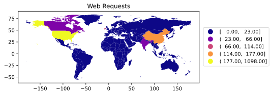

# P5: EDGAR Web Logs

In the US, public companies need to regularly file
various statements and reports to the SEC's (Securities and Exchange
Commission) EDGAR database.  EDGAR data is publicly available online;
furthermore, web requests to EDGAR from around the world are logged
and published.  EDGAR logs are huge.  Logs for *just one day* might be
about 250 MB compressed as a .zip (or 2 GB uncompressed!).

In this project, you'll create and turn in a single file, `main.py`.
It will be runnable as a command line tool for processing compressed
EDGAR web logs.  We'll provide with data from a subset of one day.

Your `main.py` will support four commands:

* `ip_check`: given one or more IP addresses, lookup the associated regions
* `sample`: create a smaller, sorted file from a bigger file, also adding regional info
* `world`: create a map of the world, colored based on frequency of web requests to EDGAR
* `phone`: dump out a list of phone numbers appearing in the docs referenced in the web logs

## Corrections/Clarifications

* none yet

## Packages

You'll need to install some packages:

```
pip3 install geopandas shapely descartes geopy mapclassify netaddr
```

# Group Part (75%)

## Part 1: `ip_check`

Your program should have an `ip_check` command that takes one or more
IP addresses.  It should use the `ip2location.csv` (borrowed from
https://lite.ip2location.com/database/ip-country) to lookup what
country/region owns a particular IP address.  The CSV file looks like
this:

```
low,high,code,region
0,16777215,-,-
16777216,16777471,US,United States of America
16777472,16778239,CN,China
16778240,16779263,AU,Australia
16779264,16781311,CN,China
...
```

The first two numbers are IP ranges (inclusive on both ends).  The IP
address 16777473 belongs to China because it is between 16777472 and
16778239, for example.

IP addresses are more commonly represented as four-part numbers, like
"34.67.75.25".  To convert an address like this to an integer, you can
use the following (see this and other approaches here:
https://stackoverflow.com/questions/9590965/convert-an-ip-string-to-a-number-and-vice-versa):

```
import netaddr
int(netaddr.IPAddress("34.67.75.25"))
```

You should use `time.time()` calls before and after the code you write
to lookup the region for an IP address to measure how long it takes.

Say somebody runs your program like this, with four IP addresses:

```
python3 main.py ip_check 1.1.1.1 1.1.1.2 9.9.9.9 1.1.1.2
```

You might have some code like this in your `.py` to identify which
command should run and pull in the relevant command line data (be sure
to read about `sys.argv` if you need a refresher on how it works).

```python
def main():
    if len(sys.argv) < 2:
        print("usage: main.py <command> args...")
    elif sys.argv[1] == "ip_check":
        ips = sys.argv[2:]
        # TODO: call a function you write that does IP checking
    # TODO: other commands
    else:
        print("unknown command: "+sys.argv[1])

if __name__ == '__main__':
     main()
```

Your printed output should be a JSON-formatted list of four dicts
(corresponding to those four IP addresses):

```
[
  {
    "ip": "1.1.1.1",
    "int_ip": 16843009,
    "region": "United States of America",
    "ms": 5.023002624511719
  },
  {
    "ip": "1.1.1.2",
    "int_ip": 16843010,
    "region": "United States of America",
    "ms": 0.04100799560546875
  },
  {
    "ip": "9.9.9.9",
    "int_ip": 151587081,
    "region": "United States of America",
    "ms": 11.50202751159668
  },
  {
    "ip": "1.1.1.2",
    "int_ip": 16843010,
    "region": "United States of America",
    "ms": 11.83176040649414
  }
]
```

In addition to giving ip, integer value of ip, and the region, it should give how many milliseconds
each lookup took.  Look at the measurements above: it took 5.02 ms to
lookup 1.1.1.1, but it only took 0.04 ms to lookup 1.1.1.2.

You aren't expected to have identical times, but you should optimize
your code so that consecutively looking up multiple IP addresses in
the same range, or nearby ranges, is fast (certainly don't loop over
every range every time).  Notice, however, that the second lookup of
1.1.1.2 is slow, even though it was looked up previously; this is fine
because it is not near the immediately preceding IP of 9.9.9.9.

The reason you need to optimize this is that the next command will
need to look up countries for a large number of IP addresses that are
in sorted order, and it will be quite slow overall if you can't do
similar consecutive lookups efficiently.

Hint: You may refer to wc.py of project 1 to print the a JSON-formatted list of dicts.

## Part 2: `sample`

Take a look at the list of daily zips and CSV documentation on the EDGAR site:
* https://www.sec.gov/dera/data/edgar-log-file-data-set.html
* https://www.sec.gov/files/EDGAR_variables_FINAL.pdf

We have provided a `jan1.zip` file, which is a subset of the records
from `log20170101.zip`.  You'll be creating lots of zip files for this
projects, so you'll want to know some command line techniques to
troubleshoot.

View names of files in a zip file:

```
unzip -l jan1.zip
```

View start of a file inside of a zip file (change "head" to "tail" to see the end):

```
unzip -p jan1.zip jan1.csv | head -n 5
```

The expected result is:

```
ip,date,time,zone,cik,accession,extention,code,size,idx,norefer,noagent,find,crawler,browser
104.197.32.ihd,2017-01-01,00:00:00,0.0,1111711.0,0001193125-12-324016,-index.htm,200.0,7627.0,1.0,0.0,0.0,10.0,0.0,
208.77.214.jeh,2017-01-01,00:00:00,0.0,789019.0,0001193125-06-031505,.txt,200.0,46327.0,0.0,0.0,0.0,10.0,0.0,
54.197.228.dbe,2017-01-01,00:00:00,0.0,800166.0,0001279569-16-003038,-index.htm,200.0,16414.0,1.0,0.0,0.0,10.0,0.0,
108.39.205.jga,2017-01-01,00:00:01,0.0,354950.0,0000950123-09-011236,-index.htm,200.0,8718.0,1.0,0.0,0.0,10.0,0.0,
```

`sample` command will do the following data preprocessing.

1) sampling data at regular intervals (the interval is given as input)

2) add a column ('region') at the end that shows the region from which the web request originated

3) write another zip file based on preprocessed data

This one takes three arguments:

* input zip (zip1)
* output zip (zip2)
* stride (mod)

If stride is 10, then rows 0, 10, 20, 30, etc. will be in the sample.
If stride is 100, then 0, 100, 200, 300, etc. will be in the sample.
Row 0 refers to the first row of actual data, not the header (the
header always needs to be written to the new file).

To add a column 'region', you can apply a very similar logie with ip_check. However, EDGAR tries to anonymize IP addresses by replacing some digits with letters, as in "157.55.39.eja".  For sorting and lookup purposes, replace letters with zeros (for example, "157.55.39.000").  The unmodified versions of the IP addresses should still appear in the first column of the new file, though.

To write a new zip file, you may refer to [sample code](sample_hints.md) for copying subsets of
data from one zipped CSV to another (no need to read or follow these
patterns if you already know how you want to do this).

For example, we can run with a stride of 30000, then check our output:

```
python3 main.py sample large.zip tiny.zip 30000

unzip -p tiny.zip
```

Output (from the second command):

```
ip,date,time,zone,cik,accession,extention,code,size,idx,norefer,noagent,find,crawler,browser,region
52.45.218.ihf,2017-01-01,10:23:25,0.0,827156.0,0001341522-06-000030,.txt,200.0,5974.0,0.0,0.0,0.0,10.0,0.0,,United States of America
54.212.94.jcd,2017-01-01,03:31:36,0.0,1461219.0,0000000000-13-001261,-index.htm,301.0,243.0,1.0,0.0,1.0,10.0,0.0,,United States of America
104.197.32.ihd,2017-01-01,00:00:00,0.0,1111711.0,0001193125-12-324016,-index.htm,200.0,7627.0,1.0,0.0,0.0,10.0,0.0,,United States of America
107.23.181.jje,2017-01-01,07:01:00,0.0,1330399.0,0001299933-16-003371,edgar/data/1330399/-,200.0,7065.0,1.0,0.0,0.0,10.0,0.0,,United States of America
107.178.195.bbb,2017-01-01,19:57:16,0.0,1584509.0,0001584509-16-000514,armk-20160930_pre.xml,200.0,68682.0,0.0,0.0,0.0,10.0,0.0,,United States of America
157.55.39.eja,2017-01-01,15:07:47,0.0,1030469.0,0000950144-09-002256,g18073exv31w2.htm,301.0,625.0,0.0,0.0,0.0,10.0,0.0,,United States of America
```

Additional requirements:

* don't do anything to read the entire data from the large zip to memory (`pd.read_csv` does this, so is not an option).  Looping over a `csv.reader` does not pull all the data into memory.
* in the new zip file, rows should be sorted asceding by IP (as converted to ints in the previous command), in ascending order.  It's OK to have all the rows in memory at once that are going to be written to the new .zip (this makes sorting easier)
* we recommend using Python's `sort` or `sorted`.  If you want to use something else, you can, but if so, learn about "stable sorting" (https://www.quora.com/What-is-the-difference-between-a-stable-and-unstable-sort/answer/Rahul-Kumar-6717?ch=10&share=2f60372f&srid=2ByvL) and make sure whatever you use is stable, like the built-in Python sorting functions

## Part 3: `world`

It should be possible to run `python3 main.py world small.zip
world.svg` to produce an image named "world.svg" that looks something
like this (check by opening it in your browser):



The title, border, and legend are optional.  Mandatory: Antarctica is
not shown, color indicates the number of web requests
originating from a region, and the map is bigger than the default
created by `GeoDataFrame.plot`.

Here's a basic world map you can start from:

```python
import geopandas
world = geopandas.read_file(geopandas.datasets.get_path('naturalearth_lowres'))
world.plot()
```


[This link](https://geopandas.org/mapping.html) has a lot of examples for 
plotting with geopandas.

Many of the region names are identical in the IP2Location(:tm:) and
`naturalearth_lowres` GeoDataFrame.  In cases where the names are
slightly different, you don't need to worry about shading for that
region.

Hint 1. To hide Antartica, you may look into 'continent' column of `world`.

Hint 2. You may want to make a new column to world by counting the value of 'region' column in zip file data.


# Individual Part (25%)

## Part 4: `phone`

Looking at the `cik`, `accession`, and `extention` fields tells you what web resoure a user was requesting (in particular, each company has it's own `cik`):

```
ip,date,time,zone,cik,accession,extention,code,size,idx,norefer,noagent,find,crawler,browser,region
54.212.94.jcd,2017-01-01,03:31:36,0.0,1461219.0,0000000000-13-001261,-index.htm,301.0,243.0,1.0,0.0,1.0,10.0,0.0,,United States of America
...
```

For this row, we can construct the following URL from `1461219.0`, `0000000000-13-001261`, and `-index.htm`:

https://www.sec.gov/Archives/edgar/data/1461219/0001209191-21-001287-index.htm

We have already downloaded all the docs corresponding to rows in
`small.zip` for you and placed them in `docs.zip`.  Use regular
expressions to see how many 10-digit phone numbers (like
`980-221-3235` and `(212) 250-5883` and `(212)790-0000`) you can find
in these files.  Before doing the regex searches, you should read the
text in of each file directly into a string (even if the file ends
with ".htm" or similar, don't both using BeautifulSoup).

You can use the following base code.

```
def phone(zp):
    rv = []
    with ZipFile(zp) as zf:
        for info in zf.infolist():
            with zf.open(info.filename) as f: # open file in zip
                t = TextIOWrapper(f)
                txt = t.read() # read html file as string
                phones = re.findall(??????, txt) # find all digit phone number
                rv.extend(phones)
```

The command is `python3 main.py phone docs.zip`.  Just print each
phone number on its own line (no duplicates!):

```
(212) 250-5883
(212) 270-6000
(212) 328-9521
(212) 376-4305
(212) 421-4100
(212) 659-2050
...
```

# Conclusion

The EDGAR logs are supposedly anonymized (with the last three docs
left), but we can still tell where the users live and what they're
looking at.  Others have used this same data to make good guesses
about what docs various hedge funds and others are looking at, then
correlate that with success.  For those interested in the nitty-gritty
details of what could be done with this data, take a look at this
early-stage work: [Hedge Funds and Public Information
Acquisition](https://papers.ssrn.com/sol3/papers.cfm?abstract_id=3127825).
