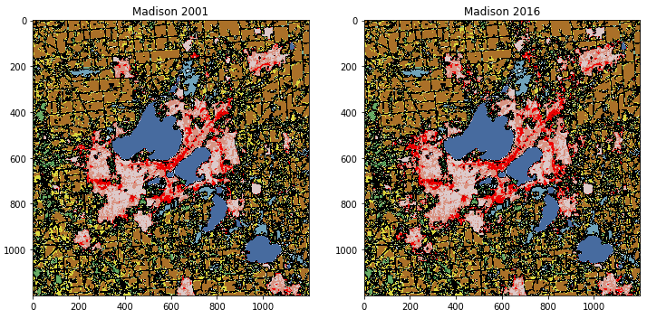
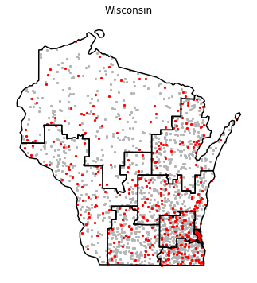
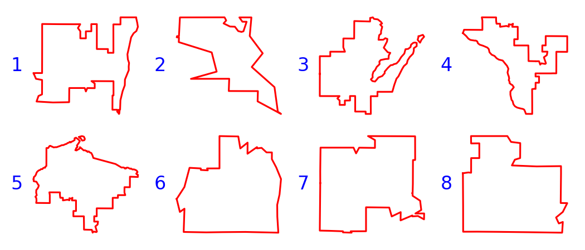
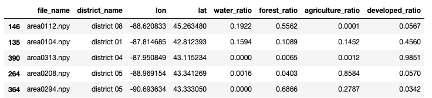
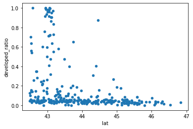
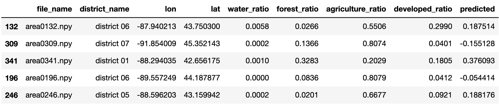
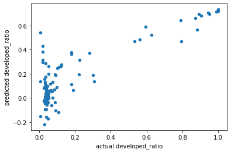
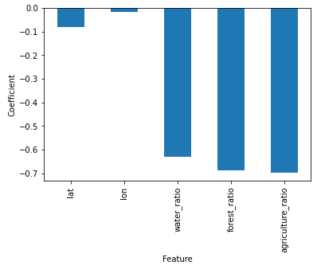
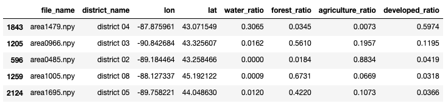
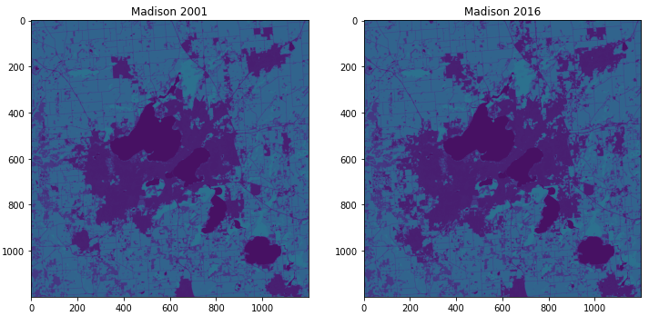

# P6: Wisconsin Land Use

## Corrections/Clarifications

* [April 3rd]: Revert back to 16 questions, removed repeating Q9. 
* [April 3rd]: Fixed number of questions, Q9 was repeated (17 questions now). 
For outputs with floats (including list and tuple), tester has a tolerance.
* [April 3rd]: Fixed typo in Q9. `area0320.py` -> `area0320.npy`.
* [April 2nd]: Tester released. Requires `ffmpeg` installed for Q16. Download `expected.json` too.

## Overview

In this project, you'll predict land development in Wisconsin based on nearby land type
(water, forest, agriculture, etc).  The project data is derived from [this
dataset](https://www.mrlc.gov/data/nlcd-land-cover-conus-all-years), which
breaks the United States into 30m squares and categorizes how those
chunks of land are being used.

Take a look
[here](https://www.mrlc.gov/data/legends/national-land-cover-database-2016-nlcd2016-legend)
to see the different ways land is used. Although the data covers the
whole US, we'll be looking at a sampling of places in WI.  Here's an
example of the land use around Madison:



The dataset is large (~10 GB across years), so we've already sampled
it for you.  We'll provide land use data for the following points:



We'll provide metrics about how land is used at each location
represented by a **red dot**.  You'll use those points for part 1 of
the project to train regression models that can predict how much land
is developed based on various characteristics such as the amount of
nearby water.  You'll evaluate how well those models perform in part
2.

For part 3 of the project, you'll write your own code to calculate
those metrics based on raw land-use maps at locations corresponding to
the each **gray dot**.

You'll do all your work in a fresh main.ipynb notebook. When answering question 1, start with a #q1 comment, and so on. Be sure to run the tester regularly.  You should download the following to get started

## Dataset

In addition to `tester.py` and `expected.json`, please download the following dataset files:
 * `data/images.db`
 * `data/images.zip`
 * `data/madison.zip`

The main dataset you'll need to get started is a sqlite database
called `data/images.db`.  It contains a table called sample with the
following columns:

* `file_name`: name of the map file from which land use metrics were calculated
* `lat`: latitude
* `lon`: longitude
* `water_ratio`, `forest_ratio`, `agriculture_ratio`: 
area covered by water bodies / forests / used for agriculture. Between 0...1.  
* `district_id`: which [congressional districts](https://en.wikipedia.org/wiki/Wisconsin%27s_congressional_districts) (shown below), a categorical variable.  The IDs are arbitrary, you have to `JOIN` with the `district` table on `district_id` to get actual district names.



* `developed_ratio`: development ratio, the output variable that you'll try to predict.

The `sample` table contains 2000 rows.  The first 400 rows contain to
the red points in the earlier map, and you'll use those for your initial
analysis.

The remaining 1600 are missing metrics in several columns.  Before you
can use those in later analysis, you'll need to compute those metrics
from raw maps, which are represented as numpy arrays inside the
`data/images.zip` file.

`madison.zip` contains seven images showing how Madison's land use has
evolved over the years.  You'll use this to create an animation in
part 4.

We generate `images.db` and `images.zip` via our build-dataset.ipynb
notebook.  You're welcome to look at how it works if you're curious,
but it's not really related to what you'll do for P6, and uses several
things we haven't talked about in CS 320.

# Group Part (75%)

For this portion of the project, you may collaborate with your group
members in any way (even looking at working code).  You may also seek
help from 320 staff (mentors, TAs, instructor).  You <b>may not</b>
seek receive help from other 320 students (outside your group) or
anybody outside the course.

## Part 1: Linear Regression

We'll train models to predict `developed_ratio` (percent of land
developed) based on how land is used nearby.  We'll be splitting the
first 400 rows of the `sample` table into a training and test dataset.
Fill in the SQL connection code and query string in the following
snippet to generate these:

```python
????
df = pd.read_sql("""
????
""", ????)

train, test = train_test_split(df, random_state=0)
```

Notes:
* when we set `random_state=0` (or some other number), the split "randomly" happens the same way every time.  Having everybody use 0 makes it possible for us to write a reliable tester.
* you may want to review the `LIMIT` clause so that you only get the first 400 rows
* only select these columns: `file_name`, `district_name`, `lon`, `lat`, `water_ratio`, `forest_ratio`, `agriculture_ratio`, `developed_ratio`
* you'll need to use a `JOIN` as introduced in lab to get the `district_name` from the `districts` table

#### Q1: What are the **last** 5 rows of the test dataset?

It should look like this:



#### Q2: What is the relationship between developed_ratio and _____? [PLOT]

Fill in the blank with a feature of your choosing.  Answer with a
scatter plot where the y-axis is developed_ratio and the x-axis is
your feature.  This is exploratory, so no need to make the plot look
nice.

Here's an example with latitude on the x-axis (don't produce the same
plot!  Choose a different feature for yourself to use on the x-axis).



#### Q3: What are the developed_ratio predictions of a Linear model on the first 5 test points?

Train a LinearRegression model on features `lat`, `lon`,
`water_ratio`, `forest_ratio`, `agriculture_ratio` of the the training
data.

Use the model to make predictions on the test dataset, and add these
predictions to a `predicted` column in a DataFrame that is a copy of
the original test DataFrame (you can copy a DataFrame with `.copy()`).

Show the first 5 rows of the test data, with this added column:



#### Q4: How does the model score when evaluated against the test dataset?

Use the r2_score (remember that this is the default for `.score`).
Expected: about 0.756.

#### Q5: How do the predictions compare to the actual values? [PLOT]

Plot the developed_ratio column on the x-axis and the predicted column
on the y-axis, like this (be sure to update the axis labels):



#### Q6: What are the coefficients for each feature in your model? [PLOT]

Hint: create a Pandas Series where where you use the feature names for
the index and the model's `.coef_` for the values, then use
`.plot.bar()`.



Perhaps the negative coefficients are not surprising -- when there is
more water, forest, or agriculture in a square of land, there is less
development space remaining.

#### Q7: Can we beat our simple model's score of 0.756 with a more complicated model?

Use a pipeline that transforms the features prior to the
LinearRegression.  Use a OneHotEncoder for district, a 2nd-degree
polynomial transformation for the ratio features, and keep using lat
and lon unmodified.

You'll again train on the training data and use the model's default
`.score` on the test data.

Hint 1: you may want to import the following, then review how to use
each imported class:

```python
from sklearn.pipeline import Pipeline
from sklearn.preprocessing import PolynomialFeatures, OneHotEncoder
from sklearn.compose import make_column_transformer
```

Hint 2: you may want to read about the `remainder` parameter for
dealing with lat and lon:
https://scikit-learn.org/stable/modules/generated/sklearn.compose.make_column_transformer.html

## Part 2: Cross Validation

Perform an 8-fold cross validation on your two models above using
`cross_val_score` on the training dataset.  You can use the default
scoring metric (which again is `r2_score`).

#### Q8: what are the mean (average) scores for simple and complex models, respectively?

Answer with a tuple, like this: `(0.5236988909638027, 0.730661154741614)`

#### Q9: what is the standard deviation of scores for each model?

Answer with a tuple again.  Hint: we used `.var()` in lecture for
variance; do a web search to see if you can find a similar method for
standard deviation on a numpy array.

## Part 3: Computing Feature Metrics

Our previous dataset was quite small, just 400 rows.  In this section,
you will be extending this to all 2000 rows by computing the metrics
directly from the raw maps in `images.zip`.  You'll want to start by
pulling in the whole dataset with a new query (one that doesn't have a
`LIMIT`).  You'll split it into train and test, just as before (again
using the default test ratio).

You'll see a bunch of .npy files in images.zip, meaning they contain numpy matrices
(these contain the use data).  These are encoded as
numpy array files -- take a look:

```
unzip -l data/images.zip
```

To complete the 1600 rows with the missing metrics, you can use the
`file_name` column to determine which numpy array to load and use.  If
`zf` is a ZipFile, you can read a numpy array inside using the
following:

```python
with zf.open(????) as f:
    buf = io.BytesIO(f.read())
    map_array = np.load(buf)
```

For those who are curious: similar StringIO (used previously), BytesIO
is like a fake file.  `f` is also a file, but it lacks a feature
called "seeking" -- we won't get into the details here, but that's why
we can't use numpy's `np.load` directly on `f`, as you would if the
numpy array file were not in a zip.

To open `zf` itself, you may or may not want to use a `with`
statement, depending on how many places in your code you'll access the
file (`with` statements cannot span multiple Jupyter cells).  Avoid
repeatedly opening `images.zip`, or your code will be slow.

In lab, we learned how to count cells with a particular in a matrix.
You'll do that here, but it will be somewhat more general.  We'll
define "water" as code 11, "forest" as codes 41-43, "agriculture" as
codes 81-82, and "developed" as codes 21-24 (all the ranges include
both the start and end numbers).

The real land matrices are much larger, but imagine you had a 2x2:

```python
np.array([
  [43, 23],
  [9,  21],
])
```

`forest_ratio` should be 0.25, developed_ratio should be 0.5, and the
others should be 0.

#### Q10: How many cells in all of `area1234.npy` contain code 52?

Expected: `36`.

#### Q11: What are the **last** 5 rows of the new test dataset?

If you did the new query and split into train/test correctly, you can
copy your code from Q1 to answer this.



#### Q12: what are the mean (average) scores for simple and complex models, respectively, on the larger dataset?

You should be able to re-use your code from Q8, running it now on the bigger dataset.

Expected: `(0.7387600196399053, 0.8832306036579041)`.

# Individual Part (25%)

You have to do the remainder of this project on your own.  Do not
discuss with anybody except 320 staff (mentors, TAs, instructor).

## Part 4: Map Animation

We have been analyzing different locations, at the same point in time.
In this section, we'll analyze multiple snapshots of one location
(Madison) and ultimately create an animation showing the city
changing.

We have zips for multiple cities under data (for you to explore if you
want for fun), but you'll only need `madison.zip`.  We won't need the
database for this part.  Check inside the zip, and see if you can
infer which .npy file is for each year, based on the names.  The .npy
files are formatted the same as the ones we've been using, although
they are somewhat larger.

Here's a code snippet to show the difference between Madison in 2001
and 2016 that may give you ideas for how to create your animation.

```python
from matplotlib import pyplot as plt

with ZipFile("data/madison.zip") as zf:
    with zf.open("year-2001.npy") as f:
        buf = io.BytesIO(f.read())
        mad2001 = np.load(buf)
    with zf.open("year-2016.npy") as f:
        buf = io.BytesIO(f.read())
        mad2016 = np.load(buf)

fig, axes = plt.subplots(ncols=2, figsize=(12,6))
axes[0].imshow(mad2001, vmin=0, vmax=255)
axes[0].set_title("Madison 2001")
axes[1].imshow(mad2016, vmin=0, vmax=255)
axes[1].set_title("Madison 2001")
```

It will initially look like this, which isn't correct:



The land use data encodes usage with codes between 11 and 95, each of
which is supposed to have a certain color, but these colors don't lie
on a natural spectrum.  For example, 11 and 90 are both blues, but
there are greens, reds, and other colors in between:
https://www.mrlc.gov/data/legends/national-land-cover-database-2016-nlcd2016-legend

We have defined a [get_usage_colormap() function](colormap.md) that
creates a custom cmap corresponding to the land-use codes.  You can
paste that function in your notebook, then pass
`cmap=get_usage_colormap()` to your `.imshow` calls to use it.


You see Madison doesn't change a lot over this period (it's only a 15
year interval), but you'll notice the differences upon close inspection.

#### Q13: What is the shape of the 2001 Madison matrix?

Expected: `(1200, 1200)`

#### Q14: What portion of the points in Madison changed from 2001 to 2016?

Expected: about 0.06156

#### Q15: What years appear in `madison.zip`?

Expected: `[2001, 2004, 2006, 2008, 2011, 2013, 2016]`

#### Q16: How has Madison evolved over the years? [VIDEO]

Use FuncAnimation to create a video with one frame per year in the
dataset (there are some gaps in the dataset, but 2001 should be frame
0, 2004 should be frame 1, etc).  It should be embedded directly in
the notebook (use `to_html5_video` and `HTML`), but should look like
[this](madison.mp4).  There should be about 1 second between frames.
A title above the plot should say what year is being currently
displayed.
