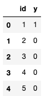
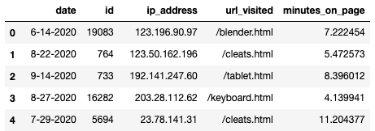

# P7: Selling Laptops: Smart Marketing

## Corrections/Clarifications

* none yet

## Overview

You are the owner of a retail website. You're planning on running a
promotion on a laptop and you want to send emails out about
it. However, you only want to send it to people that may be interested
in it so as to now annoy people that aren't interested.  You're
looking to use your data about who clicked on emails in 2020 to help
you predict which users may be interested in the promotion.

You can decide what features to consider and how to create your
classifier.  Your grade will correspond to the accuracy of your
predictions.  55% accuracy and below will give a grade of 0%, whereas
80% and above will give a grade of 100%; any accuracy between 55 and
80 will be rescaled to a 0-100% grade.  Your instructor's best model
has 90.935% accuracy -- let me know if you beat it!

You should create your classifier in a `main.py` file, which will be
the only thing you'll submit.

You can collaborate with your team on the entire project (no
individual part!).  As usual, you cannot work with students outside of
your team.

## Dataset

We have generated 3 datasets:

1. train
2. test1
3. test2 (secret)

You'll fit your classifier to the training data, then estimate your
accuracy using the test1 data.  We'll compute your final grade based
on test2 data, which is similar but not identical to test1 data.

Each of the 3 datasets consist of 3 files (so there are 9 files total, of which we give you 6):

1. `???_users.csv`: information about each user
2. `???_logs.csv`: details about webpages visited by each user
3. `???_y.csv`: y=1 means they clicked the email; y=0 means they did not

Here's some data in `train_users.csv`:


Here's the corresponding data from `train_y.csv`:



After aligning the IDs and considering the `y` column, we can see
Nikki Young clicked the promotional email, whereas the other 5 users
did not.

Here is some data in `train_logs.csv`:



Each row represents a visit to a pagepage on the site.  Each row
contains the date, the id of the user that visited the page, their ip
address, the url that they visited, and the number of minutes spent on
the page.

We have included the `ip2location.csv` dataset, identical to the one
in P5.  Feel free to use it if you want to infer country as a feature
for your model based on IP address.

## `UserPredictor` class

The goal of this project is to build a classifier that, given user and
log data, can predict whether those users will be interested in our
product.  There are a number of ways that you can go about this and a
number of ways that you can use the data (or not use portions of the
data); the freedom is yours.

You'll write your classifier as a class called `UserPredictor` in your
`main.py` file.  We require two methods (feel free to add more as
useful): `fit` and `predict`.

We recommend reading `tester.py` to understand how we expect your
class to work.  We intentionally made tester.py very simple this time
-- only 80 lines of code!

### Method 1: `fit`

Somebody using your class (and the tester) will call `fit` something
like this:

```python
from main import UserPredictor
model = UserPredictor()
train_users = pd.read_csv("data/train_users.csv")
train_logs = pd.read_csv("data/train_logs.csv")
train_y = pd.read_csv("data/train_y.csv")
model.fit(train_users, train_logs, train_y)
```

We don't have any requirements on what `fit` does (no need to output
or return anything), but you'll probably want to fit an underlying
`sklearn` model (for example, a `LogisticRegression`) to the data for
purposes of later prediction.

### Method 2: `predict`

Somebody using your class (and the tester) will call `predict` something
like this:

```python
test_users = pd.read_csv("data/test1_users.csv")
test_logs = pd.read_csv("data/test1_logs.csv")
y_pred = model.predict(test_users, test_logs)
```

`predict` should return a numpy array.  If `y_pred[n]` is 1, that
means you predict the user at index `n` will click the email;
otherwise, you're predicting they will not.

## Hints and Suggestions

* you can implement a custom classifier from scratch if you like, but we imagine most of you will have an sklearn pipeline as an attribute in your class, with your `fit` method fitting the pipeline and your `predict` method using the pipeline for predictions

* start simple, then add complexity.  About 60% of users don't click the email, so even if ignore the training data and simply predict that nobody in the test dataset clicks it, your accuracy will be above the 55% minimum, and you'll get a grade of about 20% on this project for basically doing nothing.  A `predict` that always forecasts "no click" might look like this:

```python
    def predict(self, test_users, test_logs):
        return np.zeros(len(test_users))
```

* as you consider features for your model, it's easier to start with just the `???_users.csv` file (ignoring the logs data), as each user row corresponds to exactly one outcome/prediction.  We were able to train a simple model just based on the user data that achieved a grade of 72%, completely ignoring the log data.

* to reach 100%, you'll probably need to use the logs data that describes how long each user spent on various pages.  You can decide how to use the logs data, but the simplest way might be to write a method that adds feature columns to the DataFrame read from the `???_users.csv`, based on per-user stats of your choosing calculated from the logs data.  For example, you could add a column describing how many total minutes each user spent on the site.  Using a separate method to add such information can help you avoid repeat work between your `fit` and `predict` methods (you'll presumably need the same additional columns for both training and testing).

* some users may not have any rows in logs if they didn't visit the website at all.  Consider how you'll deal with this.

* running `python3 tester.py` defaults to `python3 tester.py main test1`.  This will give you a general estimate of your final grade, but we'll run `python3 tester.py main test2` to actually compute that; you cannot run on test2, as we are not releasing `test2_users.csv`, etc.  Based on noise, your grade may be better or worse for test1 vs. test2.  Here are some tips to avoid surprises:

  * don't read any CSVs directly in your `main.py`; just use the DataFrames passed to your methods to avoid inadvertantly hardcoding paths

  * accuracy of 80% corresponsd to a grade of 100%.  We suggest you work to overshoot 80% by a bit in case you do slightly worse on test2 than test1

  * some models are more vulnerable than others to noise in accuracy scores for different train/test datasets.  You may want to do cross validation in your `fit` method and prints some stats.  How will depend on other design choices you make, but your instructor's model has a debug print something like the following in `fit` (a high standard deviation would indicate I'm more likely to be unlucky with getting a very different score on test2 than test1):

```python
scores = cross_val_score(model, train_users[self.xcols], train_y["y"])
print(f"AVG: {scores.mean()}, STD: {scores.std()}\n")
```

  * if you plan to work with your team members (not required, as usual), consider how you may want to divide the work.  One possibility: each team member could try a different model, then everybody in the team could turn in the one model that scores best.  Alternatively, each team member could be responsible for computing different per-user stats to use as features for training/predicting.  Of course, avoid getting in a situation where you are dependent on any one person to complete the project.

  * remember that the project is due Apr 28 and that you're not allowed to use late days on P7
